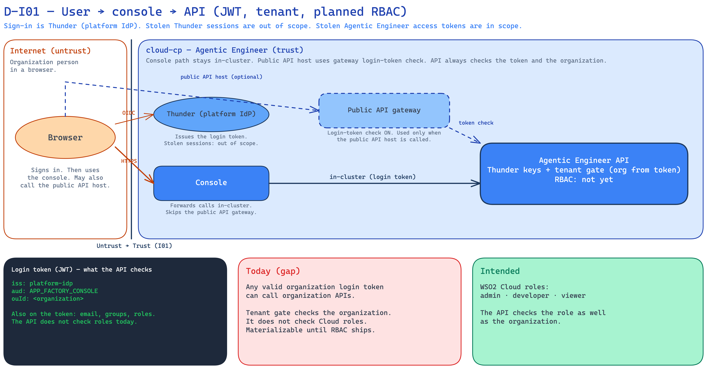

<!--
Copyright (c) 2026, WSO2 LLC. (https://www.wso2.com).

WSO2 LLC. licenses this file to you under the Apache License,
Version 2.0 (the "License"); you may not use this file except
in compliance with the License.
You may obtain a copy of the License at

http://www.apache.org/licenses/LICENSE-2.0

Unless required by applicable law or agreed to in writing,
software distributed under the License is distributed on an
"AS IS" BASIS, WITHOUT WARRANTIES OR CONDITIONS OF ANY
KIND, either express or implied.  See the License for the
specific language governing permissions and limitations
under the License.
-->

# I01: User signs in and calls the Agentic Engineer API

**Trust Boundary:** Untrust → Trust

**Description**

A person in an organization signs in with Thunder (the WSO2 Cloud platform IdP on `cloud-cp`). Thunder issues a login token (JWT). The browser uses the Agentic Engineer console over public HTTPS. The console forwards API calls inside the cluster. That hop does not go through the public API gateway.

The Agentic Engineer user API is also public. If a client calls that public host, the Cloud gateway checks the login token first.

The API then checks the token with Thunder’s public keys (JWKS). The tenant gate takes the organization from the verified token only (the `ouId` claim). It does not take the organization from the URL or the body. The first authenticated console request can create the organization in Agentic Engineer.

Cloud GitOps still has a TODO for the real console host, so sign-in redirects may not match after first deploy.

The login token can include email, groups, and roles. **Intended control:** the API also checks WSO2 Cloud roles — **admin**, **developer**, and **viewer**. **Today:** the API does not check those roles. Any valid organization login token can call organization APIs. That is a gap until RBAC ships.

Stolen Agentic Engineer access tokens are in scope here. Stolen Thunder/IdP sessions are not.

**Assets Involved**

| Initiator | Intermediate | Target |
| :---- | :---- | :---- |
| Browser (organization person) | Console (forwards calls inside the cluster). Public API gateway (only if the public API host is used). Thunder issues the login token (inherited; not modeled as a product here). | Agentic Engineer API (`/api/v1`) |

**Data Flow or Sequence Diagram**

**D-I01 — User → console → API (JWT, tenant, planned RBAC)**

**Payload**

- Login token (JWT)
- The API request (path, query, and body). Organization is not taken from the URL or the body. It comes from the token.

**Security Considerations**

| Area | Response | Comments |
| :---- | :---- | :---- |
| Data Confidentiality | High confidential \[C-High\] | The login token is a credential. Organization API calls can also carry organization data and, on some routes, secrets (saving the Anthropic key is I02). |
| Communication Medium | Network interaction \[M-NT\] | Browser to console and to Thunder over the public Cloud gateway. Console to API inside the cluster. Optional hop: browser to the public API host. |
| Transport Security | **TLS Encryption** | Public hosts use HTTPS on `*.gateway`. The console-to-API hop is in-cluster. |
| Authentication | **Bearer login token (JWT)** | Thunder (platform IdP) issues the token. Issuer `platform-idp`. Audience `APP_FACTORY_CONSOLE`. The API checks it with Thunder’s public keys (JWKS). |
| Accessibility | **Publicly Accessible** | Console and user API are public on the control-plane gateway. |
| **Access Control and Authorization** | Intended: WSO2 Cloud roles (admin, developer, viewer). Today: tenant gate only. | The tenant gate binds the organization from the verified token. It does not check Cloud roles. CORS on the public API is locked to the console origin (browser sites, not organization isolation). |

**Threat Assessment**

| ID | [Category](https://docs.google.com/presentation/d/1m3vIE2nzS_jcW8CIhCMnCaFl3KnOXZXhSLC163shHWs/edit#slide=id.g2d28a95f41a_0_94) | Threat | Materializable | Mitigations / Comment |
| :---- | :---- | :---- | :---- | :---- |
| 1 | Spoofing | A stolen Agentic Engineer access token is used as that organization person. | Yes | A valid stolen token is accepted until it expires. Thunder’s public keys and the public gateway only prove the token is real. They do not limit what it can do. Stolen Thunder/IdP sessions are out of scope. Row 8 is the missing role check. |
| 2 | Spoofing | A forged or unsigned token is accepted as an organization person. | No | The API checks the token with Thunder’s public keys (JWKS). It checks issuer (`platform-idp`) and audience (`APP_FACTORY_CONSOLE`). |
| 3 | Tampering | A caller puts another organization's id in the path or body to reach that organization. | No | Tenant gate is deny-by-default. Organization comes from the verified token only, never from the URL or the body. |
| 4 | Tampering | If Thunder cannot confirm the organization, Agentic Engineer still accepts the organization id (fail open). | Yes | Documented fail-open. Intended: reject the request when the organization cannot be confirmed. |
| 5 | Repudiation | A person denies an organization API action and we cannot show who did it. | Yes | Organization config changes have section-level audit logs. We do not yet have a full log of every API call and every access decision. |
| 6 | Information Disclosure | A token for one organization is used to read another organization's data through the Agentic Engineer API. | No | Same tenant gate as row 3. CORS does not provide this isolation. |
| 7 | Denial of Service | A flood of calls to `/api/v1` with a valid organization token. | Yes | Agentic Engineer has no application rate limit on this API. Volumetric DDoS at the Cloud edge is inherited Cloud infrastructure (out of scope here). |
| 8 | Elevation of Privilege | Any valid organization login token can call every organization API (for example a viewer can save keys, start jobs, and change settings). | Yes | Intended control: WSO2 Cloud roles admin, developer, and viewer. Today the API does not check roles. Materializable until RBAC ships. |
| 9 | Elevation of Privilege | OpenChoreo projects for different organizations can land in one shared namespace. | Yes | Today a Cloud override puts user projects in one namespace instead of one namespace per organization. The login-token tenant gate still separates Agentic Engineer API data by organization. |
