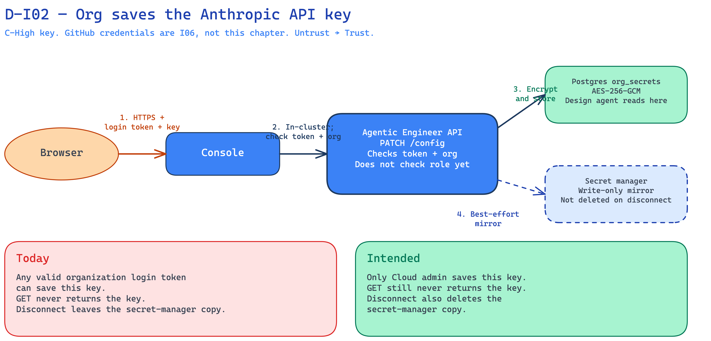

<!--
Copyright (c) 2026, WSO2 LLC. (https://www.wso2.com).

WSO2 LLC. licenses this file to you under the Apache License,
Version 2.0 (the "License"); you may not use this file except
in compliance with the License.
You may obtain a copy of the License at

http://www.apache.org/licenses/LICENSE-2.0

Unless required by applicable law or agreed to in writing,
software distributed under the License is distributed on an
"AS IS" BASIS, WITHOUT WARRANTIES OR CONDITIONS OF ANY
KIND, either express or implied.  See the License for the
specific language governing permissions and limitations
under the License.
-->

# I02: Org saves the Anthropic API key

**Trust Boundary:** Untrust → Trust

**Description**

A person in an organization saves the organization’s Anthropic API key. They call the Agentic Engineer settings API (`PATCH /config`) with a login token. The console forwards that call the same way as I01.

The key is a high-confidential credential \[C-High\]. It is the default key the design agent uses. The same settings call can also save an optional coding-agent override. That override is used in I05, not here. GitHub credentials are I06, not this chapter.

The API encrypts the key (AES-256-GCM) and stores it in Postgres (`org_secrets`). A later GET of settings does not return the key (write-only). **Intended:** the API also writes a copy to the secret manager on the dataplane (SM-API). That copy is write-only. **Today:** that Cloud overlay wiring was not found in the researched trees. The API still reads the key from Postgres when the design agent needs it.

There is no platform Anthropic key for organizations in this Cloud deployment. If the organization does not save a key, the design agent has no Cloud fallback.

**Intended control:** only Cloud admin can save this key. **Today:** any valid organization login token can save it. That gap is I01.

If the organization disconnects the key, Postgres drops the bytes. The secret-manager copy is not deleted today.

Anthropic as a company is out of scope. How Agentic Engineer stores the key is in scope.

**Assets Involved**

| Initiator | Intermediate | Target |
| :---- | :---- | :---- |
| Browser (organization person) | Console (forwards calls inside the cluster). Public API gateway (only if the public API host is used). | Agentic Engineer API (`PATCH /config`). Postgres (`org_secrets`). Secret manager (SM-API) as a write-only mirror. |

**Data Flow or Sequence Diagram**

**D-I02 — Org saves Anthropic key**

1. The person sends the Anthropic API key with a login token over HTTPS (same public path as I01).
2. The console forwards the call inside the cluster. The API checks the token and the organization. It does not check Cloud roles yet.
3. The API encrypts the key and stores it in Postgres.
4. Intended: the API also copies a reference to the secret manager on the dataplane. That hop is best-effort. A later GET does not return the key.

**Payload**

- Login token (JWT)
- Anthropic API key (the secret on this save)
- Organization comes from the token, not from the URL or the body

**Security Considerations**

| Area | Response | Comments |
| :---- | :---- | :---- |
| Data Confidentiality | High confidential \[C-High\] | The Anthropic API key is a credential. GitHub credentials are not in this chapter (I06). |
| Communication Medium | Network interaction \[M-NT\] | Browser to console over the public Cloud gateway. Console to API inside the cluster. API to Postgres. Intended extra hop: API to the secret manager on the dataplane. |
| Transport Security | **TLS Encryption** | Public hosts use HTTPS on `*.gateway`. The console-to-API hop is in-cluster. |
| Authentication | **Bearer login token (JWT)** | Same as I01. Thunder issues the token. The API checks it with Thunder’s public keys (JWKS). |
| Accessibility | **Publicly Accessible** | Same public console and user API as I01. |
| **Access Control and Authorization** | Intended: Cloud admin. Today: tenant gate only. | The tenant gate binds the organization from the verified token. It does not check Cloud roles. See I01. |

**Threat Assessment**

| ID | [Category](https://docs.google.com/presentation/d/1m3vIE2nzS_jcW8CIhCMnCaFl3KnOXZXhSLC163shHWs/edit#slide=id.g2d28a95f41a_0_94) | Threat | Materializable | Mitigations / Comment |
| :---- | :---- | :---- | :---- | :---- |
| 1 | Spoofing | A stolen or forged Agentic Engineer login token is used to save this key. | See I01 | See I01. |
| 2 | Tampering | A caller tries to save a key for another organization by putting that organization's id in the URL or body. | No | Organization comes only from the verified token, as in I01. |
| 3 | Tampering | The secret-manager copy does not match Postgres (save looks connected, or a leftover copy remains after disconnect). | Yes | Postgres is what the design agent reads. The secret-manager write is intended and best-effort. Cloud overlay wiring for that write was not found in the researched trees. Disconnect deletes Postgres bytes. It does not delete the secret-manager copy today. |
| 4 | Repudiation | A person denies saving or rotating this key and we cannot show who did it. | Yes | Config patches log which sections changed. They do not store the key. Not every API call is in a dedicated audit table. |
| 5 | Information Disclosure | A later GET of settings returns the raw Anthropic key. | No | Settings secrets are write-only. GET returns connection state, not the key. |
| 6 | Information Disclosure | The key sits in Postgres in plaintext. | No | The key is encrypted in `org_secrets` with AES-256-GCM and the platform credential-encryption-key. |
| 7 | Information Disclosure | After disconnect, a copy of the key remains in the secret manager. | Yes | Disconnect does not delete that copy today. |
| 8 | Denial of Service | A flood of settings saves with a valid organization token. | Yes | Agentic Engineer has no application rate limit on this API. Same public API as I01. |
| 9 | Elevation of Privilege | A viewer (or any organization login token) saves or replaces the organization’s Anthropic key. | Yes | Intended: Cloud admin only (same entitlement matrix as the actors chapter). Today the API does not check roles. See I01. |
