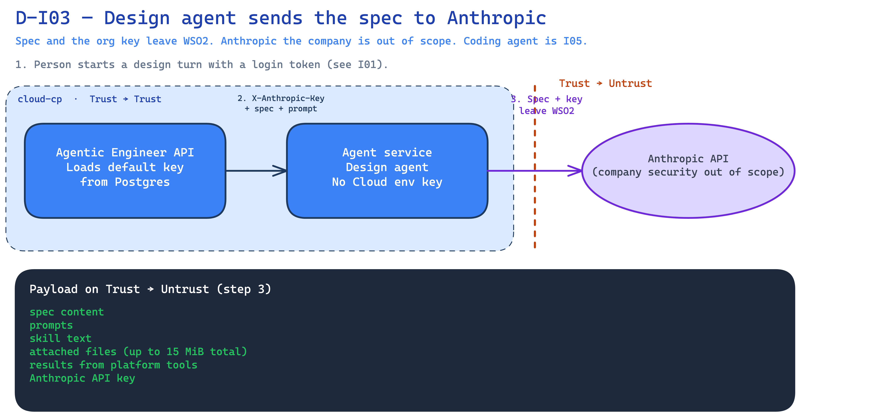

<!--
Copyright (c) 2026, WSO2 LLC. (https://www.wso2.com).

WSO2 LLC. licenses this file to you under the Apache License,
Version 2.0 (the "License"); you may not use this file except
in compliance with the License.
You may obtain a copy of the License at

http://www.apache.org/licenses/LICENSE-2.0

Unless required by applicable law or agreed to in writing,
software distributed under the License is distributed on an
"AS IS" BASIS, WITHOUT WARRANTIES OR CONDITIONS OF ANY
KIND, either express or implied.  See the License for the
specific language governing permissions and limitations
under the License.
-->

# I03: Design agent sends the spec to the AI provider

**Trust Boundary:** Trust → Untrust

**Description**

A person starts a design-agent turn. The Agentic Engineer API loads that organization’s default Anthropic key from Postgres. It calls the agent service inside the cluster. That hop uses a machine login token and sends the key in the `X-Anthropic-Key` header. The agent service has no Anthropic key of its own in this Cloud deployment.

The design agent then calls Anthropic from `cloud-cp`. That call leaves WSO2. It carries the spec, the person’s prompt, skill text, attached files, results from platform tools, and the API key.

Anthropic as a company is out of scope. How Agentic Engineer calls Anthropic is in scope. The coding agent talking to Anthropic is I05.

**Assets Involved**

| Initiator | Intermediate | Target |
| :---- | :---- | :---- |
| Agentic Engineer API (starts the turn after the person calls the API; see I01) | Agent service (design agent on `cloud-cp`) | Anthropic API |

**Data Flow or Sequence Diagram**

**D-I03 — Design agent → Anthropic**

1. The person starts a design turn with a login token (see I01).
2. The API loads the organization’s default key from Postgres. It sends the spec, the prompt, and `X-Anthropic-Key` to the agent service inside the cluster.
3. The design agent calls Anthropic. The spec, prompts, skill text, attached files, tool results, and the key leave WSO2.
4. Anthropic returns model output. The agent service records the turn.

**Payload**

What crosses Trust → Untrust (step 3):

- Spec content
- Prompts
- Skill text
- Attached files (up to 15 MiB total)
- Results from platform tools the design agent called
- Anthropic API key

The in-cluster hop (step 2) also carries the key and a machine token. That hop is Trust → Trust.

**Security Considerations**

| Area | Response | Comments |
| :---- | :---- | :---- |
| Data Confidentiality | High confidential \[C-High\] | The API key is a credential. Spec, prompts, skill text, attached files, and tool results also leave (organization design work; C-Medium). |
| Communication Medium | Network interaction \[M-NT\] | API to agent service inside the cluster. Agent service to Anthropic from `cloud-cp`. |
| Transport Security | **TLS Encryption** | Public Cloud hosts use HTTPS. The Anthropic call is an outbound API call from the agent service. A list of allowed Anthropic hosts was not found. |
| Authentication | **Anthropic API key** | The API sends the organization’s default key in `X-Anthropic-Key`. The person who started the turn uses a login token (see I01). |
| Accessibility | **Egress from `cloud-cp`** | The agent service is not public. Anthropic is outside WSO2. |
| **Access Control and Authorization** | Organization default key only | The API chooses the key. The agent service checks that `X-Org-Id` matches the conversation. Coding-agent calls to Anthropic are I05. |

**Threat Assessment**

| ID | [Category](https://docs.google.com/presentation/d/1m3vIE2nzS_jcW8CIhCMnCaFl3KnOXZXhSLC163shHWs/edit#slide=id.g2d28a95f41a_0_94) | Threat | Materializable | Mitigations / Comment |
| :---- | :---- | :---- | :---- | :---- |
| 1 | Spoofing | A stolen or forged Agentic Engineer login token is used to start a design turn. | See I01 | See I01. |
| 2 | Spoofing | The design agent is pointed at a lookalike Anthropic host and sends the spec and the key there. | Yes | A list of allowed Anthropic hosts was not found. How Agentic Engineer places this call is in scope. |
| 3 | Tampering | Spec, prompt, or key is changed on the way to Anthropic. | Yes | Same outbound path as row 2. No extra integrity control on this hop was found. |
| 4 | Repudiation | A person denies a design turn and we cannot show what was sent to Anthropic. | Yes | Turns are stored. The conversation store is swept after a time to live. We do not keep a full copy of every byte sent to Anthropic. |
| 5 | Information Disclosure | Customer spec, prompts, skill text, attached files, and tool results leave WSO2 to Anthropic. | Yes | This hop is how the design agent works. Agentic Engineer has no documented filter on what this call may send. Anthropic’s own handling is out of scope. |
| 6 | Information Disclosure | The Anthropic key is sent in `X-Anthropic-Key` inside the cluster, then on the outbound call. | Yes | The agent service has no Cloud env key of its own. The API must send the key on each turn. |
| 7 | Denial of Service | Unbounded design turns burn Anthropic quota or the agent service. | Yes | Agentic Engineer has no application rate limit on the user API (see I01). No design-turn quota was found. |
| 8 | Elevation of Privilege | The design agent uses another organization’s Anthropic key. | No | The API sets the key from that organization’s Postgres row. The agent service checks `X-Org-Id` against the conversation id. |
