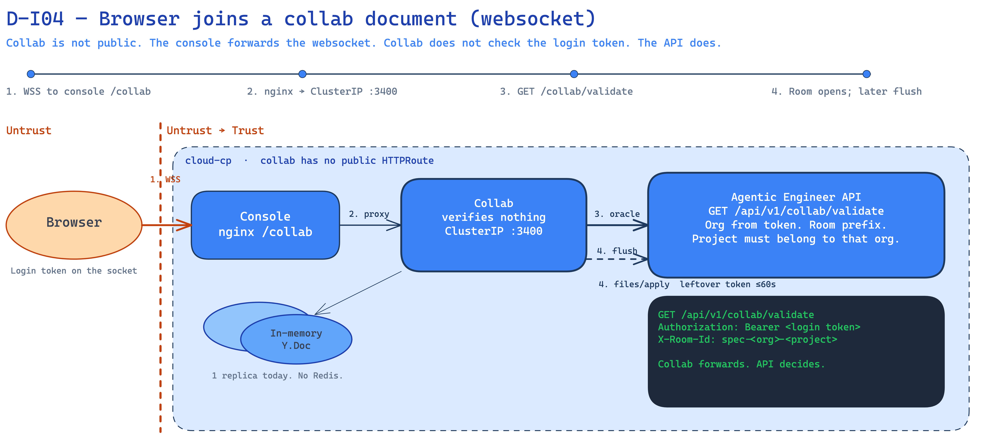

<!--
Copyright (c) 2026, WSO2 LLC. (https://www.wso2.com).

WSO2 LLC. licenses this file to you under the Apache License,
Version 2.0 (the "License"); you may not use this file except
in compliance with the License.
You may obtain a copy of the License at

http://www.apache.org/licenses/LICENSE-2.0

Unless required by applicable law or agreed to in writing,
software distributed under the License is distributed on an
"AS IS" BASIS, WITHOUT WARRANTIES OR CONDITIONS OF ANY
KIND, either express or implied.  See the License for the
specific language governing permissions and limitations
under the License.
-->

# I04: Browser joins a collab document

**Trust Boundary:** Untrust → Trust

**Description**

A person in an organization opens a project spec in the console. The browser opens a websocket to the same console host (`/collab`) over public HTTPS. The console forwards that connection inside the cluster to collab.

Collab is not on the public gateway. There is no public HTTPRoute for it.

Collab does not check the login token. It asks the Agentic Engineer API (`GET /api/v1/collab/validate`) to check it. That call sends the token and the live-spec name (`X-Room-Id`, for example `spec-<org>-<project>`). The API checks the token the same way as I01. Organization comes from the verified token only. The live-spec name must start with that organization’s prefix. The project must belong to that organization. If any of that fails, the live spec does not open.

While people edit, collab keeps the spec in memory on that one pod. About once a minute it saves through the API (`files/apply`). That save still uses the login token from the connection.

**Intended control:** collab is not public. The API checks the login token and the project. AgenticDeveloper and Admin can join and edit. **Today:** any valid organization login token that passes the tenant gate and the project check can join and edit. That gap is I01. Collab runs as one replica. The live spec is only in that pod’s memory.

Stolen Agentic Engineer access tokens are in scope here (see I01). Stolen Thunder/IdP sessions are not.

**Today on Cloud dev (`cloud-cp`):** collab is running (one replica Ready). It is not on the public gateway. The hop does not leave `cloud-cp`.

**Assets Involved**

| Initiator | Intermediate | Target |
| :---- | :---- | :---- |
| Browser (organization person) | Console (forwards the websocket inside the cluster). Collab. | Agentic Engineer API (`GET /api/v1/collab/validate`). Live spec in memory. Later save: `files/apply`. |

**Data Flow or Sequence Diagram**

**D-I04 — Browser → collab websocket**

1. The person opens a websocket to the console `/collab` over public HTTPS. The login token is on that socket (same public path as I01).
2. The console forwards the websocket inside the cluster to collab. That hop is not the public API host.
3. Collab calls `GET /api/v1/collab/validate` with the login token and the live-spec name (`X-Room-Id`). The API checks the token, the organization, and the project. The live spec opens only if that passes.
4. Collab keeps the spec in memory. About once a minute it saves with `files/apply`, still using that login token.

**Payload**

- Login token (JWT) on the websocket
- Live-spec name in `X-Room-Id` (`spec-<org>-<project>`)
- Live spec content
- On save: spec files to `files/apply`

Organization is not taken from the live-spec name. It comes from the verified token. Collab does not split that name.

**Security Considerations**

| Area | Response | Comments |
| :---- | :---- | :---- |
| Data Confidentiality | Medium confidential \[C-Medium\] | Live spec content (design work). The login token on the socket is a credential \[C-High\]. Saving the Anthropic key is I02, not this chapter. |
| Communication Medium | Network interaction \[M-NT\] | Browser to console over the public Cloud gateway (websocket). Console to collab inside the cluster. Collab to API inside the cluster. |
| Transport Security | **TLS Encryption** | Public host uses HTTPS / WSS on `*.gateway`. The console-to-collab hop is in-cluster. |
| Authentication | **Bearer login token (JWT)** | Same as I01. Collab does not check the token. The API does (Thunder public keys). |
| Accessibility | **Publicly Accessible** (console only) | Console is public. Collab is not. The browser reaches collab only through the console. |
| **Access Control and Authorization** | Intended: AgenticDeveloper and Admin. Today: tenant gate + project check only. | The API binds organization from the verified token. It checks the live-spec name prefix and project ownership. It does not check roles. See I01. |

**Threat Assessment**

| ID | [Category](https://docs.google.com/presentation/d/1m3vIE2nzS_jcW8CIhCMnCaFl3KnOXZXhSLC163shHWs/edit#slide=id.g2d28a95f41a_0_94) | Threat | Materializable | Mitigations / Comment |
| :---- | :---- | :---- | :---- | :---- |
| 1 | Spoofing | A stolen or forged Agentic Engineer login token is used to join a live spec. | See I01 | See I01. |
| 2 | Tampering | A caller puts another organization's id into the live-spec name to open that organization's spec. | No | Collab does not split the name. The API takes organization from the verified token. The name must start with `spec-<org>-`. The project must belong to that organization. Mismatch is 403. |
| 3 | Tampering | After the person leaves, collab still saves edits with the login token from that connection. | Yes | The save can still run for about 60 seconds with that token. |
| 4 | Repudiation | A person denies a spec edit from collab and we cannot show who did it. | Yes | Saves go through the API. Participant names can go on the commit. We do not store every live edit in an audit table. |
| 5 | Information Disclosure | Someone on the internet opens a collab websocket without going through the console. | No | Collab is not on the public gateway. The browser path is the console `/collab` proxy. The API still requires a login token. |
| 6 | Denial of Service | A flood of websocket joins, or the one collab pod dies and unsaved spec edits are gone. | Yes | Agentic Engineer has no application rate limit on this path (see I01). Today collab is one replica. The live spec is only in that pod’s memory. Unsaved edits (up to about 60 seconds) die with the pod. |
| 7 | Elevation of Privilege | Any organization login token joins and edits the spec. | Yes | Intended: AgenticDeveloper and Admin. Today the API does not check roles. Token + tenant gate + project check only. See I01. |
