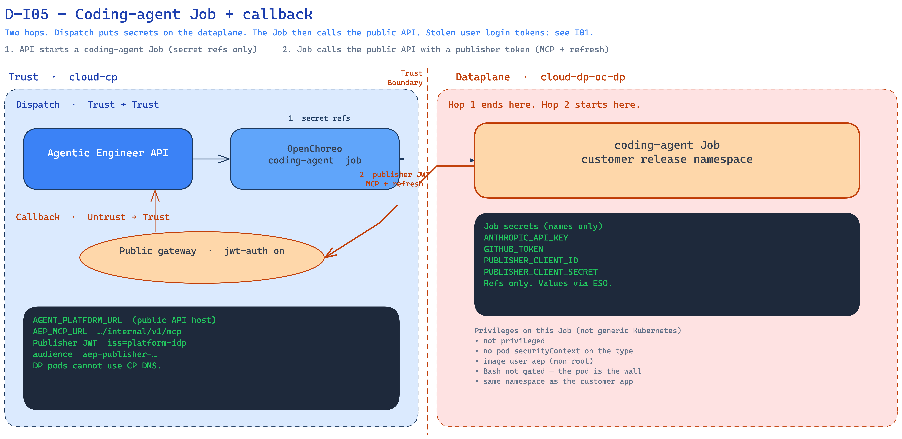

<!--
Copyright (c) 2026, WSO2 LLC. (https://www.wso2.com).

WSO2 LLC. licenses this file to you under the Apache License,
Version 2.0 (the "License"); you may not use this file except
in compliance with the License.
You may obtain a copy of the License at

http://www.apache.org/licenses/LICENSE-2.0

Unless required by applicable law or agreed to in writing,
software distributed under the License is distributed on an
"AS IS" BASIS, WITHOUT WARRANTIES OR CONDITIONS OF ANY
KIND, either express or implied.  See the License for the
specific language governing permissions and limitations
under the License.
-->

# I05: Platform starts a coding-agent Job, and the Job calls back to the API

**Trust Boundary:** Trust → Trust (hop 1, start the Job), then Untrust → Trust (hop 2, Job calls the public API)

**Description**

This chapter is two hops on one picture. Do not split them.

**Hop 1 — start the Job.** A milestone run tells the Agentic Engineer API to start one coding-agent Job. The API does not talk to Kubernetes. It asks OpenChoreo to create a `coding-agent` job in the organization’s project. OpenChoreo creates that Job on the customer dataplane (`cloud-dp-oc-dp`), in the same namespace as that project’s customer app.

The API does not copy secret values onto the Job. It sends **names**. The secret store then puts the real values into that namespace. The Job receives:

- the organization’s Anthropic key (`ANTHROPIC_API_KEY`)
- the organization’s GitHub token (`GITHUB_TOKEN`)
- the organization’s publisher client id and secret (`PUBLISHER_CLIENT_ID`, `PUBLISHER_CLIENT_SECRET`)

The Job also gets the public API address (`AEP_PLATFORM_URL`), the prompt, and git user names. Those are not secrets.

The Job image runs as user `aep`, not as root. It is not a privileged container. The coding agent inside the Job can run shell commands. Agentic Engineer does not add a second sandbox. The only wall is this Job’s container. That Job sits in the same Kubernetes namespace as this organization’s customer app. A breakout could see this organization’s secrets and that app. It would not automatically see another organization’s namespace.

**Hop 2 — the Job calls the public API.** Dataplane pods cannot use control-plane DNS. So the Job calls the **public** Agentic Engineer API (same host as I01, `*.gateway`). It first asks Thunder for a publisher token. It then calls the API with that token and uses platform tools: read organization git, list endpoints. The public gateway checks the token (jwt-auth is on). The API takes the organization from that publisher token, not from the URL or the body.

The Job talks to GitHub with the GitHub token already on it. That GitHub call is not hop 2.

Stolen Agentic Engineer **user** login tokens are I01, not this chapter. Stolen **publisher** tokens are this chapter.

Image builds are I07, not this chapter.

**Intended control:** Cloud billing caps how many coding-agent Jobs can run at once (`coding_agent_jobs`: trial 5, pay-as-you-go 100, enterprise unlimited). Over the cap, OpenChoreo answers **402** and the run is blocked, not failed. **Today:** that metric is in Cloud **dev** and **stage** (wso2cloud#793). It is not in production yet. Who may start a Job still follows I01 (no role check yet). Intended: AgenticDeveloper and Admin.

**Today on Cloud dev:** the API is running (one replica). `AGENT_PLATFORM_URL` points at the public API host. One organization has a `coding-agent` job type. When we looked, no coding-agent was running. OpenChoreo still had a finished run around so logs can be read. For that finished run, the four secret **names** above were still in that organization’s namespace (we did not read the values). Public API jwt-auth is on.

**Assets Involved**

| Initiator | Intermediate | Target |
| :---- | :---- | :---- |
| Agentic Engineer API (starts the Job after a milestone run; a person starting work still uses a login token — see I01) | OpenChoreo. Secret store (values in the customer namespace). | Coding-agent Job on `cloud-dp-oc-dp`, in the same namespace as the customer app |
| Coding-agent Job | Public API gateway (jwt-auth). Thunder (publisher token). | Agentic Engineer API (platform tools: read org git, list endpoints) |

**Data Flow or Sequence Diagram**

**D-I05 — Coding-agent Job + callback**

1. The API asks OpenChoreo to start the Job. Secret **names** go on the Job. Secret **values** appear in the customer namespace.
2. The Job asks Thunder for a publisher token. It calls the public API with that token and uses platform tools (read organization git, list endpoints). Organization comes from that token.

**Payload**

Hop 1 (into the Job):

- Secret names that become `ANTHROPIC_API_KEY`, `GITHUB_TOKEN`, `PUBLISHER_CLIENT_ID`, `PUBLISHER_CLIENT_SECRET`
- Plain values: public API address, prompt, task/org/project ids, git user names

Hop 2 (Job → public API):

- Publisher token (JWT)
- Platform-tool requests. These can read organization git and list endpoints.

The Job also calls GitHub and Anthropic from the dataplane. Those calls are not a third hop on this picture. Secrets sitting on the Job are row 7. Saving the Anthropic key is I02. Design-agent calls to Anthropic are I03.

**Security Considerations**

| Area | Response | Comments |
| :---- | :---- | :---- |
| Data Confidentiality | High confidential \[C-High\] | Anthropic key, GitHub token, and publisher client secret land in the Job. Prompt and repo content are organization work \[C-Medium\]. |
| Communication Medium | Network interaction \[M-NT\] | Hop 1: API to OpenChoreo, then secrets into the dataplane Job. Hop 2: Job to Thunder, then to the public API. |
| Transport Security | **TLS Encryption** | Public callback uses HTTPS on `*.gateway`. |
| Authentication | **Hop 1:** the platform starts the Job. **Hop 2:** Thunder publisher token (JWT) | User login tokens that start a run are I01. On Cloud the Job must use a Thunder token: the public gateway only accepts `iss=platform-idp`. |
| Accessibility | **Hop 1:** not public. **Hop 2:** public API host | The Job has no inbound HTTP. Platform tools share the same public API host as I01. |
| **Access Control and Authorization** | Publisher token. Organization from that token. | Intended Job cap: Cloud billing `coding_agent_jobs` (402 when over). In Cloud **dev** and **stage**; not in production yet. Who may start a Job is I01. |

**Threat Assessment**

| ID | [Category](https://docs.google.com/presentation/d/1m3vIE2nzS_jcW8CIhCMnCaFl3KnOXZXhSLC163shHWs/edit#slide=id.g2d28a95f41a_0_94) | Threat | Materializable | Mitigations / Comment |
| :---- | :---- | :---- | :---- | :---- |
| 1 | Spoofing | A stolen or forged Agentic Engineer **user** login token is used to start a coding-agent run. | See I01 | See I01. |
| 2 | Spoofing | A stolen **publisher** token is used to call platform tools as that organization. | Yes | A valid stolen publisher token is accepted for that organization. There is no revoke list for these machine tokens. User login tokens are I01. |
| 3 | Spoofing | A forged or unsigned publisher token is accepted on the callback. | No | The gateway and the API check a real Thunder token (`iss=platform-idp`, audience `aep-publisher-…`). |
| 4 | Tampering | A caller puts another organization’s id on the callback to act as that organization. | No | Organization comes from the verified publisher token, not from the URL or the body. |
| 5 | Tampering | The API writes secret values onto the Job instead of names. | No | Dispatch sends names only. The Job reads those four secrets from the namespace. The API never copies the values onto the Job. |
| 6 | Repudiation | A person denies a coding-agent run or a platform-tool call and we cannot show what happened. | Yes | The run has labels. Agent logs exist while OpenChoreo keeps the finished run. We do not store every platform-tool call in an audit table. Cancel deletes the run at once (logs go with it). |
| 7 | Information Disclosure | Organization Anthropic key, GitHub token, and publisher secret sit in the customer namespace, including after the Job is gone. | Yes | After a run finishes, the running container is deleted. OpenChoreo still keeps a few finished runs so logs can be read (default 10). While a finished run is kept, those four secret names stay in the namespace. Cancel deletes at once. |
| 8 | Information Disclosure | A stolen publisher token reads that organization’s git and endpoints through platform tools. | Yes | Platform tools can read organization git files and search that git. Organization comes from the token. |
| 9 | Denial of Service | Many coding-agent Jobs, or a flood of public callbacks with a valid publisher token. | Yes | Intended: Cloud billing `coding_agent_jobs` (trial 5 / pay-as-you-go 100 / enterprise unlimited). Over the cap is 402. That metric is in Cloud **dev** and **stage**. It is not in production yet. The job type does not retry. Agentic Engineer has no application rate limit on the public API (see I01). |
| 10 | Elevation of Privilege | The agent’s shell, or a breakout from this Job, reads this organization’s secrets or the customer app in the same namespace. | Yes | The image runs as user `aep`. The Job is not privileged. The agent can run shell commands. The Job is in the same namespace as the customer app. Secrets are per organization, not per project. |
| 11 | Elevation of Privilege | Any organization login token starts a coding-agent Job. | Yes | Intended: AgenticDeveloper and Admin (see actors chapter). Today the user API does not check roles. See I01. |
