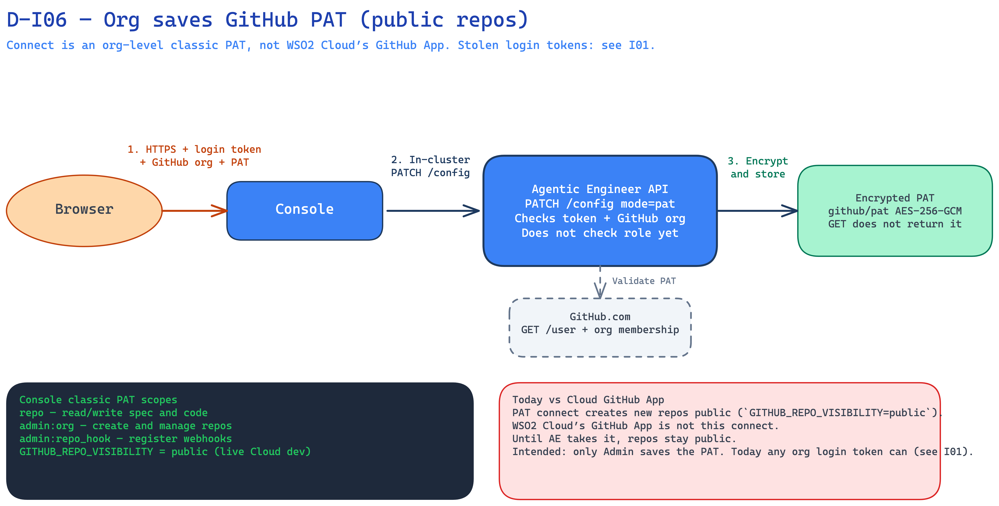

<!--
Copyright (c) 2026, WSO2 LLC. (https://www.wso2.com).

WSO2 LLC. licenses this file to you under the Apache License,
Version 2.0 (the "License"); you may not use this file except
in compliance with the License.
You may obtain a copy of the License at

http://www.apache.org/licenses/LICENSE-2.0

Unless required by applicable law or agreed to in writing,
software distributed under the License is distributed on an
"AS IS" BASIS, WITHOUT WARRANTIES OR CONDITIONS OF ANY
KIND, either express or implied.  See the License for the
specific language governing permissions and limitations
under the License.
-->

# I06: Org connects GitHub (org PAT, public repos)

**Trust Boundary:** Untrust → Trust

**Description**

A person in an organization connects GitHub by saving an **organization-level GitHub personal access token** (classic PAT). They do this in the console (settings or first-time setup) with a login token (JWT). The console calls `PATCH /config` the same way as I02. The body names the GitHub organization and the token. It does not use a GitHub App install.

The API checks the token with GitHub: who the token is, that the person is in that GitHub organization, and (when repos already exist) that the token can read them. Then it stores the token (encrypted) and a webhook HMAC secret for later per-repo hooks (I07). A later GET of settings does not return the token.

The token is a high-confidential credential \[C-High\]. The console asks for classic scopes **`repo`**, **`admin:org`**, and **`admin:repo_hook`**. That is read/write on spec and code, create and manage repos in the GitHub org, and register webhooks. Stolen Agentic Engineer login tokens are I01.

GitHub as a company is out of scope. How Agentic Engineer stores and uses this token is in scope.

WSO2 Cloud has a GitHub App path that authorizes each created repo. **Agentic Engineer has not taken that path.** New project repos are created **public** (`GITHUB_REPO_VISIBILITY=public`). Spec, code, and issues on GitHub.com are world-readable until that Cloud path is used (or the workflow plane can clone private repos). Cloud GitHub App internals stay out of scope (named only).

**Intended control:** only Admin can save this token. **Today:** any valid organization login token can save it. That gap is I01.

**Today on Cloud dev:** `GITHUB_REPO_VISIBILITY=public`. On the API deployment we only record the webhook HMAC secret (`GITHUB_WEBHOOK_SECRET`) and we do not see GitHub App identity configuration (no `GITHUB_APP_ID`, `GITHUB_CLIENT_ID`, `GITHUB_CLIENT_SECRET`, `GITHUB_APP_PRIVATE_KEY_PATH`). That matches this chapter: Agentic Engineer’s connect flow is the PAT save, not a Cloud GitHub App install.

**Assets Involved**

| Initiator | Intermediate | Target |
| :---- | :---- | :---- |
| Browser (organization person) | Console (forwards `PATCH /config` inside the cluster). Public API gateway (only if the public API host is used). GitHub.com (validate the token). | Agentic Engineer API (`PATCH /config` git provider). Encrypted store for the PAT (`github/pat`). |

**Data Flow or Sequence Diagram**

**D-I06 — Org saves GitHub PAT (public repos)**

1. The person sends the GitHub organization name and the PAT with a login token (same public path as I01 / I02). The console forwards `PATCH /config`.
2. The API checks the token with GitHub.com, then encrypts and stores it. GET later does not return it.
3. New project repos are created public. WSO2 Cloud’s GitHub App path is not this product’s connect.

**Payload**

- Login token (JWT). Organization comes from the token, not from the URL or the body. See I01.
- GitHub organization name (which GitHub org the token must belong to)
- Classic GitHub PAT (the secret on this save)
- Scopes the console asks for: `repo`, `admin:org`, `admin:repo_hook`
- New repo visibility: public

**Security Considerations**

| Area | Response | Comments |
| :---- | :---- | :---- |
| Data Confidentiality | High confidential \[C-High\] | The PAT can read and write the GitHub org’s repos, create repos, and register webhooks. Spec and code on public GitHub are organization work \[C-Medium\] and world-readable today. |
| Communication Medium | Network interaction \[M-NT\] | Browser to console over the public Cloud gateway. Console to API inside the cluster. API to GitHub.com to check the token. API to the encrypted store. |
| Transport Security | **TLS Encryption** | Public hosts use HTTPS on `*.gateway`. GitHub.com is HTTPS. |
| Authentication | **Bearer login token (JWT)** | Same as I01. Thunder issues the token. The PAT is the GitHub credential, not the Agentic Engineer login. |
| Accessibility | **Publicly Accessible** | Same public console and user API as I01. |
| **Access Control and Authorization** | Intended: Admin only. Today: tenant gate only. | Who may save the PAT is I01. GitHub membership of the named GitHub org is checked at save time. WSO2 Cloud GitHub App is not this control. |

**Threat Assessment**

| ID | [Category](https://docs.google.com/presentation/d/1m3vIE2nzS_jcW8CIhCMnCaFl3KnOXZXhSLC163shHWs/edit#slide=id.g2d28a95f41a_0_94) | Threat | Materializable | Mitigations / Comment |
| :---- | :---- | :---- | :---- | :---- |
| 1 | Spoofing | A stolen Agentic Engineer access token is used to save or replace this GitHub PAT. | See I01 | See I01. |
| 2 | Tampering | A caller puts another organization’s id in the URL or body to attach the PAT to that organization. | No | Organization comes from the verified login token only, as in I01. |
| 3 | Tampering | A PAT that is not a member of the named GitHub org is accepted. | No | The API checks GitHub identity and org membership before it stores the token. |
| 4 | Repudiation | A person denies saving or rotating this PAT and we cannot show who did it. | Yes | Config patches log which sections changed. They do not store the token. Not every API call is in a dedicated audit table. |
| 5 | Information Disclosure | A later GET of settings returns the raw PAT. | No | Settings secrets are write-only. GET returns connection state, not the token. |
| 6 | Information Disclosure | The PAT sits in Postgres in plaintext. | No | The token is encrypted in the credential store (`github/pat`) with AES-256-GCM and the platform credential-encryption-key. |
| 7 | Information Disclosure | Spec, code, and issues in new project repos are world-readable on GitHub.com. | Yes | Live `GITHUB_REPO_VISIBILITY=public`. Agentic Engineer has not taken the WSO2 Cloud GitHub App path that authorizes each created repo. Anyone on the internet can read that GitHub repo. |
| 8 | Information Disclosure | A stolen PAT (or a token saved by a stolen login) can read and write every repo in that GitHub org, create repos, and change webhooks. | Yes | Those are the scopes the console asks for (`repo`, `admin:org`, `admin:repo_hook`). There is no narrower Cloud connect. Stolen Agentic Engineer login tokens are I01. |
| 9 | Denial of Service | A flood of settings saves with a valid organization token. | Yes | Agentic Engineer has no application rate limit on this API. Same public API as I01. |
| 10 | Elevation of Privilege | An AgenticDeveloper (or any organization login token) saves or replaces the organization’s GitHub PAT. | Yes | Intended: Admin only. Today the API does not check roles. See I01. |
