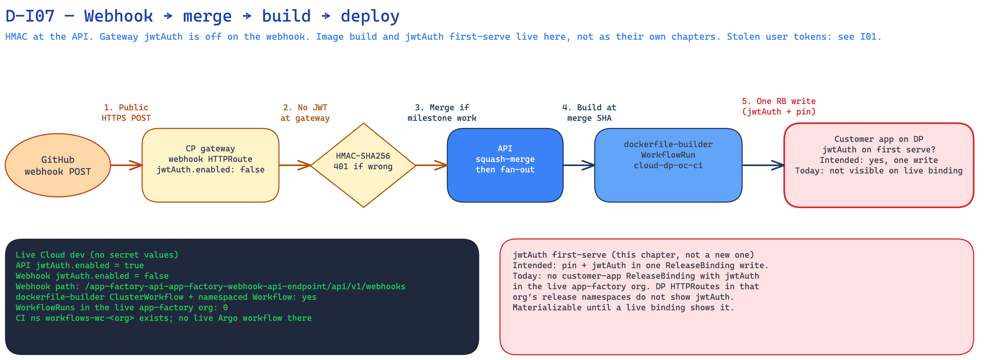

<!--
Copyright (c) 2026, WSO2 LLC. (https://www.wso2.com).

WSO2 LLC. licenses this file to you under the Apache License,
Version 2.0 (the "License"); you may not use this file except
in compliance with the License.
You may obtain a copy of the License at

http://www.apache.org/licenses/LICENSE-2.0

Unless required by applicable law or agreed to in writing,
software distributed under the License is distributed on an
"AS IS" BASIS, WITHOUT WARRANTIES OR CONDITIONS OF ANY
KIND, either express or implied.  See the License for the
specific language governing permissions and limitations
under the License.
-->

# I07: GitHub webhook: merge, build, deploy

**Trust Boundary:** Untrust → Trust

**Description**

GitHub tells Agentic Engineer that work happened in a connected repo. GitHub POSTs to a **public** webhook HTTPRoute on the control-plane gateway. Gateway jwtAuth is **off** on that route so GitHub can deliver without a login token. The API checks an HMAC (`X-Hub-Signature-256`) instead. It routes the event to one organization from the App installation (or repo), stores a redacted copy, and ignores duplicates of the same delivery id.

This chapter is one pipeline. Do not split image build or jwtAuth-on-deploy into their own chapters.

When a coding pull request is ready and closes milestone work, Agentic Engineer squash-merges it. A **merged** pull request fans out image builds, then deploy.

**Build (folded in).** The API asks OpenChoreo for a `dockerfile-builder` WorkflowRun. That type is a cluster workflow on `cloud-dp-oc-cp`, bound to the default workflow plane (`cloud-dp-oc-ci`). Each organization has a namespaced `dockerfile-builder` Workflow. The clone uses the org git credential (SecretReference / GitSecret path). The workflow lives about one day after it finishes. Agentic Engineer platform images are not built here.

**Deploy.** After builds are green, the API writes the customer-app ReleaseBinding: release pin and trait config together, including jwtAuth when the design says the API is protected. **Intended:** a protected app does not serve before that jwtAuth is on the binding. **Today:** no customer-app ReleaseBinding was visible in the live app-factory org, and dataplane HTTPRoutes in that org’s release namespaces do not show jwtAuth. Treat the first-serve window as still materializable until a live customer-app binding shows jwtAuth on first serve.

Stolen Agentic Engineer **user** login tokens (including a person triggering a build from the API) are I01. GitHub as a company is out of scope. How Agentic Engineer uses the webhook, the builder, and jwtAuth is in scope.

**Today on Cloud dev:** webhook HTTPRoute exists on `development-wso2cloud.gateway.dev.cloud.wso2.com` at `/app-factory-api-app-factory-webhook-api-endpoint/api/v1/webhooks` (external). API jwtAuth is on; webhook jwtAuth is off. `GITHUB_WEBHOOK_DELIVERY_URL` points at `…/api/v1/webhooks/github`. `dockerfile-builder` ClusterWorkflow and a namespaced Workflow exist; the app-factory org had **zero** WorkflowRuns. The CI cluster has `workflows-wc-*` namespaces (including this org); no live Argo workflow was in that org ns. Customer-app jwtAuth was **not** visible on `cloud-dp-oc-dp` (ReleaseBinding is not a dataplane CR; HTTPRoutes in that org’s release namespaces had no jwt filter).

**Assets Involved**

| Initiator | Intermediate | Target |
| :---- | :---- | :---- |
| GitHub (webhook delivery) | Public control-plane gateway (webhook HTTPRoute, jwtAuth off). Agentic Engineer API (HMAC, merge, fan-out). OpenChoreo (`dockerfile-builder` WorkflowRun on the workflow plane). | Customer app on the dataplane gateway (`cloud-dp-oc-dp`) |

**Data Flow or Sequence Diagram**

**D-I07 — Webhook → merge → build → deploy**

1. GitHub POSTs to the public webhook HTTPRoute. Gateway jwtAuth is off.
2. The API checks HMAC, maps the event to one organization, and stores a redacted copy.
3. A ready coding pull request that closes milestone work is squash-merged.
4. A merged pull request fans out `dockerfile-builder` WorkflowRuns on `cloud-dp-oc-ci`.
5. After builds, the API writes the customer-app ReleaseBinding (jwtAuth in the same write when the API is protected) and the app is served on the dataplane gateway.

**Payload**

- Webhook headers: `X-Hub-Signature-256`, `X-GitHub-Event`, `X-GitHub-Delivery`
- `pull_request` JSON (action, merged, merge SHA, files, repo)
- HMAC secret (used to check the signature; not in the body)
- WorkflowRun (image build at the merge SHA)
- ReleaseBinding trait config, including `jwtAuth.enabled` when the design says the API is protected

**Security Considerations**

| Area | Response | Comments |
| :---- | :---- | :---- |
| Data Confidentiality | High confidential \[C-High\] | HMAC and git clone credentials are C-High. Merge payloads are organization spec and code \[C-Medium\], and they are public today (I06). Bodies are stored after redact of the test-user marker. HMAC uses the App webhook secret (platform Secret **name** `GITHUB_WEBHOOK_SECRET` on the API). The API then checks that secret for the organization that owns the install. |
| Communication Medium | Network interaction \[M-NT\] | GitHub to public CP gateway. API to OpenChoreo for WorkflowRun and ReleaseBinding. Builder clones GitHub from the CI plane. Customer app is served on the DP gateway. |
| Transport Security | **TLS Encryption** | Public webhook host is HTTPS on `*.gateway`. GitHub.com clone is HTTPS. |
| Authentication | **HMAC-SHA256** on the webhook. Not a login token. | Gateway jwtAuth is off on the webhook HTTPRoute by design. User API jwtAuth stays on (I01). |
| Accessibility | **Publicly Accessible** (webhook). Image build is not a public HTTP API. Customer apps are public on `*.gateway.dp` unless visibility is internal. | Anyone who can reach the webhook host can POST. Without a valid HMAC the API returns 401. |
| **Access Control and Authorization** | HMAC + installation/repo → one organization. Deploy jwtAuth is a separate row. | A webhook for an unknown install is 200 no-op. Who may trigger a build from the user API is I01. |

**Threat Assessment**

| ID | [Category](https://docs.google.com/presentation/d/1m3vIE2nzS_jcW8CIhCMnCaFl3KnOXZXhSLC163shHWs/edit#slide=id.g2d28a95f41a_0_94) | Threat | Materializable | Mitigations / Comment |
| :---- | :---- | :---- | :---- | :---- |
| 1 | Spoofing | A stolen Agentic Engineer access token is used to start a build or deploy through the user API. | See I01 | See I01. |
| 2 | Spoofing | A forged webhook (missing or wrong HMAC) is accepted as a real GitHub event. | No | The API checks `X-Hub-Signature-256` (HMAC-SHA256) against the org’s accepted secrets. Bad or malformed signatures are 401. |
| 3 | Spoofing | A stolen webhook HMAC is used to send a fake merge (or other) event for that organization. | Yes | A valid HMAC is accepted. Gateway jwtAuth is off on this path by design. There is no extra GitHub proof at the gateway. Rotate the HMAC if it leaks. |
| 4 | Tampering | A webhook for one organization’s install is applied to another organization. | No | The API maps `installation.id` (App) to one organization, then checks HMAC for that organization. Unknown installs are 200 no-op. |
| 5 | Tampering | A replayed delivery is processed twice (double merge/build). | No | Dedup is on `X-GitHub-Delivery`. An already-processed id is 200 and skipped. |
| 6 | Tampering | A malicious Dockerfile in the (public) repo is built and the image is deployed as the customer app. | Yes | `dockerfile-builder` builds whatever the merge SHA contains. Repos are public (I06). This is how Agentic Engineer uses GitHub and the workflow plane, not a review of GitHub-the-company. |
| 7 | Repudiation | A person denies a merge, build, or deploy and we cannot show the GitHub delivery. | Yes | Deliveries are stored (redacted). We do not yet have a full human-readable audit of every merge decision and every ReleaseBinding write. |
| 8 | Information Disclosure | Webhook bodies (spec text, issue text, file lists) sit in Postgres. | Yes | Bodies are persisted after redact of the test-user marker. Public repos already make the same content world-readable (I06). |
| 9 | Denial of Service | A flood of POSTs to the public webhook host. | Yes | HMAC still runs. Forgery that fails HMAC is 401. Forced secret refetch on mismatch is rate-limited per org and source IP. Agentic Engineer has no other application rate limit. Volumetric DDoS at the Cloud edge is out of scope. |
| 10 | Elevation of Privilege | A protected customer API goes live without login (jwtAuth first-serve window). | Yes | Intended: one ReleaseBinding write with the release pin and `jwtAuth.enabled: true` before first serve. Today no customer-app ReleaseBinding with jwtAuth was visible in the live app-factory org, so we cannot treat that control as in place here. Dataplane HTTPRoutes in that org’s release namespaces do not show jwtAuth. |
