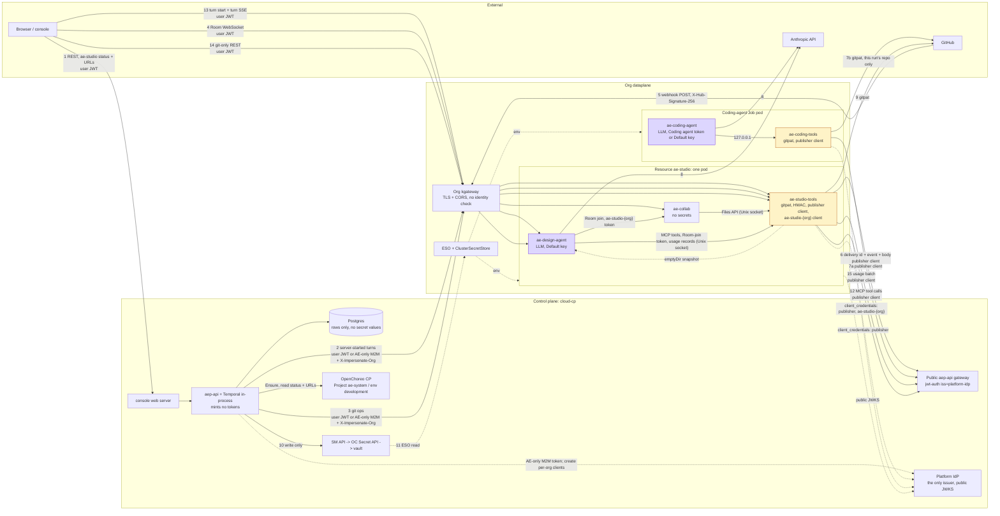

# 03 Components

Every runtime in the intended architecture: its job, what it mounts, and what it exposes. The picture shows WSO2 Cloud. Local differences are in [11-local-vs-cloud.md](11-local-vs-cloud.md). Flow numbers on the arrows are explained in [04-flows.md](04-flows.md).

Source: [01-end-to-end.excalidraw](diagrams/01-end-to-end.excalidraw).

Mermaid version of 01

## The naming rule

Each dataplane pod is an **agent** plus its **tools**:

- A `*-agent` container runs a model. It holds only the org's AI keys: the Default key, or for a coding run the Coding agent token. Where a coding run's other secrets go is open item O-11.
- A `*-tools` container runs no model. It holds the gitpat, the org HMAC (on `ae-studio-tools` only), the publisher client, and the `ae-studio-<org>` client (on `ae-studio-tools` only).

Each image has the same name as its container.

## Control plane

| Component | Job | Holds | Exposes |
|---|---|---|---|
| console | The browser app. On load it asks `aep-api` for the `ae-studio` status and URLs, then calls `ae-studio` directly. | Nothing secret. | Browser UI. Its web server passes API calls to `aep-api` inside the control plane (flow 1). |
| `aep-api` (BFF, the console's backend) | Authorizes users. Keeps rows in Postgres, including the usage ledger. Writes secrets through the SM API. Ensures the dataplane Resource and reads its status and URLs. Creates the per-org clients `aep-publisher-<org>` and `ae-studio-<org>`. Calls `ae-studio` (flows 2, 3) with the forwarded user JWT, or with the AE-only M2M token and `X-Impersonate-Org` when no user is on the request. Runs the Temporal worker in the same process. It mints no token, publishes no JWKS, copies no turn stream, and keeps no turn lock or conversation thread. | The `APP_FACTORY_BFF_TO_AE_STUDIO` client secret (working name). A gitpat or org HMAC only in memory, only during gitpat submit. | The console web server's API path (flow 1); the public `aep-api` gateway (`jwt-auth`, `iss=platform-idp`) for flows 6, 7a, 12 and 15. |
| Postgres | Rows: repositories, webhook deliveries, the usage ledger. | **No organization secret values.** | Only to `aep-api`. |
| SM API | Writes secret values into vault through the OpenChoreo Secret API, and creates a SecretReference with names only. | Nothing it gives back. | Write-only. GET returns keys and `secretReferenceName` only. |
| Platform IdP | The shared Thunder issuer (`iss=platform-idp`) and the only issuer AE uses. Issues user JWTs, publisher client tokens, `ae-studio-<org>` tokens and the AE-only M2M token. | Inherited platform. | Inherited platform. Its JWKS is public. |
| OpenChoreo control plane | Holds Project `ae-system`, its `development` ProjectReleaseBinding, and Resource `ae-studio`. Renders them into the dataplane. Reports the Resource's URLs (`status.outputs`) and readiness (`Ready`) on its ResourceReleaseBinding. | SecretReference objects (names only) in the org control-plane namespace (`wc-…` in Cloud, `default` locally). | Inherited platform. |

## Org dataplane

### Resource `ae-studio`

An OpenChoreo **Resource** of a custom ResourceType, also named `ae-studio`. It lives in Project `ae-system`, environment `development`, in both installs. It is one pod with three containers. It is **not** a Room. Many Rooms can be live on it. There is one `ae-studio` pod per org, so turn state can stay in the pod.

Each container checks its own tokens against the public Platform IdP JWKS, with the org and role rule ([07-identity-and-tokens.md](07-identity-and-tokens.md)).

| Container | Job | Mounts | Exposes |
|---|---|---|---|
| `ae-design-agent` | Runs the design agent model. Starts turns and streams them to the browser. Holds the one-active-turn lock, the conversation thread and its rotation. Reads snapshots from the shared emptyDir. Runs server-started turns for `aep-api`. Buffers the usage record of each finished turn for `ae-studio-tools`. Calls platform MCP tools on `ae-studio-tools` over a Unix socket. No URL-fetch tool; web search runs at Anthropic as a model tool; its file tools stay inside the snapshot. | **Default key only.** For a Room join, the `ae-studio-<org>` token from `ae-studio-tools` sits in memory. | Turn route behind the org kgateway: turn start and turn SSE for the browser (flow 13), server-started turns from `aep-api` (flow 2). |
| `ae-collab` | The Yjs Room WebSocket server. Talks the Files API to `ae-studio-tools` over a Unix socket (`files/bundle`, `files/apply`, seed, flush). It does not speak git. | **No secrets.** | Room WebSocket behind the org kgateway, for the browser with the user JWT (flow 4). The same server on `localhost` for `ae-design-agent` with the `ae-studio-<org>` token. |
| `ae-studio-tools` | Runs no model. Clone, fetch, commit, push. GitHub REST (issues, PRs, milestones, merge, repo create). The skills mirror into a project repo. Git-only REST for the browser. The MCP server for `ae-design-agent`: remote-git tools with the gitpat, other tools passed to `aep-api` (flow 12). Gets the `ae-studio-<org>` token and hands it to `ae-design-agent` for a Room join. Sends usage batches to `aep-api` (flow 15). Webhook receive and HMAC check. Writes snapshots to the shared emptyDir. Calls `aep-api` as the publisher client. | gitpat, org HMAC, publisher client (`client_id`, `client_secret`), `ae-studio-<org>` client (`client_id`, `client_secret`). | Service route behind the org kgateway: flow 3 from `aep-api`, git-only REST from the browser (flow 14). Webhook route (flow 5). Files API on a Unix socket that only `ae-collab` can reach. MCP tools on a second Unix socket that only `ae-design-agent` can reach. It never returns a secret value. |

All containers in a pod share one network: any container can reach any `localhost` port. So a `localhost` port cannot keep `ae-design-agent` out. Inside the pod:

- `ae-collab` → `ae-studio-tools`: the Files API on a Unix socket, in an emptyDir mounted only into those two containers. No token.
- `ae-design-agent` → `ae-studio-tools`: platform MCP tools, the Room-join token request and usage records on a second Unix socket, in its own emptyDir mounted only into those two containers. No token.
- `ae-design-agent` → `ae-collab`: the Room WebSocket with the `ae-studio-<org>` token ([07-identity-and-tokens.md](07-identity-and-tokens.md)).
- `ae-studio-tools` → `ae-design-agent`: snapshots in a shared named emptyDir. No call.

Listeners for flows 2, 3, 4, 5, 13 and 14 are the only Resource endpoints. No internal API is an endpoint.

### Routes of Resource `ae-studio`

The ResourceType renders the routes on the org kgateway and publishes their public URLs as outputs, which `aep-api` reads for the console.

- **CORS.** Each browser-facing route has a Gateway API `CORS` filter: the exact console origin, `Authorization` and `Content-Type` allowed, no credentials. The gateway answers preflight, so preflight needs no token and never reaches a container.
- **Timeouts.** The turn SSE route and the Room WebSocket route have raised request and stream-idle timeouts, so the gateway does not cut a long stream.

### Coding agent Job

A separate, one-shot pod per run cycle. OpenChoreo renders it from a `coding-agent` Component, as today, now with two containers.

| Container | Job | Mounts | Exposes |
|---|---|---|---|
| `ae-coding-agent` | Runs the coding agent model with Bash, the build tools and the workspace. | The Coding agent token (the org's Claude subscription token) when the org has one, otherwise the Default key. No gitpat, no publisher client, no HMAC. Dependency secrets and test-user passwords: open item O-11. | Nothing inbound. |
| `ae-coding-tools` | Runs no model. Does git and GitHub for **this run's repository only**, and platform calls for **this run only**. Serves the platform MCP tools to `ae-coding-agent`: remote-git with the gitpat, the rest over flow 7a. | gitpat, publisher client. | An API on `127.0.0.1` for `ae-coding-agent`, not an endpoint. It never returns a secret value and never writes one into the shared workspace. |

### Shared dataplane parts

| Part | Job |
|---|---|
| Org kgateway | Public gateway of the org dataplane. TLS, and CORS on the `ae-studio` routes. It does not check identity; each container checks its own token. |
| ESO + ClusterSecretStore | ESO (External Secrets Operator) reads vault and writes a Kubernetes Secret into the release namespace. Containers get values as environment variables. |

## Outside

| Party | Talks to |
|---|---|
| Browser | The console web server, then `aep-api` (flow 1); `ae-design-agent` (flow 13), `ae-collab` (flow 4) and `ae-studio-tools` (flow 14) on the public URLs of Resource `ae-studio`. |
| GitHub | Receives git and REST calls with the gitpat (flows 7b, 9). Posts webhooks to `ae-studio-tools` (flow 5). |
| Anthropic API | Called by `ae-design-agent` and `ae-coding-agent` on public 443 (flow 8). |

## Not chosen, and why

- **A stock `service` Component for the runtime.** It has one `main` container, so every secret would land on the model container.
- **One container for the whole runtime.** The model would sit next to the gitpat and the HMAC.
- **Two OpenChoreo Components for the runtime.** More objects to Ensure, and the split between them does not match the secret split.
- **A custom Component, like the coding agent.** It brings the `coding-agent` Ensure chain and still needs a Project. A Resource fits a long-lived system runtime.
- **collab and git in one container.** Needs a rewrite or a process supervisor, and puts the gitpat next to collab. A later wish for this needs a fresh decision, because it changes the secret split and the trust boundaries.
- **agent and collab in one container.** Mixes the model with the Room server.
- **Project `wc-system`.** App Factory orgs do not get `wc-system`.
- **A user Project.** Deleting the user's Project would delete the runtime.
- **A ClusterResourceType on cloud-cp.** Wrong plane: the runtime must run in the org dataplane.
- **`ae-workspace` as the Resource name.** "Workspace" already names other things (the `/workspaces` volume, the coding Job's emptyDir), and the glossary avoids it for Room and Spec bundle.
- **Turn start on `aep-api` with the turn SSE direct from `ae-design-agent`.** An extra hop, and `aep-api` would still need a turn-end report from the pod.
- **The turn lock, the conversation thread and the turn stream copy on `aep-api`.** They need the model key and the snapshots, which live in the pod. One pod per org keeps them pod-local.
- **`aep-api` pulls usage from `ae-studio`.** Push was chosen: `ae-studio-tools` already calls `aep-api` as the publisher client.
