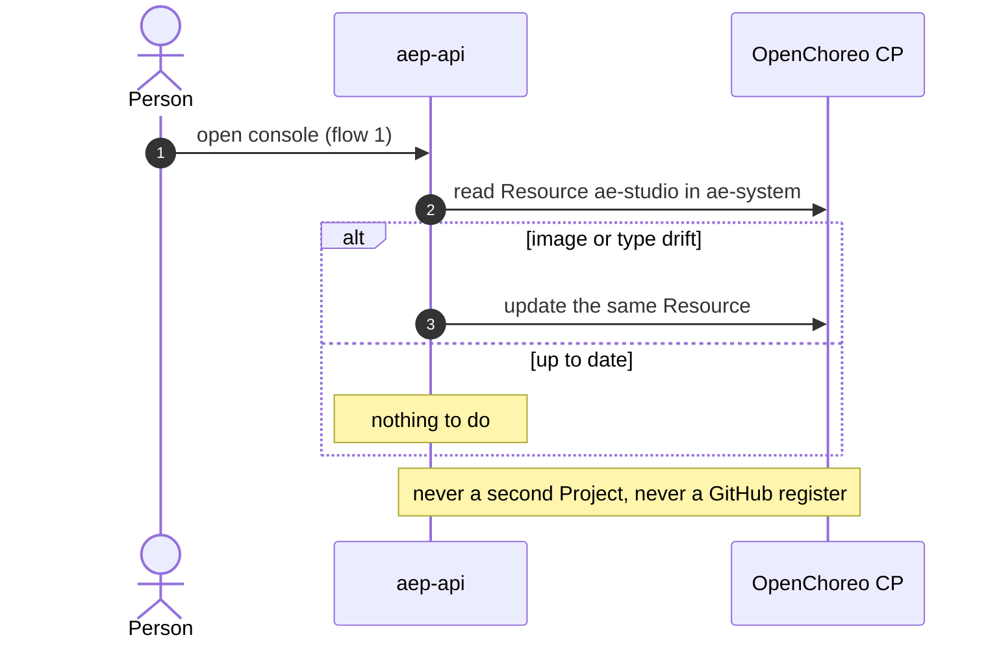

# 05 Lifecycle

When things are created, written, upgraded and started. Flow numbers refer to [04-flows.md](04-flows.md).

## gitpat submit (Connect)

gitpat submit is the one moment the control plane holds the gitpat. The procedure creates the dataplane runtime and registers the GitHub webhook.

1. The person pastes the gitpat in the console. The request reaches `aep-api` over flow 1.
2. `aep-api` checks the gitpat against GitHub, in memory.
3. `aep-api` writes the gitpat and the org HMAC through the SM API (flow 10). SM API writes vault and creates a SecretReference with names only.
4. `aep-api` creates or heals Project `ae-system`, its `development` ProjectReleaseBinding and Resource `ae-studio` (the Ensure step below).
5. `aep-api` waits until `ae-studio-tools` can accept a POST on its public webhook address.
6. `aep-api` registers that address on GitHub once, with the in-memory gitpat and the org HMAC.
7. `aep-api` drops the gitpat. It never reads it again.

If the wait in step 5 ends with no address, `aep-api` registers no hook. There is no placeholder URL and no second URL: the control-plane webhook URL is not a stand-in. Because `aep-api` cannot read the gitpat after step 7, it cannot patch the hook later.

On a local install, smee is inside the wait in step 5: the hook is created only after the in-cluster smee client forwards to a ready `ae-studio-tools` ([11-local-vs-cloud.md](11-local-vs-cloud.md)).

```mermaid
sequenceDiagram
  autonumber
  actor U as Person
  participant API as aep-api
  participant GH as GitHub
  participant SM as SM API
  participant V as vault
  participant OC as OpenChoreo CP
  participant ST as ae-studio-tools
  U->>API: paste gitpat (flow 1)
  API->>GH: check gitpat (in memory)
  API->>SM: write gitpat + org HMAC (flow 10)
  SM->>V: write via OpenChoreo Secret API
  SM-->>API: keys + secretReferenceName only
  API->>OC: Ensure ae-system, ProjectReleaseBinding, Resource ae-studio (refs only)
  OC-->>ST: render pod; ESO mounts gitpat, HMAC, publisher client (flow 11)
  loop until ready or wait ends
    API->>ST: is the public webhook address ready?
  end
  API->>GH: register webhook once (in-memory gitpat, org HMAC)
  Note over API: drop gitpat. aep-api never reads it again.
```

## Key writes

The Default key and the Coding agent token are written the same way as the gitpat:

1. The person enters the key in the console. It reaches `aep-api` over flow 1.
2. `aep-api` writes it through the SM API (flow 10). The console shows only a projection (for example a prefix and the last four characters).
3. `aep-api` never reads the value back. ESO delivers it to the container that mounts it ([06-secrets.md](06-secrets.md)).

How a changed value reaches a container that is already running is not yet specified. See [12-gaps-and-open-items.md](12-gaps-and-open-items.md).

## Ensure

`aep-api` Ensures three OpenChoreo objects, in both installs:

| Object | Name |
|---|---|
| Project | `ae-system` |
| ProjectReleaseBinding | the `development` environment of `ae-system` |
| Resource (of ResourceType `ae-studio`) | `ae-studio` |

The Resource carries secret **references** only: the environment variable name, the SecretReference name and the key. OpenChoreo's ReleaseBinding collects the SecretReferences and renders an ExternalSecret into the dataplane release namespace.

In WSO2 Cloud, the orchestrator cannot create this Resource today, so `aep-api` does it. A Project created by `aep-api` counts toward the org's `projects` quota and is visible to the org. That is accepted for now ([12-gaps-and-open-items.md](12-gaps-and-open-items.md)).

## Upgrade on console load

A later console load may update the **same** Resource: a new image, a changed ResourceType, a re-pin. The upgrade:

- updates Resource `ae-studio` in place;
- never creates a second Project;
- never registers GitHub again, because the control plane has no gitpat.



## Coding Job start

The coding agent Job is created per run cycle, as today. What changes is the pod shape and where the secrets land.

1. The person clicks build in the console (flow 1). `aep-api` stamps the publisher client SecretReference while the user's JWT is on the request.
2. The Temporal worker inside `aep-api` dispatches the run cycle. It reads secret **reference names** only.
3. `aep-api` creates the `coding-agent` Component and its release through the OpenChoreo API. The Workload carries references only.
4. OpenChoreo renders the Job into the project's dataplane release namespace. ESO mounts:
   - on `ae-coding-agent`: the Coding agent token, or the Default key when the org has no Coding agent token;
   - on `ae-coding-tools`: the gitpat and the publisher client.
5. `ae-coding-tools` gets a publisher client token at the Platform IdP (`client_credentials`), then calls `aep-api` for this run (flow 7a) and GitHub for this run's repository (flow 7b).
6. The run cycle settles on GitHub webhooks (pull request opened or merged), which now arrive through `ae-studio-tools` (flows 5 and 6).

```mermaid
sequenceDiagram
  autonumber
  actor U as Person
  participant API as aep-api + Temporal
  participant OC as OpenChoreo CP
  participant CA as ae-coding-agent
  participant CT as ae-coding-tools
  participant IDP as Platform IdP
  participant GH as GitHub
  U->>API: build (flow 1)
  API->>OC: coding-agent Component + release (refs only)
  OC-->>CA: Job pod; ESO mounts Anthropic key
  OC-->>CT: Job pod; ESO mounts gitpat + publisher client
  CT->>IDP: client_credentials
  CA->>CT: 127.0.0.1: git, GitHub, platform actions
  CT->>GH: this run's repo only (flow 7b)
  CT->>API: this run's platform calls (flow 7a)
  GH-->>API: PR webhook via ae-studio-tools (flows 5, 6)
```
