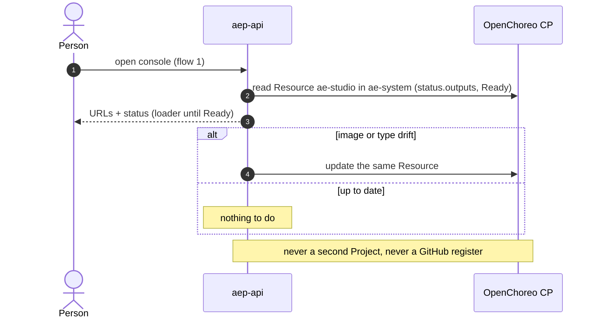

# 05 Lifecycle

When things are created, written, upgraded and started. Flow numbers refer to [04-flows.md](04-flows.md).

## gitpat submit (Connect)

gitpat submit is the one moment the control plane holds the gitpat. The procedure creates the dataplane runtime and registers the GitHub webhook.

1. The person pastes the gitpat in the console. The request reaches `aep-api` over flow 1.
2. `aep-api` checks the gitpat against GitHub, in memory.
3. `aep-api` writes the gitpat and the org HMAC through the SM API (flow 10). SM API writes vault and creates a SecretReference with names only.
4. Before the Ensure step, `aep-api` creates the `ae-studio-<org>` client (a Thunder Agent entity in the org OU) at the Platform IdP, if it does not exist. It writes the client secret through the SM API (flow 10), as it does for the publisher client.
5. `aep-api` creates or heals Project `ae-system`, its `development` ProjectReleaseBinding and Resource `ae-studio` (the Ensure step below).
6. `aep-api` waits until `ae-studio-tools` can accept a POST on its public webhook address.
7. `aep-api` registers that address on GitHub once, with the in-memory gitpat and the org HMAC.
8. `aep-api` drops the gitpat. It never reads it again.

If the wait in step 5 ends with no address, `aep-api` registers no hook. There is no placeholder URL and no second URL: the control-plane webhook URL is not a stand-in. Because `aep-api` cannot read the gitpat after step 8, it cannot patch the hook later.

On a local install, smee is inside the wait in step 5: the hook is created only after the in-cluster smee client forwards to a ready `ae-studio-tools` ([11-local-vs-cloud.md](11-local-vs-cloud.md)).

```mermaid
sequenceDiagram
  autonumber
  actor U as Person
  participant API as aep-api
  participant GH as GitHub
  participant SM as SM API
  participant V as vault
  participant OC as OpenChoreo CP
  participant ST as ae-studio-tools
  U->>API: paste gitpat (flow 1)
  API->>GH: check gitpat (in memory)
  API->>SM: write gitpat + org HMAC (flow 10)
  SM->>V: write via OpenChoreo Secret API
  SM-->>API: keys + secretReferenceName only
  API->>SM: write ae-studio-&lt;org&gt; client secret (flow 10)
  API->>OC: Ensure ae-system, ProjectReleaseBinding, Resource ae-studio (refs only)
  OC-->>ST: render pod; ESO mounts gitpat, HMAC, publisher client, ae-studio-&lt;org&gt; client (flow 11)
  loop until ready or wait ends
    API->>ST: is the public webhook address ready?
  end
  API->>GH: register webhook once (in-memory gitpat, org HMAC)
  Note over API: drop gitpat. aep-api never reads it again.
```

## Key writes

The Default key and the Coding agent token are written the same way as the gitpat:

1. The person enters the key in the console. It reaches `aep-api` over flow 1.
2. `aep-api` writes it through the SM API (flow 10). The console shows only a projection (for example a prefix and the last four characters).
3. `aep-api` never reads the value back. ESO delivers it to the container that mounts it ([06-secrets.md](06-secrets.md)).

How a changed value reaches a container that is already running is not yet specified. See [12-gaps-and-open-items.md](12-gaps-and-open-items.md).

## Ensure

`aep-api` Ensures three OpenChoreo objects, in both installs:

| Object | Name |
|---|---|
| Project | `ae-system` |
| ProjectReleaseBinding | the `development` environment of `ae-system` |
| Resource (of ResourceType `ae-studio`) | `ae-studio` |

The `ae-studio-<org>` client is created before the Ensure step, in the same gitpat submit run. Its secret is a SecretReference on the Resource, mounted only on `ae-studio-tools` ([06-secrets.md](06-secrets.md)).

The Resource carries secret **references** only: the environment variable name, the SecretReference name and the key. OpenChoreo's ReleaseBinding collects the SecretReferences and renders an ExternalSecret into the dataplane release namespace.

In WSO2 Cloud, the orchestrator cannot create this Resource today, so `aep-api` does it. A Project created by `aep-api` counts toward the org's `projects` quota and is visible to the org. That is accepted for now ([12-gaps-and-open-items.md](12-gaps-and-open-items.md)).

## Console load

On every console load, the console asks `aep-api` for the status and public URLs of Resource `ae-studio` (flow 1). `aep-api` reads the Resource's ResourceReleaseBinding in OpenChoreo:

- the URLs come from `status.outputs`. The ResourceType publishes them as outputs, because a Resource has no invoke URL;
- readiness comes from the `Ready` condition.

Until `Ready`, the console shows a loader and makes no call to `ae-studio`. Then the console calls `ae-design-agent`, `ae-collab` and `ae-studio-tools` directly with the user JWT ([04-flows.md](04-flows.md)).

## Upgrade on console load

The same load may update the **same** Resource: a new image, a changed ResourceType, a re-pin. The upgrade:

- updates Resource `ae-studio` in place;
- never creates a second Project;
- never registers GitHub again, because the control plane has no gitpat.

```mermaid
sequenceDiagram
  autonumber
  actor U as Person
  participant API as aep-api
  participant OC as OpenChoreo CP
  U->>API: open console (flow 1)
  API->>OC: read Resource ae-studio in ae-system (status.outputs, Ready)
  API-->>U: URLs + status (loader until Ready)
  alt image or type drift
    API->>OC: update the same Resource
  else up to date
    Note over API: nothing to do
  end
  Note over API,OC: never a second Project, never a GitHub register
```

## The AE-only client

`APP_FACTORY_BFF_TO_AE_STUDIO` (working name) is not created by `aep-api` at runtime. WSO2 Cloud provisions it once: the Platform IdP application in the admin OU, its secret in the SRE vault, and its delivery to `aep-api` in the WSO2 Cloud deployment (O-15 in [12-gaps-and-open-items.md](12-gaps-and-open-items.md)). It is not in platform-api's impersonation policy. Local differences are in [11-local-vs-cloud.md](11-local-vs-cloud.md). `aep-api` uses it for Temporal work, kickoff, the marketplace chat, and the `aep-api`-coupled calls to `ae-studio-tools` ([07-identity-and-tokens.md](07-identity-and-tokens.md)).

## Coding Job start

The coding agent Job is created per run cycle, as today. What changes is the pod shape and where the secrets land.

1. The person clicks build in the console (flow 1). `aep-api` stamps the publisher client SecretReference while the user's JWT is on the request.
2. The Temporal worker inside `aep-api` dispatches the run cycle. It reads secret **reference names** only.
3. `aep-api` creates the `coding-agent` Component and its release through the OpenChoreo API. The Workload carries references only.
4. OpenChoreo renders the Job into the project's dataplane release namespace. ESO mounts:
   - on `ae-coding-agent`: the Coding agent token, or the Default key when the org has no Coding agent token;
   - on `ae-coding-tools`: the gitpat and the publisher client.
5. `ae-coding-tools` gets a publisher client token at the Platform IdP (`client_credentials`), then calls `aep-api` for this run (flow 7a) and GitHub for this run's repository (flow 7b).
6. The run cycle settles on GitHub webhooks (pull request opened or merged), which now arrive through `ae-studio-tools` (flows 5 and 6).

```mermaid
sequenceDiagram
  autonumber
  actor U as Person
  participant API as aep-api + Temporal
  participant OC as OpenChoreo CP
  participant CA as ae-coding-agent
  participant CT as ae-coding-tools
  participant IDP as Platform IdP
  participant GH as GitHub
  U->>API: build (flow 1)
  API->>OC: coding-agent Component + release (refs only)
  OC-->>CA: Job pod; ESO mounts Anthropic key
  OC-->>CT: Job pod; ESO mounts gitpat + publisher client
  CT->>IDP: client_credentials
  CA->>CT: 127.0.0.1: git, GitHub, platform actions
  CT->>GH: this run's repo only (flow 7b)
  CT->>API: this run's platform calls (flow 7a)
  GH-->>API: PR webhook via ae-studio-tools (flows 5, 6)
```
