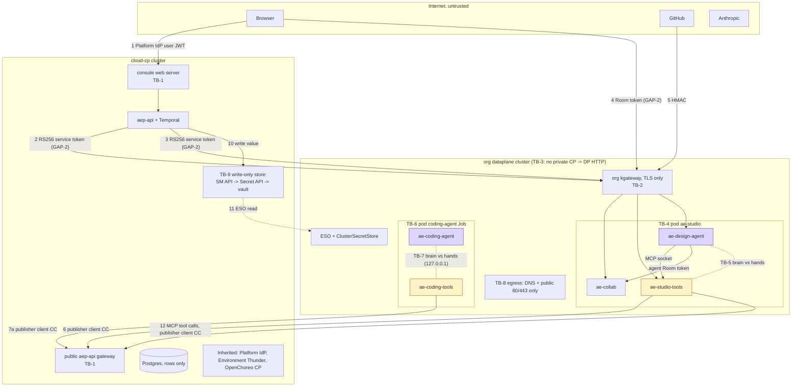

# 10 WSO2 Cloud trust boundaries

The trust boundaries of the intended WSO2 Cloud production shape. The Cloud threat model uses TB-1 to TB-9 as its working list. Flow numbers refer to [04-flows.md](04-flows.md). Gaps refer to [12-gaps-and-open-items.md](12-gaps-and-open-items.md).

WSO2 Cloud, the Platform IdP, Environment Thunder, Kubernetes and OpenChoreo are inherited platform. They are drawn, not analysed here.

Source: [S2-trust-zones.excalidraw](diagrams/S2-trust-zones.excalidraw).

Source: [02-cloud-trust-boundaries.excalidraw](diagrams/02-cloud-trust-boundaries.excalidraw).

Mermaid version of 02

## Boundaries

| Boundary | What crosses (flows) | Control in place (as designed) | Gap to intended |
|---|---|---|---|
| **TB-1** Internet → `aep-api` | 1 user REST and SSE; 6 webhook events; 7a run platform calls; 12 design agent MCP tool calls | Flow 1: the console web server passes calls on, and `aep-api` checks the user JWT itself (signature, `iss`, `aud`, `exp`). Flows 6, 7a, 12: gateway `jwt-auth` `iss=platform-idp`. Then `aep-api` authorizes user, org and Room; for 6: repository looked up only in the token's org, redact, dedup on delivery id; for 12: `/internal/v1/mcp` accepts only the publisher client token, org from `ouHandle` | none |
| **TB-2** Internet → org kgateway | 2, 3 service calls; 4 Room WebSocket; 5 GitHub webhook | TLS only at the gateway; containers check aep-api JWKS, `aud`, `exp`, org; `X-Hub-Signature-256` check | GAP-2 `aep-api`-minted tokens |
| **TB-3** cloud-cp ↔ org dataplane | 2, 3 CP → DP; 6, 7a, 12 DP → CP; 11 ESO read of vault | No private CP → DP HTTP; every hop goes through a public gateway and carries a token | GAP-2 until the Environment Thunder token exchange |
| **TB-4** `ae-studio` pod edge | in: 2, 3, 4, 5 and env secrets; out: 6, 8, 9, 12 | Non-root, read-only root filesystem, drop all capabilities, no privilege escalation, seccomp `RuntimeDefault`, no ServiceAccount token, no shared process namespace; only flows 2–5 are endpoints; ingress only through the org kgateway; the agent's Room join carries the agent Room token | GAP-3 gVisor RuntimeClass missing; GAP-2 `aep-api`-minted Room tokens |
| **TB-5** brain vs hands, in `ae-studio` | Files API on a Unix socket (`ae-collab` → `ae-studio-tools`); MCP tools on a second Unix socket (`ae-design-agent` → `ae-studio-tools`); emptyDir snapshots to `ae-design-agent`; agent Room join to `ae-collab` | The model container has the Default key only (no gitpat, HMAC or publisher client), no URL fetch, jailed file tools; it cannot see the Files API socket; the MCP socket serves only an allow-list of eleven read-only tools and `ae-collab` cannot see it; its Room token opens only this turn's Room | none (accepted: no prompt-injection filter) |
| **TB-6** coding agent Job pod edge | in: env secrets; out: 7a, 7b, 8 | Same pod controls as TB-4 | GAP-3 gVisor RuntimeClass missing |
| **TB-7** `ae-coding-agent` vs `ae-coding-tools` | `ae-coding-agent` calls `ae-coding-tools` on `127.0.0.1` (not an endpoint) | `ae-coding-agent` has no gitpat and no publisher client; tools act only for this run's repository and platform calls | none (accepted: no prompt-injection filter) |
| **TB-8** dataplane egress | 6, 7a, 7b, 8, 9, 12 out to the internet | DNS and public 80/443 only; deny private ranges, link-local, metadata and the Kubernetes API | none |
| **TB-9** SM API and vault, write-only | 10 secret value in from `aep-api`; 11 ESO read to the dataplane | SM API GET returns keys and `secretReferenceName` only; `GetSecretWithValue` is not supported | O-3 open (Postgres holds no secret values) |

## Notes for the threat model

- The model covers WSO2 Cloud only. smee and the local install are not in it.
- It models the intended production shape and treats GAP-2 and GAP-3 as controls not yet in place.
- The Room join inside `ae-studio` (`ae-design-agent` → `ae-collab`) uses the agent Room token, checked like the browser's. A leaked token opens this Room until the turn ends.
- The design agent's platform MCP calls go `ae-design-agent` → MCP socket → `ae-studio-tools` → flow 12 → `aep-api` as the publisher client. They are not bound to a user or a turn (accepted risk in [12-gaps-and-open-items.md](12-gaps-and-open-items.md)).
- A user-started flow 10 write carries the user's Platform IdP JWT. The authentication of flow 11, and of flow 10 writes with no user, is not stated in this spec (open item O-3).
- How dataplane containers fetch and refresh the aep-api JWKS is not stated (open item O-10). It crosses TB-3.
