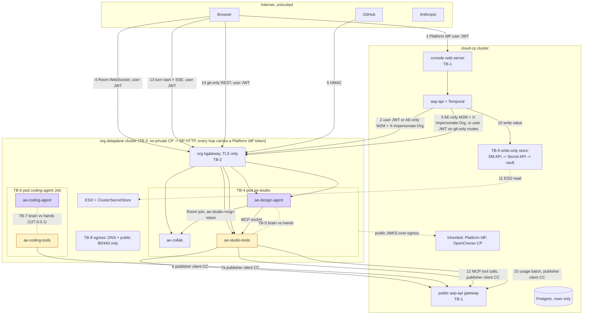

# 10 WSO2 Cloud trust boundaries

The trust boundaries of the intended WSO2 Cloud production shape. The Cloud threat model uses TB-1 to TB-9 as its working list. Flow numbers refer to [04-flows.md](04-flows.md). Gaps refer to [12-gaps-and-open-items.md](12-gaps-and-open-items.md).

WSO2 Cloud, the Platform IdP, Kubernetes and OpenChoreo are inherited platform. The Platform IdP is the only issuer AE uses. They are drawn, not analysed here.

Source: [S2-trust-zones.excalidraw](diagrams/S2-trust-zones.excalidraw).

Source: [02-cloud-trust-boundaries.excalidraw](diagrams/02-cloud-trust-boundaries.excalidraw).

Mermaid version of 02

```mermaid
flowchart TB
  subgraph NET[Internet, untrusted]
    B[Browser]
    GH[GitHub]
    AN[Anthropic]
  end
  subgraph CPC["cloud-cp cluster"]
    CWS["console web server<br/>TB-1"]
    GW1["public aep-api gateway<br/>TB-1"]
    API[aep-api + Temporal]
    PG[(Postgres, rows only)]
    INH[Inherited: Platform IdP, OpenChoreo CP]
    SM["TB-9 write-only store:<br/>SM API -> Secret API -> vault"]
  end
  subgraph ODP["org dataplane cluster (TB-3: no private CP -> DP HTTP, every hop carries a Platform IdP token)"]
    KGW["org kgateway, TLS only<br/>TB-2"]
    subgraph P1["TB-4 pod ae-studio"]
      AS[ae-design-agent]:::llm
      CS[ae-collab]
      GHD[ae-studio-tools]:::hands
    end
    subgraph P2["TB-6 pod coding-agent Job"]
      MAIN[ae-coding-agent]:::llm
      CAT[ae-coding-tools]:::hands
    end
    ESO[ESO + ClusterSecretStore]
    EGR["TB-8 egress: DNS + public 80/443 only"]
  end
  B -- "1 Platform IdP user JWT" --> CWS --> API
  B -- "4 Room WebSocket, user JWT" --> KGW --> CS
  B -- "13 turn start + SSE, user JWT" --> KGW --> AS
  B -- "14 git-only REST, user JWT" --> KGW --> GHD
  GH -- "5 HMAC" --> KGW --> GHD
  API -- "2 user JWT or AE-only M2M + X-Impersonate-Org" --> KGW --> AS
  API -- "3 AE-only M2M + X-Impersonate-Org, or user JWT on git-only routes" --> KGW
  GHD -- "6 publisher client CC" --> GW1
  CAT -- "7a publisher client CC" --> GW1
  GHD -- "12 MCP tool calls, publisher client CC" --> GW1
  GHD -- "15 usage batch, publisher client CC" --> GW1
  AS -- "MCP socket" --> GHD
  P1 -. "public JWKS over egress" .-> INH
  API -- "10 write value" --> SM
  SM -. "11 ESO read" .-> ESO
  AS -- "Room join, ae-studio-&lt;org&gt; token" --> CS
  AS -. "TB-5 brain vs hands" .- GHD
  MAIN -. "TB-7 brain vs hands (127.0.0.1)" .- CAT
  classDef llm fill:#ddd6fe,stroke:#6d28d9
  classDef hands fill:#fef3c7,stroke:#b45309
```

## Boundaries

| Boundary | What crosses (flows) | Control in place (as designed) | Gap to intended |
|---|---|---|---|
| **TB-1** Internet → `aep-api` | 1 user REST (including the `ae-studio` status and URL lookup); 6 webhook events; 7a run platform calls; 12 design agent MCP tool calls; 15 usage batches | Flow 1: the console web server passes calls on, and `aep-api` checks the user JWT itself (signature, `iss`, `aud`, `exp`). Flows 6, 7a, 12, 15: gateway `jwt-auth` `iss=platform-idp`. Then `aep-api` authorizes user and org; for 6: repository looked up only in the token's org, redact, dedup on delivery id; for 12: `/internal/v1/mcp` accepts only the publisher client token, org from `ouHandle`; for 15: `aud` prefix and `ouHandle`, ledger keyed on the turn id | none |
| **TB-2** Internet → org kgateway | 2, 3 calls from `aep-api`; 4 Room WebSocket, 13 turn start and SSE and 14 git-only REST from the browser; 5 GitHub webhook | TLS and CORS only at the gateway (no identity check). Each container checks its own tokens: signature against the public Platform IdP JWKS, `iss=platform-idp`, `exp`, `aud` allow-list, then the org and role rule. `ae-studio-tools` accepts a user JWT only on the git-only routes. `X-Hub-Signature-256` check on flow 5 | O-12 (user JWTs carry the console `aud`); O-13 (AE-only M2M carries no org) |
| **TB-3** cloud-cp ↔ org dataplane | 2, 3 CP → DP; 6, 7a, 12, 15 DP → CP; 11 ESO read of vault; the public JWKS fetch (no authentication) | No private CP → DP HTTP; every hop goes through a public gateway and carries a Platform IdP token; the JWKS is public | O-13 (org-bound machine tokens); O-15 (provisioning of the AE-only client) |
| **TB-4** `ae-studio` pod edge | in: 2, 3, 4, 5, 13, 14 and env secrets; out: 6, 8, 9, 12, 15 and the JWKS fetch | Non-root, read-only root filesystem, drop all capabilities, no privilege escalation, seccomp `RuntimeDefault`, no ServiceAccount token, no shared process namespace; only flows 2, 3, 4, 5, 13 and 14 are endpoints; ingress only through the org kgateway; the agent's Room join carries the `ae-studio-<org>` token | GAP-3 gVisor RuntimeClass missing |
| **TB-5** brain vs hands, in `ae-studio` | Files API on a Unix socket (`ae-collab` → `ae-studio-tools`); MCP tools on a second Unix socket (`ae-design-agent` → `ae-studio-tools`); emptyDir snapshots to `ae-design-agent`; agent Room join to `ae-collab` | The model container has the Default key only (no gitpat, HMAC or publisher client), no URL fetch, jailed file tools; it cannot see the Files API socket; the MCP socket serves only an allow-list of eleven read-only tools, the Room-join token request, the usage hand-off and the project-known lookup, and `ae-collab` cannot see it; its `ae-studio-<org>` token is checked for org only and opens any Room of the org while it lives | none (accepted: no prompt-injection filter; the token scope; unsent usage records lost if the pod dies) |
| **TB-6** coding agent Job pod edge | in: env secrets; out: 7a, 7b, 8 | Same pod controls as TB-4 | GAP-3 gVisor RuntimeClass missing |
| **TB-7** `ae-coding-agent` vs `ae-coding-tools` | `ae-coding-agent` calls `ae-coding-tools` on `127.0.0.1` (not an endpoint) | `ae-coding-agent` has no gitpat and no publisher client; tools act only for this run's repository and platform calls | none (accepted: no prompt-injection filter) |
| **TB-8** dataplane egress | 6, 7a, 7b, 8, 9, 12, 15 out to the internet; the JWKS fetch and the `client_credentials` calls to the Platform IdP | DNS and public 80/443 only; deny private ranges, link-local, metadata and the Kubernetes API | none |
| **TB-9** SM API and vault, write-only | 10 secret value in from `aep-api`; 11 ESO read to the dataplane | SM API GET returns keys and `secretReferenceName` only; `GetSecretWithValue` is not supported | O-3 open (Postgres holds no secret values) |

## Notes for the threat model

- The model covers WSO2 Cloud only. smee and the local install are not in it.
- It models the intended production shape and treats GAP-3 as a control not yet in place. O-12 and O-13 are WSO2 Cloud asks that narrow two accepted residual risks.
- The browser reaches `ae-studio` directly (flows 4, 13, 14) with the user JWT. Each container checks it. The org kgateway does not.
- The Room join inside `ae-studio` (`ae-design-agent` → `ae-collab`) uses the `ae-studio-<org>` token, sent in the Hocuspocus auth message and checked for org only. A leaked token opens any Room of the org while it lives (accepted risk in [12-gaps-and-open-items.md](12-gaps-and-open-items.md)).
- The design agent's platform MCP calls go `ae-design-agent` → MCP socket → `ae-studio-tools` → flow 12 → `aep-api` as the publisher client. They are not bound to a user or a turn (accepted risk in [12-gaps-and-open-items.md](12-gaps-and-open-items.md)).
- A user-started flow 10 write carries the user's Platform IdP JWT. The authentication of flow 11, and of flow 10 writes with no user, is not stated in this spec (open item O-3).
- The dataplane containers fetch the Platform IdP JWKS over egress. It is public and needs no authentication. It crosses TB-3.
