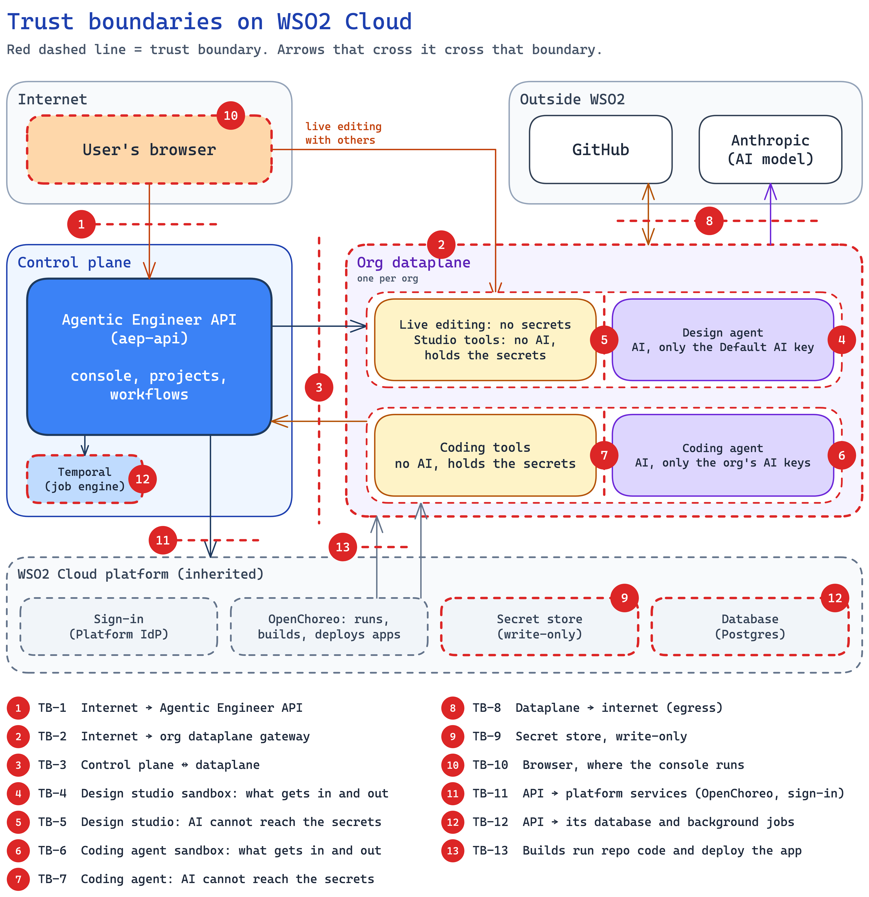

<!--
Copyright (c) 2026, WSO2 LLC. (https://www.wso2.com).

WSO2 LLC. licenses this file to you under the Apache License,
Version 2.0 (the "License"); you may not use this file except
in compliance with the License.
You may obtain a copy of the License at

http://www.apache.org/licenses/LICENSE-2.0

Unless required by applicable law or agreed to in writing,
software distributed under the License is distributed on an
"AS IS" BASIS, WITHOUT WARRANTIES OR CONDITIONS OF ANY
KIND, either express or implied.  See the License for the
specific language governing permissions and limitations
under the License.
-->

# Trust Boundaries

This section lists the interactions of Agentic Engineer on WSO2 Cloud and the trust boundaries they cross. Eight interactions get a full chapter (AE-01 to AE-08). Smaller ones are in "Other interactions and platform-wide risks", and what is not modelled is in "Out of scope".

Trust types in simple words:

- **Untrust → Trust:** someone outside starts a call into Agentic Engineer (a browser, GitHub).
- **Trust → Trust:** two parts we run talk to each other, or we call the WSO2 Cloud platform.
- **Trust → Untrust:** we call out to the internet (Anthropic, GitHub).

**D2: Trust boundaries**

## Interactions

| ID | Interaction | Trust Boundary |
| :---- | :---- | :---- |
| AE-01 | A user signs in and uses Agentic Engineer | Untrust → Trust |
| AE-02 | An org saves its secrets and connects GitHub | Untrust → Trust |
| AE-03 | Project creation: the control plane drives the org dataplane | Trust → Trust |
| AE-04 | A design agent turn and its tools | Trust → Untrust |
| AE-05 | People and the agent edit in a Room, and edits become commits | Untrust → Trust |
| AE-06 | A coding or validation agent runs | Trust → Untrust |
| AE-07 | GitHub webhook, then auto-merge | Untrust → Trust |
| AE-08 | Build, provision and deploy the customer's app | Trust → Trust |

## Trust boundary list

The numbers match the red badges in D2. The IDs in the last-but-one column are listed in "Open decisions and improvements", near the end.

| TB | What crosses | Control | Open / improvements | Chapters |
| :---- | :---- | :---- | :---- | :---- |
| **TB-1** Internet → Agentic Engineer API | Console calls, design-turn stream, Room token request; from the dataplane: webhook events, coding-run calls, design-agent tool calls | The console's web server passes calls to the API; other callers come through the public gateway. The API checks the login token (signature, issuer, audience), takes the org from it, and checks the user's permission. Dataplane calls use the org's machine login (publisher client: the org's non-human sign-in) on internal routes only. | none | AE-01, AE-02, AE-07 |
| **TB-2** Internet → org dataplane gateway | Control-plane calls to the design studio; the Room WebSocket (live editing session); GitHub webhooks | The gateway only ends TLS. Each container checks its own token: signature, audience, expiry, and that the org is this pod's org. Webhooks are checked with the org's webhook secret (HMAC). | GAP-2 | AE-03, AE-05, AE-07 |
| **TB-3** Control plane ↔ dataplane | Calls in both directions; secret values read into the dataplane | No private network path. Every call goes through a public gateway and carries a token. | GAP-2, O-10 | AE-03, AE-06 |
| **TB-4** [Design studio](01-introduction-and-architecture.md#c-design-studio) sandbox: what gets in and out | Calls from the control plane, the Room, webhooks, secrets as env; model calls, git and tool calls out | Non-root, read-only file system, no added Linux powers, no Kubernetes token. Only four listeners are reachable, and only through the org gateway. | GAP-3 | AE-03, AE-04, AE-05 |
| **TB-5** Design studio: AI cannot reach the secrets | File saves, tool calls and Room edits between the three containers | The AI container holds only the AI key. It cannot see the file-save channel. Its tool channel allows 11 read-only tools. | none | AE-04, AE-05 |
| **TB-6** Coding agent sandbox: what gets in and out | Secrets as env; model calls, git and platform calls out | Same pod controls as TB-4. | GAP-3 | AE-06 |
| **TB-7** Coding agent: AI cannot reach the secrets | The agent asks its tools container for git and platform actions | The AI container has no GitHub token and no machine login. The tools container acts only for this run's repository. | none | AE-06 |
| **TB-8** Dataplane → internet (egress) | Model calls, GitHub, calls back to the API | Only DNS and public ports 80/443. Private ranges, cloud metadata and the Kubernetes API are blocked. | none | AE-03, AE-04, AE-06 |
| **TB-9** Secret store, write-only | Secret values written by the API; read by the dataplane | The API can write a value but never read it back. Only the dataplane reads values, through the platform's [secret sync](01-introduction-and-architecture.md#c-secret-store). | O-3, O-4 | AE-02 |
| **TB-10** Browser, where the console runs | The console page and scripts; the user's login token | Sign-in at the [Platform IdP](01-introduction-and-architecture.md#c-platform-idp) with PKCE, a safe sign-in method for browser apps. The token is kept only in the browser tab's session. | none | AE-01 |
| **TB-11** API → platform services (OpenChoreo, sign-in) | Project, build and deploy calls; creating the design studio; sign-in admin calls | User requests carry the user's login token, so the platform scopes them to the user's org. Background work uses a platform service client. | none | AE-01, AE-03, AE-08 |
| **TB-12** API → its database and background jobs | Rows (no secret values); workflow inputs and results | [Temporal](01-introduction-and-architecture.md#c-temporal) is reachable only inside the Agentic Engineer project on the control plane. Postgres holds no secret values. | none | AE-06, AE-07, AE-08 |
| **TB-13** Builds run repo code and deploy the app | Repository code at the merged commit; the built image; the release to the customer's dataplane | OpenChoreo builds in its own build plane. Build clone secrets are passed by reference only. | H-1 | AE-07, AE-08 |

Agentic Engineer's own boundary ends where it calls the WSO2 Cloud platform (TB-9, TB-11, TB-13). What happens inside the platform is WSO2 Cloud's scope.
