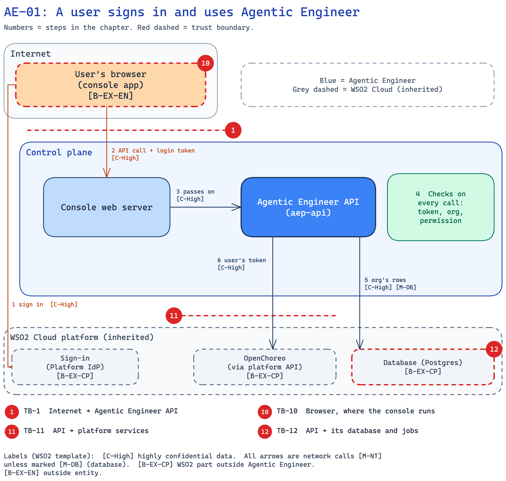

<!--
Copyright (c) 2026, WSO2 LLC. (https://www.wso2.com).

WSO2 LLC. licenses this file to you under the Apache License,
Version 2.0 (the "License"); you may not use this file except
in compliance with the License.
You may obtain a copy of the License at

http://www.apache.org/licenses/LICENSE-2.0

Unless required by applicable law or agreed to in writing,
software distributed under the License is distributed on an
"AS IS" BASIS, WITHOUT WARRANTIES OR CONDITIONS OF ANY
KIND, either express or implied.  See the License for the
specific language governing permissions and limitations
under the License.
-->

## AE-01: A user signs in and uses Agentic Engineer

**Trust boundary:** Untrust → Trust

**Description**

A person signs in to the Agentic Engineer console at the WSO2 Cloud sign-in page, and the browser keeps the login token in that tab. Each console action reaches the Agentic Engineer API through the console's web server. The API checks the token, takes the org from it, and checks that the user's role allows the action. Every later chapter starts from this check.

**Assets Involved**

| Initiator | Intermediate | Target |
| :---- | :---- | :---- |
| User's browser (console app) | Platform IdP (identity provider, for sign-in); console web server | Agentic Engineer API; Postgres; OpenChoreo (through the platform API) |

**Data Flow Diagram**

**Steps**

1. The browser signs the user in at the [Platform IdP](../../01-introduction-and-architecture.md#c-platform-idp) and gets a login token. It uses PKCE, a safe sign-in method for browser apps.
2. The browser calls the console web server over HTTPS with the login token.
3. The console web server passes the call to the API inside the control plane.
4. The API checks the token (signature, issuer, audience), takes the org from it, and checks the user's permission for this action.
5. The API reads or writes only this org's records in Postgres.
6. When the action needs the platform (for example, creating a project), the API calls it with the user's token, so the platform also limits the call to the user's org.

**Payload**

- Login token (JWT, a signed JSON token): issuer `platform-idp`, audience (who the token is for) `APP_FACTORY_CONSOLE`, the org (`ouHandle`, `ouId`), the user, and the user's permissions (`scope`, `ae:*` keys). Lives 1 hour; the browser refreshes it.
- Request: the action and its inputs, for example a project name, a spec edit, or a chat message.
- Response: org data, for example projects, specs, build status, and the design agent's reply as a live stream.

**Security Considerations**

| Area | Response | Comments |
| :---- | :---- | :---- |
| Data Confidentiality | High confidential [C-High] | The login token acts as the user. Specs, designs and org settings are customer data. |
| Communication Medium | Network interaction [M-NT] | Browser to console web server over the internet; web server to API inside the control plane. |
| Transport Security | TLS Encryption | HTTPS from the browser. The hop from the web server to the API is plain HTTP inside the cluster. |
| Authentication | OAuth 2.0 / OIDC login token (JWT) | Signed by the Platform IdP. The API checks signature, issuer and audience on every call. |
| Accessibility | Publicly Accessible | The console and API are on the internet. Only signed-in org members get past the check. |
| Access Control and Authorization | Org from the token, then a permission check | The org is never taken from the URL or body. Each action needs a permission from the user's role (see the entitlement matrix). |

**Threat Assessment**

| ID | Category | Threat | Materializable | Mitigations / Comment |
| :---- | :---- | :---- | :---- | :---- |
| AE-01-1 | Spoofing | A malicious actor calls the API with a forged or expired login token, or with a machine token. | No | **Implemented:** the API checks the signature against the Platform IdP's keys, the issuer, the audience and the expiry on every call. User routes accept only the console's audience, so machine tokens are refused. |
| AE-01-2 | Tampering | A malicious org member puts another org's name in a request to read or change that org's data. | No | **Implemented:** the API takes the org only from the login token and scopes every record to it. Platform calls carry the user's token. **Inherited:** the platform limits those calls to the user's org. |
| AE-01-3 | Repudiation | A user denies starting a build or deploy. | No | **Implemented:** the API records who clicked Build and who edited the spec. The builds and deploys that follow belong to that run and are not stored with a user. |
| AE-01-4 | Information disclosure | A Developer reads data meant for Admins, such as usage and cost, or the org's AI keys. | No | **Implemented:** the permission check refuses views the role does not allow. Secret values are never returned; the console shows only a short prefix and the last four characters, which the API records when the secret is saved. |
| AE-01-5 | Denial of service | A malicious actor floods the API or sends very large requests. | No | **Inherited:** flood protection is WSO2 Cloud's. **Implemented:** the API refuses requests over 80 MiB. |
| AE-01-6 | Elevation of privilege | A Developer changes the GitHub token or AI keys, or deletes a project. | No | **Implemented:** the permission check denies by default. These actions need permissions only Admins hold. |

**Product improvements flagged**

- **Planned:** console calls also go through the public gateway, so the token is checked there too and the gateway's traffic limits apply (H-8).
- **Planned:** WSO2 Cloud sign-in issues the `ae-admin` and `ae-developer` roles and their `ae:*` permissions, and the console asks for them (H-7).
