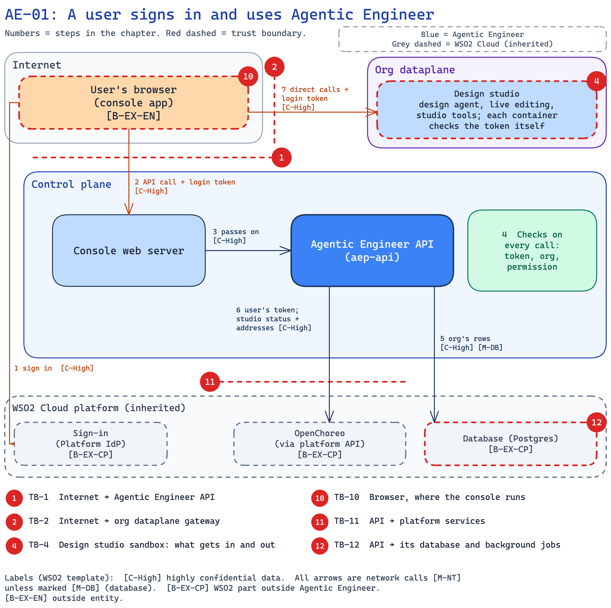

<!--
Copyright (c) 2026, WSO2 LLC. (https://www.wso2.com).

WSO2 LLC. licenses this file to you under the Apache License,
Version 2.0 (the "License"); you may not use this file except
in compliance with the License.
You may obtain a copy of the License at

http://www.apache.org/licenses/LICENSE-2.0

Unless required by applicable law or agreed to in writing,
software distributed under the License is distributed on an
"AS IS" BASIS, WITHOUT WARRANTIES OR CONDITIONS OF ANY
KIND, either express or implied.  See the License for the
specific language governing permissions and limitations
under the License.
-->

## AE-01: A user signs in and uses Agentic Engineer

**Trust boundary:** Untrust → Trust

**Description**

A person signs in to the Agentic Engineer console at the WSO2 Cloud sign-in page, and the browser keeps the login token in that tab. Console actions that need records, builds or deploys reach the Agentic Engineer API through the console's web server. The API checks the token, takes the org from it, and checks that the user's role allows the action. On load, the API also tells the console where the org's [design studio](../../01-introduction-and-architecture.md#c-design-studio) is. The browser then calls the design studio directly with the same token, and each studio container makes the same checks itself. Every later chapter starts from these checks.

**Assets Involved**

| Initiator | Intermediate | Target |
| :---- | :---- | :---- |
| User's browser (console app) | Platform IdP (identity provider, for sign-in); console web server; org dataplane gateway | Agentic Engineer API; Postgres; OpenChoreo (through the platform API); design studio |

**Data Flow Diagram**

**Steps**

1. The browser signs the user in at the [Platform IdP](../../01-introduction-and-architecture.md#c-platform-idp) and gets a login token. It uses PKCE, a safe sign-in method for browser apps.
2. The browser calls the console web server over HTTPS with the login token.
3. The console web server passes the call to the API inside the control plane.
4. The API checks the token (signature, issuer, audience), takes the org from it, and checks the user's permission for this action.
5. The API reads or writes only this org's records in Postgres.
6. When the action needs the platform (for example, creating a project), the API calls it with the user's token, so the platform also limits the call to the user's org. On each console load, the API also reads the design studio's status and public addresses from OpenChoreo and returns them. Until the studio is ready, the console waits.
7. The browser calls the design studio directly through the org dataplane gateway, with the login token: design turns (see AE-04), the Room (see AE-05), and git-only reads such as spec files and task lists from [studio tools](../../01-introduction-and-architecture.md#c-studio-tools). Each container checks the token itself against the Platform IdP's public keys (JWKS), then the org and the role.

**Payload**

- Login token (JWT, a signed JSON token): issuer `platform-idp`, audience (who the token is for) `APP_FACTORY_CONSOLE`, the org (`ouHandle`, `ouId`), the user, and the user's permissions (`scope`, `ae:*` keys). Lives 1 hour; the browser refreshes it. The same token goes to the API and to the three design studio containers, in a header or in the Room's first message, never in an address or a cookie.
- Request: the action and its inputs, for example a project name, a spec edit, or a chat message.
- Response: org data, for example projects, specs, build status, the design studio's status and addresses, and the design agent's reply as a live stream.

**Security Considerations**

| Area | Response | Comments |
| :---- | :---- | :---- |
| Data Confidentiality | High confidential [C-High] | The login token acts as the user. Specs, designs and org settings are customer data. |
| Communication Medium | Network interaction [M-NT] | Browser to console web server and to the org dataplane gateway over the internet; web server to API inside the control plane. |
| Transport Security | TLS Encryption | HTTPS from the browser. The hop from the web server to the API is plain HTTP inside the cluster. |
| Authentication | OAuth 2.0 / OIDC login token (JWT) | Signed by the Platform IdP. The API and each design studio container check signature, issuer, audience and expiry on every call. |
| Accessibility | Publicly Accessible | The console, the API and the design studio routes are on the internet. Only signed-in org members get past the checks. |
| Access Control and Authorization | Org from the token, then a permission check | The org is never taken from the address or body. Each API action needs a permission from the user's role (see the entitlement matrix). In the design studio, the token's org must be the pod's org, and it applies the same permission rule as the API. |

**Threat Assessment**

| ID | Category | Threat | Materializable | Mitigations / Comment |
| :---- | :---- | :---- | :---- | :---- |
| AE-01-1 | Spoofing | A malicious actor calls the API or the design studio with a forged or expired login token, or with a machine token; or a web page on another site makes the user's browser send calls as the user. | No | **Implemented:** the API checks the signature against the Platform IdP's keys, the issuer, the audience and the expiry on every call. User routes accept only the console's audience, so machine tokens are refused. **By design:** each design studio container makes the same checks, and each accepts only its own list of audiences. The browser sends the token only in a header or the Room's first message, never in a cookie, so it is not added to another site's calls. The design studio routes allow cross-site calls (CORS) only from the console's exact address, with no cookies (TB-2, TB-10). |
| AE-01-2 | Tampering | A malicious org member puts another org's name or project in a request to read or change that org's data. | No | **Implemented:** the API takes the org only from the login token and scopes every record to it. Platform calls carry the user's token. **Inherited:** the platform limits those calls to the user's org. **By design:** each org has its own design studio pod. Its containers accept a token only when its org (`ouId` and `ouHandle`) is the pod's org, and a project only when it is one of the org's repositories that studio tools knows. |
| AE-01-3 | Repudiation | A user denies starting a build or deploy. | No | **By design:** the builds and deploys that follow a Build click belong to that run. **Planned:** record who starts a build (H-6). |
| AE-01-4 | Information disclosure | A login token leaks from a design studio container, and someone replays it on the other console APIs or at platform-api (the WSO2 Cloud platform API). | No | **By design:** containers keep tokens in memory only, never in a file or a ConfigMap (a Kubernetes settings object), never in a prompt, and the model has no tool that reads them. The pod is locked down (TB-4). The token lives 1 hour. It carries the console's audience, so a leaked copy works on every console API until it expires. platform-api checks neither the audience nor the issuer, so the copy also works there. **Planned:** tokens sent to the design studio carry an Agentic Engineer-only audience (H-10). That alone does not protect platform-api; WSO2 Cloud is asked to make platform-api check the audience (O-16). |
| AE-01-5 | Denial of service | A malicious actor floods the API or the design studio, or sends very large requests. | No | **Inherited:** flood protection is WSO2 Cloud's, at both gateways. **Implemented:** the API refuses requests over 80 MiB. |
| AE-01-6 | Elevation of privilege | A Developer reads or changes what only Admins may, such as usage and cost, the GitHub token or AI keys, or deletes a project. | No | **Implemented:** the permission check denies by default. These actions need permissions only Admins hold. Secret values are never returned; the console shows only a short prefix and the last four characters, which the API records when the secret is saved. **By design:** the design studio offers no Admin-only action. It applies the same permission rule as the API, so the two cannot differ. Until WSO2 Cloud sign-in issues the `ae:*` permissions (H-7), Cloud users without them are denied by both. |

**Product improvements flagged**

- **Planned:** console calls also go through the public gateway, so the token is checked there too and the gateway's traffic limits apply (H-8).
- **Planned:** WSO2 Cloud sign-in issues the `ae-admin` and `ae-developer` roles and their `ae:*` permissions, and the console asks for them (H-7).
- **Planned:** tokens sent to the design studio carry an Agentic Engineer-only audience (H-10).
