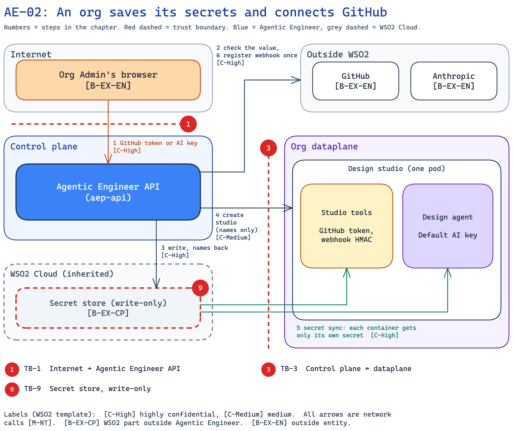

<!--
Copyright (c) 2026, WSO2 LLC. (https://www.wso2.com).

WSO2 LLC. licenses this file to you under the Apache License,
Version 2.0 (the "License"); you may not use this file except
in compliance with the License.
You may obtain a copy of the License at

http://www.apache.org/licenses/LICENSE-2.0

Unless required by applicable law or agreed to in writing,
software distributed under the License is distributed on an
"AS IS" BASIS, WITHOUT WARRANTIES OR CONDITIONS OF ANY
KIND, either express or implied.  See the License for the
specific language governing permissions and limitations
under the License.
-->

## AE-02: An org saves its secrets and connects GitHub

**Trust boundary:** Untrust → Trust

**Description**

An org Admin pastes the org's GitHub token or an AI key into the console. The API checks the value once and writes it to the WSO2 Cloud secret store, which is write-only: the API gets back names, never the value. The platform's [secret sync](../../01-introduction-and-architecture.md#c-secret-store) then delivers each value only to the dataplane container that needs it. When a GitHub token is saved, the API also creates the org's [design studio](../../01-introduction-and-architecture.md#c-design-studio) and registers the GitHub webhook once, then forgets the token.

Agentic Engineer needs these secrets to function: the **GitHub token** to create the project repository and commit specs and code to the org's GitHub, the **Default AI key** and **Coding agent AI key** for the design and coding agents' calls to Anthropic, and the **webhook secret** so [studio tools](../../01-introduction-and-architecture.md#c-studio-tools) can check that a webhook really came from GitHub.

**Assets Involved**

| Initiator | Intermediate | Target |
| :---- | :---- | :---- |
| Org Admin's browser | Agentic Engineer API | Secret store; studio tools and design agent; GitHub; Anthropic; OpenChoreo |

**Data Flow Diagram**

**Steps**

1. The Admin sends the GitHub token or an AI key to the API (see AE-01 for sign-in).
2. The API checks the value in memory: the GitHub token with GitHub, an AI key with Anthropic.
3. The API writes the value to the secret store. For a GitHub token it also writes a new webhook secret (HMAC) for this org. The store returns names only.
4. For a GitHub token, the API asks OpenChoreo to create the org's design studio, passing secret names only (see AE-03).
5. The secret sync delivers the GitHub token and webhook secret to the studio tools container, and the Default AI key to the design agent.
6. The API waits until the studio tools' webhook address is reachable, registers it on GitHub once, and forgets the token.

**Payload**

- GitHub token (personal access token) of the org's GitHub account.
- Default AI key and Coding agent AI key (Anthropic).
- Webhook secret (HMAC), created by the API, one per org.
- Secret names (secret references) returned by the store.
- Webhook address of the studio tools container.

**Security Considerations**

| Area | Response | Comments |
| :---- | :---- | :---- |
| Data Confidentiality | High confidential [C-High] | The GitHub token can read and write the org's repositories. The AI keys spend the org's money. |
| Communication Medium | Network interaction [M-NT] | Browser to API, API to the secret store, GitHub and Anthropic, secret sync to the dataplane. |
| Transport Security | TLS Encryption | HTTPS to GitHub, Anthropic and the API. |
| Authentication | Login token (JWT), then platform identity | The Admin's login token on the API. How the API and the secret sync sign in to the store is open (O-3). |
| Accessibility | Org Admins only | Through the console. |
| Access Control and Authorization | Admin-only permissions | `ae:github-config` for the GitHub token, `ae:model-config` for AI keys. |

**Threat Assessment**

| ID | Category | Threat | Materializable | Mitigations / Comment |
| :---- | :---- | :---- | :---- | :---- |
| AE-02-1 | Spoofing | A Developer, or a member of another org, saves a GitHub token or AI key for this org, for example to point the org at a GitHub account they control. | No | **Implemented:** only Admins hold `ae:github-config` and `ae:model-config`, and the org comes from the login token (see AE-01). |
| AE-02-2 | Tampering | A request writes a secret into another org's store, for example to swap that org's GitHub token. | No | **Implemented:** the API writes only for the org in the login token, and the call to the secret store carries the user's own token. |
| AE-02-3 | Repudiation | An Admin denies changing the GitHub token or an AI key. | No | **Implemented:** each change writes a log line naming the section, never the value. **Planned:** record who made each change (H-6). |
| AE-02-4 | Information disclosure | A saved GitHub token or AI key leaks back out of the control plane, for example in a response, a log or a database backup. | No | **By design:** values live only in the write-only secret store. The API cannot read them back, and the database holds none. **Implemented:** responses show only a short prefix and the last four characters, and logs never carry the value. |
| AE-02-5 | Denial of service | A malicious actor floods the secret store or the secret sync. | No | **Inherited:** the secret store and its sync are WSO2 Cloud's. |
| AE-02-6 | Elevation of privilege | A compromised AI agent reads the GitHub token or the webhook secret. | No | **By design:** only the studio tools and coding tools containers hold the GitHub token, and only studio tools holds the webhook secret. The AI containers hold only their AI key (TB-5, TB-7). |

**Product improvements flagged**

- **Planned:** each change to the GitHub token or an AI key records who made it (H-6).
