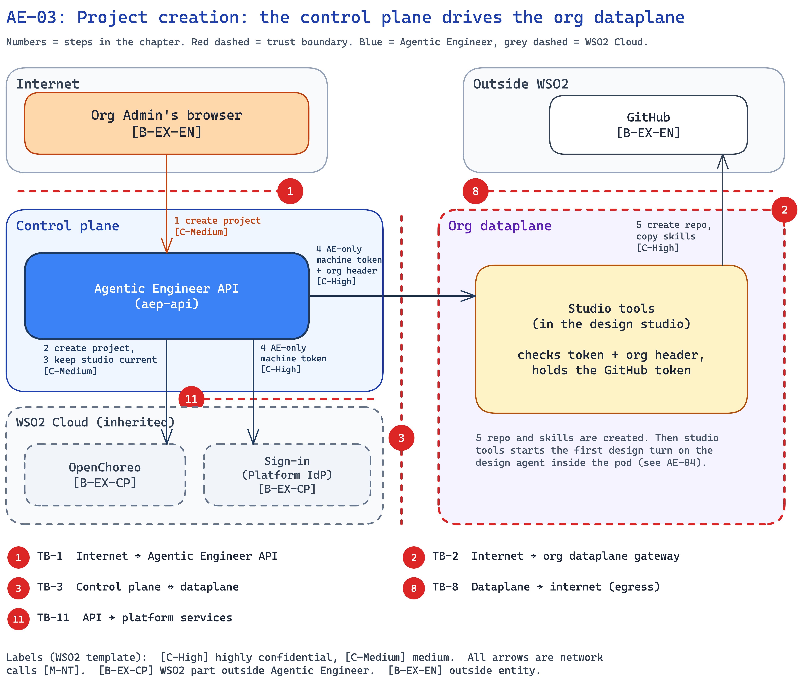

<!--
Copyright (c) 2026, WSO2 LLC. (https://www.wso2.com).

WSO2 LLC. licenses this file to you under the Apache License,
Version 2.0 (the "License"); you may not use this file except
in compliance with the License.
You may obtain a copy of the License at

http://www.apache.org/licenses/LICENSE-2.0

Unless required by applicable law or agreed to in writing,
software distributed under the License is distributed on an
"AS IS" BASIS, WITHOUT WARRANTIES OR CONDITIONS OF ANY
KIND, either express or implied.  See the License for the
specific language governing permissions and limitations
under the License.
-->

## AE-03: Project creation: the control plane drives the org dataplane

**Trust boundary:** Trust → Trust

**Description**

An org Admin creates a project in the console. The API creates the project in [OpenChoreo](../../01-introduction-and-architecture.md#c-openchoreo); the org's [design studio](../../01-introduction-and-architecture.md#c-design-studio) is kept up to date on each console load. The API then asks the [studio tools](../../01-introduction-and-architecture.md#c-studio-tools) container to create the GitHub repository and copy the org's skills (instruction files the org writes for its agents) into it. The control plane has no private path into the dataplane, so this call goes through the org gateway. It carries the AE-only machine token: a token from the [Platform IdP](../../01-introduction-and-architecture.md#c-platform-idp) (identity provider) for the API's AE-only control-plane client, with the org named in a header. The API uses the same token for all studio tools work tied to its own records, and for design studio calls with no user on the request.

**Assets Involved**

| Initiator | Intermediate | Target |
| :---- | :---- | :---- |
| Org Admin's browser | Agentic Engineer API; Platform IdP; org gateway | OpenChoreo; studio tools; GitHub |

**Data Flow Diagram**

**Steps**

1. The Admin creates a project in the console (see AE-01 for sign-in).
2. The API creates the project in OpenChoreo with the user's token.
3. The API keeps the org's design studio current. It checks the studio on each console load, and if its version is old, the API updates the same studio in place, passing secret names only. It never creates a second one.
4. The API gets an AE-only machine token from the Platform IdP (`client_credentials`, the grant for a machine sign-in), and calls studio tools through the org gateway with it and the `X-Impersonate-Org` header set to this org. It does this even though a user started the work.
5. Studio tools checks the token, then creates the GitHub repository and copies the org's skills into it with the org's GitHub token. The API then asks the [design agent](../../01-introduction-and-architecture.md#c-design-agent) to start the first design turn, where it reads the first prompt and starts the spec (see AE-04).

**Payload**

- Project name and the first prompt.
- AE-only machine token: from the Platform IdP, for the client `APP_FACTORY_BFF_TO_AE_STUDIO` (a working name), audience its own client id. It carries no org. The org is in the `X-Impersonate-Org` header.
- Repository name, and the org's skill files.
- Design studio settings: image version and secret names, never values.

**Security Considerations**

| Area | Response | Comments |
| :---- | :---- | :---- |
| Data Confidentiality | High confidential [C-High] | The AE-only machine token lets the control plane act in any org's design studio, with the org in a header. The project's spec and code are customer data. |
| Communication Medium | Network interaction [M-NT] | API to OpenChoreo, API to the Platform IdP, API to the org gateway, studio tools to GitHub. |
| Transport Security | TLS Encryption | The org gateway ends TLS. HTTPS to the Platform IdP and GitHub. |
| Authentication | Platform IdP machine token and org header | Studio tools checks the signature against the Platform IdP's public keys (JWKS), the issuer, the expiry, that the client is the pinned AE-only client with the machine grant, and that the header names its own org. |
| Accessibility | Publicly Accessible | The org gateway is on the internet, but every call needs a valid token. |
| Access Control and Authorization | Admin only, then a split of routes by token | Creating a project needs `ae:requirement-update`, checked by the API. Studio tools routes tied to the API's records (repository create, skills copy, merge) accept only the AE-only machine token. A person's login token works only on git-only read routes. |

**Threat Assessment**

| ID | Category | Threat | Materializable | Mitigations / Comment |
| :---- | :---- | :---- | :---- | :---- |
| AE-03-1 | Spoofing | A malicious actor calls studio tools through the public org gateway, pretending to be the control plane. | No | **By design:** studio tools checks every call itself: the Platform IdP signature, issuer and expiry, the pinned AE-only client id and machine grant, and that `X-Impersonate-Org` is its own org. It refuses the org's machine login (publisher client), the Room-join token and any other audience. The gateway only ends TLS. |
| AE-03-2 | Tampering | Someone takes a copy of the AE-only machine token from one org's design studio and replays it with another org in the header, against that org's design studio or against platform-api. | No | **By design:** the client's secret stays in the API and never reaches a dataplane pod. The client is not on platform-api's impersonation list (the clients platform-api lets act for any org), so platform-api refuses the copy. The token carries no org, so while it lives, a copy reaches other orgs' design studios. **Planned:** machine tokens that carry their org (H-11). |
| AE-03-3 | Repudiation | An Admin denies creating or deleting a project. | No | **Planned:** record who creates or deletes a project (H-6). |
| AE-03-4 | Information disclosure | A project's spec and code are readable by anyone on GitHub. | No | **Planned:** project repositories become private (H-9), when Agentic Engineer moves to the GitHub App install path that OpenChoreo uses for private repositories. |
| AE-03-5 | Denial of service | A malicious actor floods the org gateway. | No | **Inherited:** the org gateway is WSO2 Cloud's. |
| AE-03-6 | Elevation of privilege | An org member calls studio tools directly with their own login token to create a repository or copy skills, skipping the API's permission check. | No | **By design:** studio tools accepts only the AE-only machine token on those routes, even when a user started the work. A person's login token works only on git-only read routes. |

**Product improvements flagged**

- **Planned:** project repositories become private (GitHub App install path, H-9).
- **Planned:** record who creates or deletes a project (H-6).
- **Planned:** machine tokens that carry their org, for the API's calls to the design studio (H-11).
