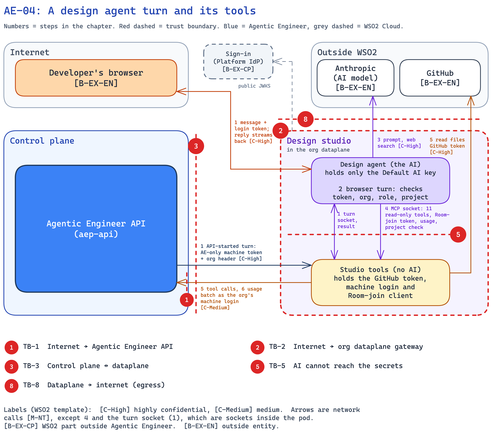

<!--
Copyright (c) 2026, WSO2 LLC. (https://www.wso2.com).

WSO2 LLC. licenses this file to you under the Apache License,
Version 2.0 (the "License"); you may not use this file except
in compliance with the License.
You may obtain a copy of the License at

http://www.apache.org/licenses/LICENSE-2.0

Unless required by applicable law or agreed to in writing,
software distributed under the License is distributed on an
"AS IS" BASIS, WITHOUT WARRANTIES OR CONDITIONS OF ANY
KIND, either express or implied.  See the License for the
specific language governing permissions and limitations
under the License.
-->

## AE-04: A design agent turn and its tools

**Trust boundary:** Trust → Untrust

**Description**

The [design agent](../../01-introduction-and-architecture.md#c-design-agent) is the AI that helps people write a project's spec: they describe what they want in the console, and it writes and updates the requirements and design. The browser sends each message straight to the design agent, which checks the login token itself, runs the turn in the pod and streams the reply back. To do this it reads text that nobody has checked, such as uploaded documents, the org's skills (instruction files the org writes for its agents), web search results and API descriptions from the internet. Some of that text may try to give the agent orders, which is called prompt injection. So the design keeps what the agent can reach small: it holds only the Default AI key, and for platform facts it must ask the [studio tools](../../01-introduction-and-architecture.md#c-studio-tools) container beside it, which keeps the secrets and answers only 11 read-only tools.

**Assets Involved**

| Initiator | Intermediate | Target |
| :---- | :---- | :---- |
| Developer's browser; Agentic Engineer API (for turns it starts) | Org gateway; studio tools (for turns the API starts) | Design agent; studio tools; Agentic Engineer API; Anthropic; GitHub; public web sites |

**Data Flow Diagram**

**Steps**

1. The Developer sends a message (see AE-01 for sign-in). The browser sends it with the login token through the org gateway straight to the design agent. For work the [API](../../01-introduction-and-architecture.md#c-api) starts, such as a project kickoff or a milestone plan, the API calls studio tools instead, with the AE-only machine token and the org header (see AE-03). Studio tools starts the turn on the design agent over a turn socket inside the pod, which only these two containers can see, and returns the result to the API. The API then makes any GitHub changes, such as issues from a plan, through studio tools' internal routes.
2. The design agent checks the token itself: the Platform IdP signature, issuer, audience, expiry, that the org is this pod's org, and that the user may change the design. It asks studio tools whether the project is one of the org's repositories. It accepts no machine token. It holds the one-turn lock and the conversation in the pod, and streams the reply back to the browser as it comes.
3. The design agent reads the spec from a copy that studio tools wrote for it, and calls the AI model at Anthropic with the Default AI key. The model may also run a web search, up to four times per turn.
4. For platform facts, the agent calls studio tools on its own socket inside the pod. It uses MCP (Model Context Protocol, a standard way for an AI to call tools). The socket answers only 11 read-only tools, the Room-join token request (the token the agent uses to join a Room, see AE-05), the usage hand-off and the project check.
5. Studio tools answers the call. It reads repository files on GitHub itself, with the GitHub token. For the other tools it calls the API as the org's machine login (publisher client, the org's non-human sign-in), and the API runs the tool for this org: for example, it lists the org's services or fetches an API description (OpenAPI document) from a public web address. In a Room, the agent's edits go into the live session (see AE-05).
6. When a turn ends, the design agent hands its usage record to studio tools on the same socket. Studio tools sends the records to the API as the machine login, in a batch every few minutes and when the pod stops.

**Payload**

- Message: up to 64 KiB of text, plus up to 10 attachments (PDF, images, text), 5 MiB each.
- Login token (see AE-01). For a turn the API starts: the AE-only machine token with the `X-Impersonate-Org` header, to studio tools only (see AE-03); studio tools passes only the request on the turn socket.
- Model call: the prompt, the spec text, tool results and the Default AI key. The model is one of two allowed Claude models.
- Tool call: a tool name from the list of 11 and its inputs, for example a search term, a file path or a web address.
- Reply: the agent's text and proposed file changes, streamed as events. The conversation is kept for 7 days.
- Usage batch: one record per finished turn, each with its turn id.

**Security Considerations**

| Area | Response | Comments |
| :---- | :---- | :---- |
| Data Confidentiality | High confidential [C-High] | Specs, repository files and uploads are customer data. The login token acts as the user. The model call carries the Default AI key. |
| Communication Medium | Network interaction [M-NT] | Browser and API to the org gateway, the agent to Anthropic, studio tools to GitHub and the API. The agent to studio tools is a socket inside the pod. |
| Transport Security | TLS Encryption | The org gateway ends TLS. HTTPS to Anthropic, GitHub, the API and web sites. |
| Authentication | Platform IdP tokens; machine login | The design agent checks the login token against the Platform IdP's public keys (JWKS). Turns the API starts come from studio tools on the turn socket, with no token. Studio tools signs in to the API as the org's machine login. |
| Accessibility | Publicly Accessible | The org gateway is on the internet, but every call needs a valid token, and cross-site calls (CORS) are allowed only from the console. The agent's socket is reachable only inside the pod. |
| Access Control and Authorization | Org and role in the pod, then a fixed tool list | Starting a turn follows the same permission rule as the API: it needs `ae:design`. The agent can call only the 11 read-only tools. The org comes from the machine login, never from the agent. |

**Threat Assessment**

| ID | Category | Threat | Materializable | Mitigations / Comment |
| :---- | :---- | :---- | :---- | :---- |
| AE-04-1 | Spoofing | A malicious actor calls the design agent through the public org gateway to run turns on the org's AI key, with no token, another org's token or another app's token. | No | **By design:** the design agent checks every call itself: the Platform IdP signature, issuer, expiry, the console's audience, and that the org is its own. It refuses the AE-only machine token, the machine login and the Room-join token; turns the API starts reach it only through studio tools inside the pod. A copied AE-only machine token is AE-03-2 (H-11), and a leaked login token is AE-01-4 (H-10). |
| AE-04-2 | Tampering | Text in a spec, an upload, a skill, a search result or an OpenAPI document tells the model to write harmful spec text; or a compromised design studio sends false or repeated usage records. | No | **By design:** there is no filter for prompt injection. Instead, the agent holds only the Default AI key, its file tools stay inside its copy of the spec, and its tools only read. What it writes shows up in the Room, where people see it before a build (see AE-05). Usage records reach the API only as the org's machine login, so the org comes from the token, not the record, and the API counts each turn id once. |
| AE-04-3 | Repudiation | A tool call cannot be tied to the user who started the turn, or a turn's usage is never counted. | No | **By design:** the design agent takes the user from the verified login token, or, for a turn the API starts, from the API's request that studio tools passes on. Tool calls reach the API as the org's machine login over a channel with no token, so they cannot be tied to one user or turn; they only read this org's data. Usage records not yet sent are lost if the pod stops without warning. This is an accepted risk. |
| AE-04-4 | Information disclosure | A steered agent sends spec or repository text out, inside a web search query or an OpenAPI web address. | No | **By design:** the agent has no web fetch tool, holds no GitHub token, and the dataplane blocks private addresses (TB-8). **Implemented:** the API fetches OpenAPI documents over HTTPS from public addresses only, with a size limit. **Planned:** guardrails on the agents' internet calls (H-4). |
| AE-04-5 | Denial of service | A user, or a steered agent in a loop, runs long turns and spends the org's AI budget. | No | **Implemented:** a turn stops after 30 minutes or 60 model steps, and messages and attachments have size limits. **By design:** the design agent holds a one-turn lock per project in the pod. **Inherited:** flood protection at the gateways is WSO2 Cloud's. |
| AE-04-6 | Elevation of privilege | A steered agent tries to read the GitHub token, the machine login or the Room-join secret, save files to git, or call a tool that changes something. | No | **By design:** the secrets live only in studio tools. The agent gets a Room-join token, never the secret behind it. The agent's socket answers only the 11 read-only tools and the three fixed requests, and the agent cannot see the file-save socket. The containers do not share processes, and the pod has no Kubernetes token (TB-4, TB-5). **Planned:** a stronger sandbox, gVisor (GAP-3). |
