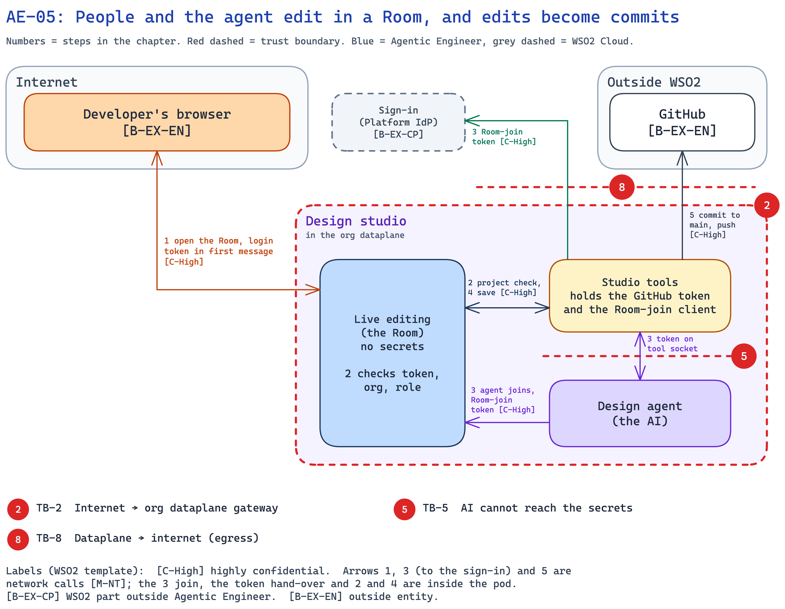

<!--
Copyright (c) 2026, WSO2 LLC. (https://www.wso2.com).

WSO2 LLC. licenses this file to you under the Apache License,
Version 2.0 (the "License"); you may not use this file except
in compliance with the License.
You may obtain a copy of the License at

http://www.apache.org/licenses/LICENSE-2.0

Unless required by applicable law or agreed to in writing,
software distributed under the License is distributed on an
"AS IS" BASIS, WITHOUT WARRANTIES OR CONDITIONS OF ANY
KIND, either express or implied.  See the License for the
specific language governing permissions and limitations
under the License.
-->

## AE-05: People and the agent edit in a Room, and edits become commits

**Trust boundary:** Untrust → Trust

**Description**

A Room is a live editing session where people and the design agent write a project's spec together, like a shared document. The browser opens the Room straight on the org dataplane, and each person joins with their own login token, which [live editing](../../01-introduction-and-architecture.md#c-live-editing) checks itself. The design agent joins with the org's Room-join token, which only [studio tools](../../01-introduction-and-architecture.md#c-studio-tools) can get. The agent's edits show highlighted until a person accepts or removes them. The Room's files are then saved to the project's GitHub repository, and a coding run builds from them only when a person clicks Build.

**Assets Involved**

| Initiator | Intermediate | Target |
| :---- | :---- | :---- |
| Developer's browser; design agent | Org gateway; Platform IdP (for the Room-join token) | Live editing; studio tools; GitHub |

**Data Flow Diagram**

**Steps**

1. The user opens a project's spec (see AE-01 for sign-in). The browser opens the Room over a WebSocket (a live two-way connection) through the org gateway. It sends the login token in the first message of the connection (the Hocuspocus auth message; Hocuspocus is the Room server), never in the address or a cookie.
2. Live editing checks the token itself: the Platform IdP signature, issuer, audience, expiry, that the org is its own, and the role (`ae:design` to edit, `ae:design-view` to watch; until H-7, org membership). It asks studio tools, on the file-save socket, whether the project is one of the org's repositories.
3. During a design turn (see AE-04), the [design agent](../../01-introduction-and-architecture.md#c-design-agent) asks studio tools for a Room-join token on its tool socket. Studio tools gets an `ae-studio-<org>` token from the [Platform IdP](../../01-introduction-and-architecture.md#c-platform-idp) with the org's Room-join secret, and hands over only the token. The agent joins the same Room inside the pod with it, in the same first message. Live editing checks it for the org only. The agent's edits appear highlighted for everyone in the Room.
4. Live editing saves the Room's files to studio tools over a file-save socket that only these two containers can see. It saves when a turn ends, when the last person leaves, and before a build.
5. Studio tools commits the files under `specs/` to the main branch and pushes them to GitHub with the GitHub token. The people in the Room are listed as co-authors of the commit, and agent edits credit the user named in the turn.

**Payload**

- Login token (see AE-01), in the Room's first message.
- Room-join token (`ae-studio-<org>`): from the Platform IdP, audience the org's own Room-join client, carries the org (`ouId`, `ouHandle`), lives as long as the Platform IdP sets. Kept only in the memory of studio tools and the design agent, for that connection.
- Room messages: text edits, the names and cursors of the people in the Room, and the marks that highlight the agent's text.
- Save: files under `specs/`, up to 5 MiB each. Each file carries the version it was based on, so a save never overwrites a newer change.
- Reference uploads (documents the user adds for the agent) do not go through the Room: up to 10 files, 5 MiB each, allowed file types only.

**Security Considerations**

| Area | Response | Comments |
| :---- | :---- | :---- |
| Data Confidentiality | High confidential [C-High] | The spec is customer data. The login token acts as the user, and the Room-join token opens the org's Rooms. The push uses the GitHub token. |
| Communication Medium | Network interaction [M-NT] | Browser to the org gateway, studio tools to the Platform IdP and GitHub. The agent's join, the token hand-over and the save are inside the pod. |
| Transport Security | TLS Encryption | Secure WebSocket from the browser. The org gateway ends TLS. HTTPS to the Platform IdP and GitHub. |
| Authentication | Platform IdP tokens | Live editing checks the login token (people) and the Room-join token (the agent) itself, against the Platform IdP's public keys (JWKS). |
| Accessibility | Publicly Accessible | The Room address is on the org gateway on the internet, but a valid token of this org is needed to join. |
| Access Control and Authorization | Org and role from the token, then a project check | Watching needs `ae:design-view`, editing `ae:design` (until H-7, org membership). The project must be one studio tools knows. The Room-join token is checked for the org only, so it opens any Room of the org. |

**Threat Assessment**

| ID | Category | Threat | Materializable | Mitigations / Comment |
| :---- | :---- | :---- | :---- | :---- |
| AE-05-1 | Spoofing | A member of another org, a holder of another app's token, or a coding run joins this project's Room. | No | **By design:** each org has its own live editing container. It checks the signature, issuer and expiry, the audience (the console's for a person, this org's Room-join client for the agent), and that `ouId` and `ouHandle` are its org. The project must be one studio tools knows. It refuses the org's machine login (publisher client), and a coding run holds only that, so a coding run cannot join a Room. |
| AE-05-2 | Tampering | The design agent, steered by prompt injection (see AE-04-2), writes harmful spec text, and a coding run later builds from it. | No | **By design:** agent text is shown highlighted in the editor until a person accepts or removes it. Saving to `main` starts nothing. A coding run starts only when a person clicks Build, and it uses the spec as the person sees it. New or deleted files and `design.json` changes are not highlighted, and Build does not warn about text not yet accepted (see Product improvements). |
| AE-05-3 | Repudiation | A user denies making a spec change. | No | **By design:** each commit lists the people in the Room as co-authors, and agent edits credit the user named in the turn. Git keeps the history of every change. The co-author names come from what each browser reports, so they show who was in the Room, not proof of who edited (see Product improvements). |
| AE-05-4 | Information disclosure | A Room-join token leaks, and someone reads or edits the org's specs. | No | **By design:** the token opens any Room of its org while it lives. This is an accepted risk. It stays in the memory of studio tools and the design agent, never in an address, and it works only for this org. Its secret stays in studio tools. The design agent already holds the same org's Default AI key. A leaked login token is AE-01-4. |
| AE-05-5 | Denial of service | A member sends very large edits or opens many connections, so the Room cannot save. | No | **By design:** each org has its own live editing container, so one org cannot slow another org's Rooms. Studio tools refuses a saved file over 5 MiB. |
| AE-05-6 | Elevation of privilege | A malicious user finds a bug in live editing through the public WebSocket, or a steered agent tries to save files itself, to reach the GitHub token or write outside the spec. | No | **By design:** live editing holds no secrets, and the GitHub token lives only in studio tools. Only live editing and studio tools can see the file-save socket; the agent cannot (TB-4, TB-5). Studio tools writes only files under `specs/`. |

**Product improvements flagged**

- New files, deleted files and `design.json` changes made by the agent are also highlighted, and Build warns when some agent text is not yet accepted.
- Live editing takes each person's shown name from their login token, limits document size and connections, and credits only the people who edited.
