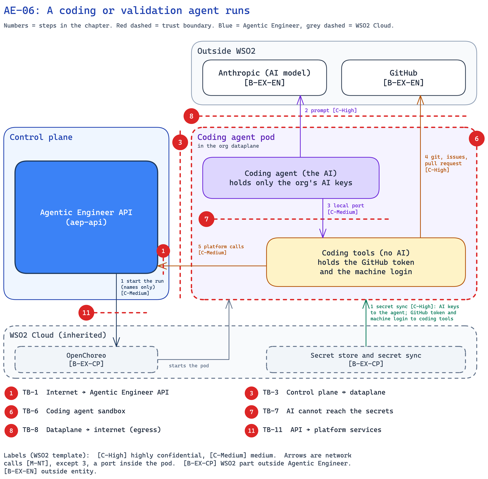

<!--
Copyright (c) 2026, WSO2 LLC. (https://www.wso2.com).

WSO2 LLC. licenses this file to you under the Apache License,
Version 2.0 (the "License"); you may not use this file except
in compliance with the License.
You may obtain a copy of the License at

http://www.apache.org/licenses/LICENSE-2.0

Unless required by applicable law or agreed to in writing,
software distributed under the License is distributed on an
"AS IS" BASIS, WITHOUT WARRANTIES OR CONDITIONS OF ANY
KIND, either express or implied.  See the License for the
specific language governing permissions and limitations
under the License.
-->

## AE-06: A coding or validation agent runs

**Trust boundary:** Trust → Untrust

**Description**

The [coding agent](../../01-introduction-and-architecture.md#c-coding-agent) is the AI that builds the app from the spec and opens a pull request. The validation agent is the same pod with another skill: after a deploy, it tests the app against the spec. It works alone with a shell, and it reads text nobody has checked, such as issue comments, repository files, org skills and web pages, so it can be steered by prompt injection. So the [pod](../../01-introduction-and-architecture.md#c-coding-agent-pod) is split: the AI holds only the org's AI keys, and [coding tools](../../01-introduction-and-architecture.md#c-coding-tools) beside it holds the other secrets and acts only for this run. Both coding agent runtimes an org can choose, Claude Code and OpenCode, run this way.

**Assets Involved**

| Initiator | Intermediate | Target |
| :---- | :---- | :---- |
| Agentic Engineer API | OpenChoreo; coding tools | Coding agent; Anthropic; GitHub |

**Data Flow Diagram**

**Steps**

1. A person clicks Build (see AE-01), or a deploy finishes (see AE-08). Build starts a coding run; the image build is AE-08. The [API](../../01-introduction-and-architecture.md#c-api) asks [OpenChoreo](../../01-introduction-and-architecture.md#c-openchoreo) to start a pod for this run, with secret names only. The [secret sync](../../01-introduction-and-architecture.md#c-secret-store) puts the org's AI keys into the agent, and the GitHub token and the machine login into coding tools.
2. The agent writes and tests code in its own workspace, and calls the AI model at Anthropic with the Coding agent token, or with the Default AI key when the org has no Coding agent token.
3. For git, GitHub and platform tools, the agent calls coding tools on a local port inside the pod.
4. Coding tools clones the repository, reads the issues, pushes the run's branch and opens the pull request. It refuses any other repository.
5. Coding tools calls the API as the org's machine login for this run's platform calls. The pull request then goes to AE-07.

**Payload**

- Run start: the repository, the milestone, the skill (`aep` or `validation-task`) and secret names.
- Model call: the prompt, spec, code, issue text and that token or key.
- Calls to coding tools: an action or tool name and its inputs. Coding tools never returns a secret.

**Security Considerations**

| Area | Response | Comments |
| :---- | :---- | :---- |
| Data Confidentiality | High confidential [C-High] | Code and issues are customer data. The model call carries the org's token or AI key. |
| Communication Medium | Network interaction [M-NT] | Except the local port inside the pod. |
| Transport Security | TLS Encryption | HTTPS to Anthropic, GitHub and the API. |
| Authentication | Machine login; GitHub token | Held by coding tools. The local port needs no token: only the agent can reach it. |
| Accessibility | Not publicly accessible | The pod has no public address. |
| Access Control and Authorization | Permission check, then this run only | Build needs `ae:build`. Coding tools acts only for this run's repository. |

**Threat Assessment**

| ID | Category | Threat | Materializable | Mitigations / Comment |
| :---- | :---- | :---- | :---- | :---- |
| AE-06-1 | Spoofing | Another workload calls the coding tools port to use the GitHub token. | No | **By design:** the port listens only inside the pod, and the pod accepts no calls from other pods. |
| AE-06-2 | Tampering | An issue comment, a repository file (such as `CLAUDE.md`), an org skill, the spec or a web page tells the agent to add harmful code. | No | **By design:** there is no filter for prompt injection. The agent holds only the org's AI keys, and its code arrives as a pull request on this run's repository (see AE-07). **Implemented:** only an Admin can change org skills. **Planned:** private repositories, so outsiders cannot comment (H-9). |
| AE-06-3 | Repudiation | A run's changes cannot be tied to the person who started it. | No | **Implemented:** the API records who clicked Build to start the run. Git keeps every commit. |
| AE-06-4 | Information disclosure | A steered agent sends code or a secret out through its shell, a web fetch or a search. | No | **By design:** the agent has no GitHub token or machine login, and the dataplane blocks private addresses and cloud metadata (TB-8). This egress rule is the main control. **Implemented:** web fetch refuses literal private IP addresses and known cluster host names, and web search refuses a query that holds a secret. **Planned:** dependency secrets stay out of the agent's container (H-3), and guardrails on internet calls (H-4). |
| AE-06-5 | Denial of service | A steered agent loops and spends the org's AI budget. | No | **Implemented:** a run stops after 3 hours (validation: 2), with fixed CPU and memory, and one coding run per project at a time. See PW-3. |
| AE-06-6 | Elevation of privilege | A steered agent tries to read the GitHub token or reach the cluster from its shell. | No | **By design:** the secrets live only in coding tools. The pod runs non-root, with a read-only file system, no Kubernetes token and no shared processes (TB-6, TB-7). **Planned:** a stronger sandbox, gVisor (GAP-3). |

**Product improvements flagged**

- **Planned:** dependency secrets stay out of the agent's container (H-3), and guardrails on internet calls (H-4).
- The coding agent reads only instructions and skills from the repository, not settings that can change its environment or run commands.
