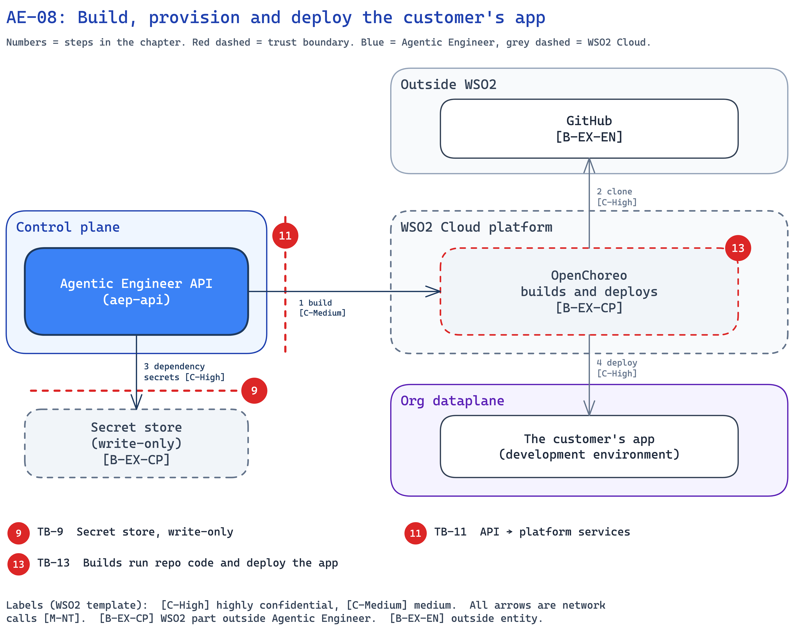

<!--
Copyright (c) 2026, WSO2 LLC. (https://www.wso2.com).

WSO2 LLC. licenses this file to you under the Apache License,
Version 2.0 (the "License"); you may not use this file except
in compliance with the License.
You may obtain a copy of the License at

http://www.apache.org/licenses/LICENSE-2.0

Unless required by applicable law or agreed to in writing,
software distributed under the License is distributed on an
"AS IS" BASIS, WITHOUT WARRANTIES OR CONDITIONS OF ANY
KIND, either express or implied.  See the License for the
specific language governing permissions and limitations
under the License.
-->

## AE-08: Build, provision and deploy the customer's app

**Trust boundary:** Trust → Trust

**Description**

After a merge, Agentic Engineer turns the code into a running app on [OpenChoreo](../../01-introduction-and-architecture.md#c-openchoreo). OpenChoreo builds the app by running the repository's own build file. Before the first deploy, a Developer enters the secret values the app needs, such as a database password, and the API creates test users for the validation agent. The [API](../../01-introduction-and-architecture.md#c-api) gives OpenChoreo secret names only, never values.

**Assets Involved**

| Initiator | Intermediate | Target |
| :---- | :---- | :---- |
| Agentic Engineer API | OpenChoreo; secret store | GitHub; the customer's app |

**Data Flow Diagram**

**Steps**

1. After a merge (see AE-07), the API asks OpenChoreo to build each changed part.
2. OpenChoreo clones the repository and builds the image in its own build plane.
3. A Developer enters each dependency's secret values in the console, and the API writes them to the write-only [secret store](../../01-introduction-and-architecture.md#c-secret-store) (see AE-02). The API also creates test users, and their logins are posted on the build's roles gate issue on GitHub (until H-2).
4. When every dependency is ready, the API asks OpenChoreo to deploy the app to the development environment. The validation run then starts (see AE-06).

**Payload**

- Build: the part, the merged commit and the name of the clone secret.
- Dependency values: what the Developer types. The API never reads them back.
- Test-user logins: a user name and password for each test role.

**Security Considerations**

| Area | Response | Comments |
| :---- | :---- | :---- |
| Data Confidentiality | High confidential [C-High] | Dependency secrets, test-user passwords and the customer's code. |
| Communication Medium | Network interaction [M-NT] | |
| Transport Security | TLS Encryption | |
| Authentication | User's login token; platform service client | Background work uses the platform service client for the run's org (TB-11). |
| Accessibility | Publicly Accessible | The deployed app is on the internet. It has sign-in only when its design adds one. The console shows which parts have none. |
| Access Control and Authorization | Permission check | Builds, dependency values and test-user passwords need `ae:build`. |

**Threat Assessment**

| ID | Category | Threat | Materializable | Mitigations / Comment |
| :---- | :---- | :---- | :---- | :---- |
| AE-08-1 | Spoofing | A member of one org builds or deploys in another org. | No | **Implemented:** the org comes from the login token, and a person's own token goes to the platform. Background work names the run's org on each platform call. |
| AE-08-2 | Tampering | Harmful code in the repository (see AE-06-2, AE-07-2) is built and deployed. | No | **Inherited:** builds run in OpenChoreo's own build plane. **By design:** the deploy goes only to the development environment. **Planned:** auto-merge checks who opened the pull request (H-1). |
| AE-08-3 | Repudiation | Nobody can tell who started a build or deploy. | No | **Implemented:** the API records who clicked Build. The builds and deploy that follow belong to that run and are not stored with a user. |
| AE-08-4 | Information disclosure | Others read test-user passwords on a public issue, or dependency secrets. | No | **By design:** dependency values go only to the write-only secret store. **Implemented:** seeing a test-user password in the console needs `ae:build`. **Planned:** test-user passwords are kept in the secret store and not posted in issue comments (H-2), and project repositories are private (H-9). |
| AE-08-5 | Denial of service | Many merges start many builds. | No | **Implemented:** one build per part and commit, one automatic retry, one run per project at a time. **Inherited:** build capacity is WSO2 Cloud's. |
| AE-08-6 | Elevation of privilege | A build reaches the GitHub token or other secrets. | No | **By design:** the build gets the GitHub token by name only. **Inherited:** OpenChoreo gives the clone secret only to the build. |

**Product improvements flagged**

- **Planned:** test-user passwords are kept in the secret store and not posted in issue comments (H-2), and auto-merge checks who opened the pull request (H-1).
