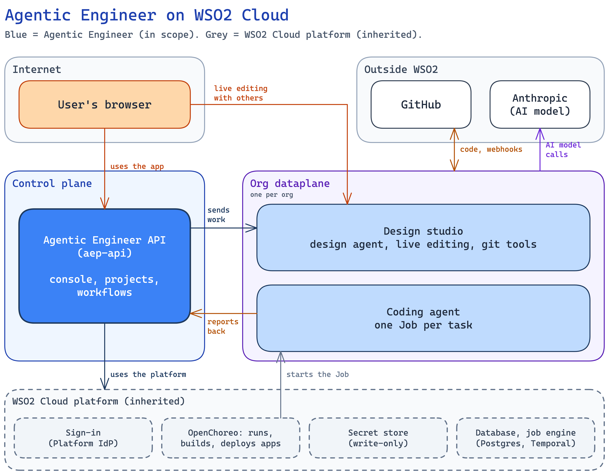
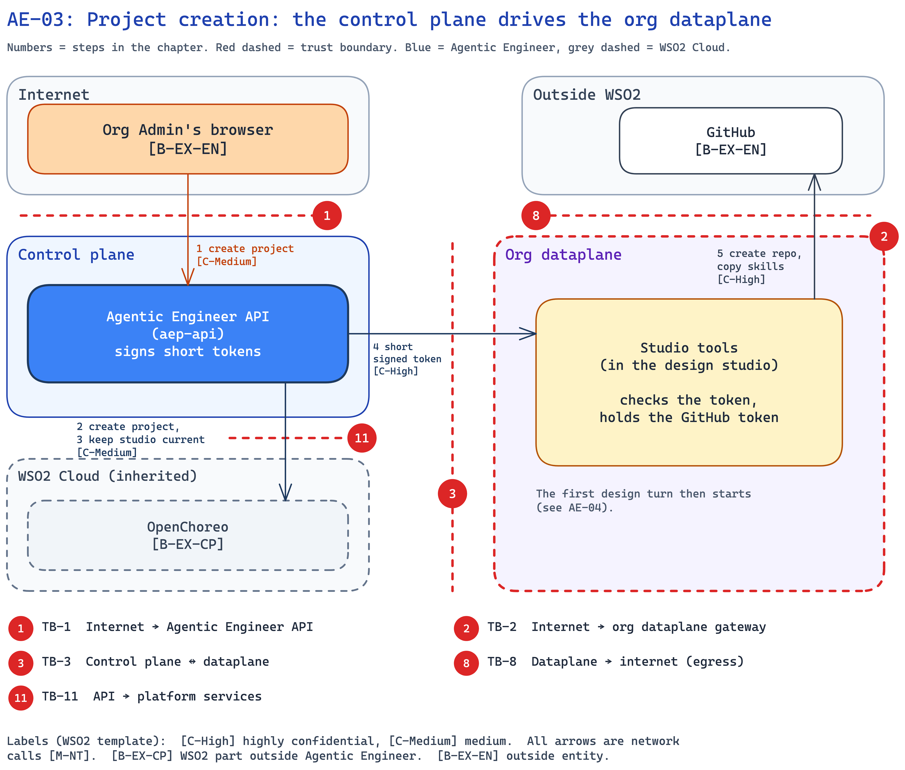
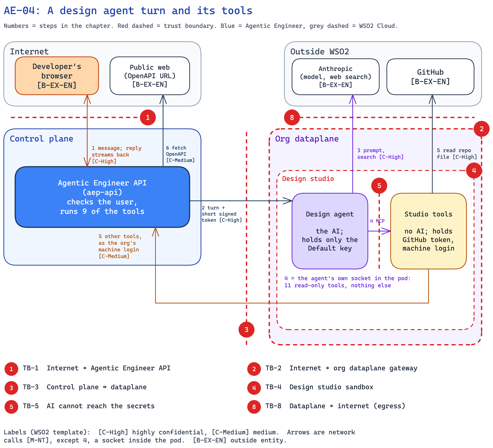
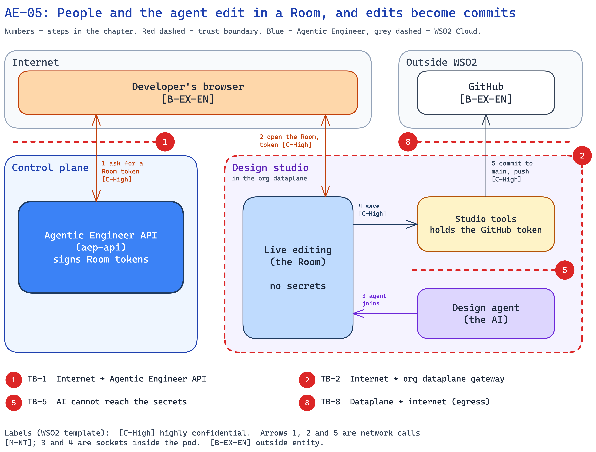
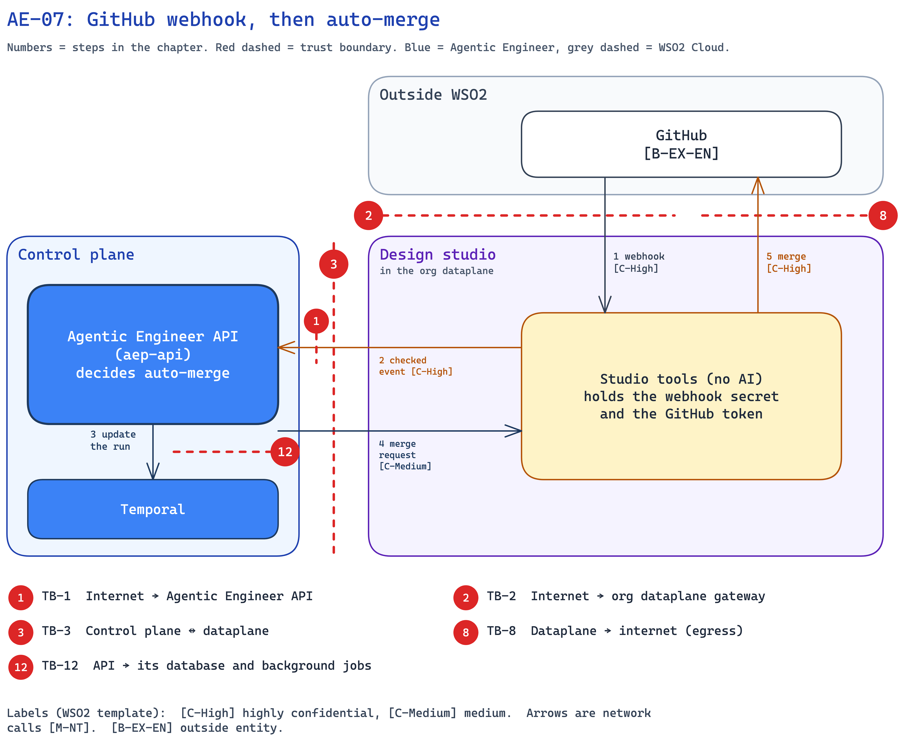

# Agentic Engineer on WSO2 Cloud

Threat Model

**Version: 1.0**  
**Date:** `[date]`  
**Email:** `[team email]`

This product was previously called App Factory / AEP.

> **Baseline.** Written against `main` `4b6142d4`, PR #778 (roles and permissions) treated as merged (reviewed at `ee2ba084`), and the architecture spec at `3dd05e5f`. WSO2 Cloud settings are taken from the Cloud overlay `fc6bd9f` and wso2cloud-deployment `ac9fb79da`.

# Table of Contents

- [Revision History](#revision-history)
- [Introduction](#introduction)
  - [Components](#components)
- [Trust Boundaries](#trust-boundaries)
  - [Interactions](#interactions)
  - [Trust boundary list](#trust-boundary-list)
- [Actors and Resources](#actors-and-resources)
  - [Actors](#actors)
  - [Entitlement matrix](#entitlement-matrix)
  - [Resources](#resources)
  - [Dependencies](#dependencies)
- [Out-of-Scope Interactions/Risks](#out-of-scope-interactionsrisks)
  - [Inside Agentic Engineer](#inside-agentic-engineer)
  - [Outside Agentic Engineer](#outside-agentic-engineer)
- [Session 1: Access and secrets](#session-1-access-and-secrets)
  - [AE-01: A user signs in and uses Agentic Engineer](#ae-01-a-user-signs-in-and-uses-agentic-engineer)
  - [AE-02: An org saves its secrets and connects GitHub](#ae-02-an-org-saves-its-secrets-and-connects-github)
  - [AE-03: Project creation: the control plane drives the org dataplane](#ae-03-project-creation-the-control-plane-drives-the-org-dataplane)
- [Session 2: Design](#session-2-design)
  - [AE-04: A design agent turn and its tools](#ae-04-a-design-agent-turn-and-its-tools)
  - [AE-05: People and the agent edit in a Room, and edits become commits](#ae-05-people-and-the-agent-edit-in-a-room-and-edits-become-commits)
- [Session 3: Build](#session-3-build)
  - [AE-06: A coding or validation agent runs](#ae-06-a-coding-or-validation-agent-runs)
  - [AE-07: GitHub webhook, then auto-merge](#ae-07-github-webhook-then-auto-merge)
  - [AE-08: Build, provision and deploy the customer's app](#ae-08-build-provision-and-deploy-the-customers-app)
- [Open Decisions, Improvements and Platform-wide Risks](#open-decisions-improvements-and-platform-wide-risks)
  - [Open decisions and improvements](#open-decisions-and-improvements)
  - [Platform-wide risks](#platform-wide-risks)
- [Review Checklist](#review-checklist)
  - [Security Considerations](#security-considerations)
  - [Vulnerability Management](#vulnerability-management)
  - [Privacy Considerations](#privacy-considerations)
  - [Kubernetes-based considerations](#kubernetes-based-considerations)
- [Threat Model Review Sessions](#threat-model-review-sessions)
- [Risk registry entries](#risk-registry-entries)
- [Document lifecycle](#document-lifecycle)
- [Appendix](#appendix)
  - [Feature/Product Documentation](#featureproduct-documentation)

# Revision History

| Version | Release Date | Contributors / Authors | Summary of Changes |
| ----- | ----- | ----- | ----- |
| 1.0 | `[date]` | `[contributors]` | Initial version |

# Introduction

This is the threat model for Agentic Engineer on WSO2 Cloud. Agentic Engineer lets an organization take an idea to a running app: people and an AI design agent write a spec together (the project's requirements and design, kept in its GitHub repository), coding agents build from the spec, and the platform deploys the app. It follows the WSO2 threat modeling method (What are we building? What can go wrong? What are we doing about it? Did we do a good enough job?).

The model describes the design in the Agentic Engineer architecture spec: organization secrets live only in a write-only secret store, and the [design studio](#components) and the [coding agents](#components) run in the organization's own dataplane (its own cluster, apart from WSO2 Cloud's shared control plane). Threats are assessed per interaction, from sign-in to deploy, in three review sessions.

**D1: Agentic Engineer on WSO2 Cloud**

## Components

**Agentic Engineer components**

| Component | Runs in | What it does |
| :---- | :---- | :---- |
| Console | Control plane | The web app people use in the browser. |
| Agentic Engineer API (`aep-api`) | Control plane | Checks every call, keeps records, writes secrets, and drives the org dataplane. |
| Temporal | Control plane | Runs long background workflows for the API. |
| Design studio | Org dataplane, project `ae-system` | The org's pod where people and the design agent write the spec. It has three parts: |
| ↳ Design agent | Design studio | The AI that writes and updates the spec. Holds only the Default AI key. |
| ↳ Live editing | Design studio | Hosts Rooms, the live sessions where people and the agent edit together. |
| ↳ Studio tools | Design studio | Does git and GitHub work and checks webhooks. Runs no AI. Holds the GitHub token. |
| Coding agent pod | Org dataplane, the app's project | Started for one run to build or test the app. It has two parts: |
| ↳ Coding agent | Coding agent pod | The AI that writes or tests code. Holds only the org's AI keys. |
| ↳ Coding tools | Coding agent pod | Does git, GitHub and platform actions for that run. Runs no AI. |

**WSO2 Cloud platform (inherited)**

| Component | What it does |
| :---- | :---- |
| Platform IdP | WSO2 Cloud sign-in (identity provider, IdP) for people and machine logins. |
| Environment Thunder | Sign-in service for one org and environment. |
| OpenChoreo | Runs, builds and deploys workloads. |
| Secret store and secret sync | Write-only vault, and the job that copies a secret into a container. |
| Gateways | The public API gateway and the org dataplane gateway. |
| Postgres | The API's database. |

# Trust Boundaries

This section lists the interactions of Agentic Engineer on WSO2 Cloud and the trust boundaries they cross. Eight interactions get a full chapter (AE-01 to AE-08). Risks that run across all chapters are in "Platform-wide risks", and what is not modelled is in "Out of scope".

Trust types in simple words:

- **Untrust → Trust:** someone outside starts a call into Agentic Engineer (a browser, GitHub).
- **Trust → Trust:** two parts we run talk to each other, or we call the WSO2 Cloud platform.
- **Trust → Untrust:** we call out to the internet (Anthropic, GitHub).

**D2: Trust boundaries**

## Interactions

| ID | Interaction | Trust Boundary |
| :---- | :---- | :---- |
| AE-01 | A user signs in and uses Agentic Engineer | Untrust → Trust |
| AE-02 | An org saves its secrets and connects GitHub | Untrust → Trust |
| AE-03 | Project creation: the control plane drives the org dataplane | Trust → Trust |
| AE-04 | A design agent turn and its tools | Trust → Untrust |
| AE-05 | People and the agent edit in a Room, and edits become commits | Untrust → Trust |
| AE-06 | A coding or validation agent runs | Trust → Untrust |
| AE-07 | GitHub webhook, then auto-merge | Untrust → Trust |
| AE-08 | Build, provision and deploy the customer's app | Trust → Trust |

## Trust boundary list

The numbers match the red badges in D2. TB-1 to TB-9 are the boundaries in the architecture spec; TB-10 to TB-13 are added by this model. The IDs in the "Open / improvements" column are listed in "Open decisions and improvements" (chapter 06). A chapter is listed in the "Chapters" column when its diagram shows the badge or its text names the boundary.

| TB | What crosses | Control | Open / improvements | Chapters |
| :---- | :---- | :---- | :---- | :---- |
| **TB-1** Internet → Agentic Engineer API | Console calls, design-turn stream, Room token request; from the dataplane: webhook events, coding-run calls, design-agent tool calls | The console's web server passes calls to the API; other callers come through the public gateway. The API checks the login token (signature, issuer, audience), takes the org from it, and checks the user's permission. Dataplane calls use the org's machine login (publisher client: the org's non-human sign-in) on internal routes only. | none | AE-01, AE-02, AE-03, AE-04, AE-05, AE-06, AE-07 |
| **TB-2** Internet → org dataplane gateway | Control-plane calls to the design studio; the Room WebSocket (live editing session); GitHub webhooks | The gateway only ends TLS. Each container checks its own token: signature, audience, expiry, and that the org is this pod's org. Webhooks are checked with a signature made with the org's webhook secret (HMAC, a keyed hash). | GAP-2 | AE-03, AE-04, AE-05, AE-07 |
| **TB-3** Control plane ↔ dataplane | Calls in both directions; secret values read into the dataplane | No private network path. Every call goes through a public gateway and carries a token. | GAP-2, O-10 | AE-02, AE-03, AE-04, AE-06, AE-07 |
| **TB-4** [Design studio](#components) sandbox: what gets in and out | Calls from the control plane, the Room, webhooks, secrets as env; model calls, git and tool calls out | Non-root, read-only file system, no added Linux powers, no Kubernetes token. Only four listeners are reachable (design turns, studio tools calls, the Room, webhooks), and only through the org gateway. | GAP-2, GAP-3 | AE-04, AE-05 |
| **TB-5** Design studio: AI cannot reach the secrets | File saves, tool calls and Room edits between the three containers | The AI container holds only the Default AI key. It cannot see the file-save channel. Its tool channel allows 11 read-only tools. | none | AE-02, AE-04, AE-05 |
| **TB-6** Coding agent sandbox: what gets in and out | Secrets as env; model calls, git and platform calls out | Non-root, read-only file system, no added Linux powers, no Kubernetes token. The pod accepts no incoming calls. | GAP-3 | AE-06 |
| **TB-7** Coding agent: AI cannot reach the secrets | The agent asks its tools container for git and platform actions | The AI container holds only the org's AI keys: no GitHub token and no machine login. The tools container acts only for this run's repository. | H-3 | AE-02, AE-06 |
| **TB-8** Dataplane → internet (egress) | Model calls, GitHub, calls back to the API | Only DNS and public ports 80/443. Private ranges, cloud metadata and the Kubernetes API are blocked. | none | AE-03, AE-04, AE-05, AE-06, AE-07 |
| **TB-9** Secret store, write-only | Secret values written by the API; read by the dataplane | The API can write a value but never read it back. Only the dataplane reads values, through the platform's [secret sync](#components). | O-3, O-4 | AE-02, AE-08 |
| **TB-10** Browser, where the console runs | The console page and scripts; the user's login token | Sign-in at the [Platform IdP](#components) (identity provider) with PKCE, a safe sign-in method for browser apps. The token is kept only in the browser tab's session. | none | AE-01 |
| **TB-11** API → platform services (OpenChoreo, sign-in) | Project, build and deploy calls; creating the design studio; sign-in admin calls | User requests carry the user's login token, so the platform scopes them to the user's org. Background work uses a platform service client. | none | AE-01, AE-02, AE-03, AE-06, AE-08 |
| **TB-12** API → its database and background jobs | Rows (no org secret values); workflow inputs and results | [Temporal](#components) is reachable only inside the Agentic Engineer project on the control plane. Postgres holds no org secret values. **Planned:** test-user passwords move to the secret store (H-2). | H-2 | AE-01, AE-07 |
| **TB-13** Builds run repo code and deploy the app | Repository code at the merged commit; the built image; the release to the customer's dataplane | OpenChoreo builds in its own build plane. Build clone secrets are passed by reference only. | H-1 | AE-08 |

Agentic Engineer's own boundary ends where it calls the WSO2 Cloud platform (TB-9, TB-11, TB-13). What happens inside the platform is WSO2 Cloud's scope.

# Actors and Resources

## Actors

**People**

| Actor (Role) | Description | Roles or Permissions |
| :---- | :---- | :---- |
| Org Admin (`ae-admin`) | Sets up the org: GitHub token, AI keys, skills, external resources. Can do all Developer work. | All 14 permissions (matrix below). |
| Org Developer (`ae-developer`) | Writes specs, chats with the design agent, builds and deploys. | 5 permissions (matrix below). |

**Malicious actors**

| Actor | Description | What they can reach |
| :---- | :---- | :---- |
| Malicious external actor | Anyone on the internet with no account. | Public addresses: the API, the org dataplane gateway, the webhook address. Public repositories. |
| Malicious org member | A Developer who tries to act above their role, or a member of another org. | Their own org, only with their own role's permissions. Another org: nothing, because the org comes from the login token. |
| Compromised agent | A design or coding agent whose model follows injected instructions from a spec, repository file, issue or web page. | What its container and its tools allow (TB-5, TB-7). |
| Compromised org Admin | An attacker using an Admin's account, or an Admin acting in bad faith. | Holds `ae-admin`, so it can change the GitHub token, AI keys and skills, and create or delete projects, in its own org only. It cannot reach other orgs (PW-1) or read saved secrets back (TB-9). **Planned:** record who changes secrets (H-6). |
| Malicious or compromised WSO2 operator | A WSO2 Cloud operator who misuses standing or break-glass access. | Clusters, databases and the secret store. **Inherited:** WSO2 Cloud operations controls cover this access (see Out of scope). |

**Systems Agentic Engineer runs**

| Actor | What it holds |
| :---- | :---- |
| [Agentic Engineer API](#components) | The key that signs its short tokens. It cannot read secret values back. |
| [Design agent](#components) | Only the Default AI key. |
| [Live editing](#components) | No secrets. |
| [Studio tools](#components) | GitHub token, webhook HMAC (the key that signs and checks webhooks), machine login. |
| [Coding agent](#components) | Only the org's AI keys. |
| [Coding tools](#components) | GitHub token and machine login, for this run's repository only. |
| Machine login (publisher client): one per org, used only from the dataplane to the API | Internal API routes only. No user permissions. |

## Entitlement matrix

Permissions come from the user's role. The API checks them on every call and refuses anything not listed.

| Permission | Lets you | `ae-admin` | `ae-developer` |
| :---- | :---- | :----: | :----: |
| `ae:requirement-view` | See projects and their status | Yes | Yes |
| `ae:requirement-update` | Create, change and delete projects | Yes | No |
| `ae:design-view` | Read specs, join a Room | Yes | Yes |
| `ae:design` | Edit specs, chat with the design agent | Yes | Yes |
| `ae:build-view` | See builds, deploys and test results | Yes | Yes |
| `ae:build` | Start builds and deploys, enter dependency secrets, see or rotate test-user passwords (see H-2) | Yes | Yes |
| `ae:github-config` | Connect or change the GitHub token | Yes | No |
| `ae:model-config` | Set the AI keys, coding agent runtime and model | Yes | No |
| `ae:skill-view` / `ae:skill-config` | See / manage org skills (instruction files the org writes for its agents) | Yes | No |
| `ae:resource-view` / `ae:resource-config` | See / manage external resources and the org catalog | Yes | No |
| `ae:usage-view` | See usage and cost | Yes | No |
| `ae:observability-view` | See incident reports and alerts | Yes | No |

- The machine login has none of these permissions.
- A member of another org has none of them in this org.
- Each change to the GitHub token or an AI key writes a log line naming the section changed, never the value.

## Resources

These are the resources Agentic Engineer controls, besides the systems above.

| Asset | Description (usage, purpose, authentication, authorizations, and security) |
| :---- | :---- |
| Console | Web app served over HTTPS by its own web server, which passes API calls to the API. Sign-in at the Platform IdP (identity provider). See AE-01. |
| API signing key | Signs the short tokens the dataplane trusts. [C-High]. See AE-03. |
| Org secrets | GitHub token, AI keys, webhook HMAC, machine login secret. Only in the secret store, delivered to the containers that need them. [C-High]. See AE-02. |
| Postgres | Org records, projects, conversations, runs. No org secret values. **Planned:** test-user passwords move to the secret store (H-2). |
| Temporal | Engine that runs background workflows for runs, builds and deploys. |
| Project `ae-system` | The org's OpenChoreo project that holds the design studio. See AE-03. |

## Dependencies

These are resources we do not control.

| Dependency | Description (usage, purpose, authentication, authorizations, and security) |
| :---- | :---- |
| Platform IdP | WSO2 Cloud sign-in. Signs user and machine login tokens. |
| Environment Thunder | Per org and environment sign-in. Future issuer of tokens made by token exchange, which trades a Platform IdP token for a new one there (GAP-2). |
| Secret store (secret manager API, called SM API; vault; secret sync) | Stores org secrets write-only and syncs them into the dataplane. Our boundary ends at the write. |
| OpenChoreo | Runs projects, the design studio, coding runs, builds and deploys. |
| GitHub | Repositories, issues, pull requests, webhooks. Reached with the org's GitHub token. A GitHub App may come later. |
| Anthropic | AI models. Receives specs, code and prompts. |
| WSO2 Cloud infrastructure | Clusters, networks, gateways, databases, images, operations. |

# Out-of-Scope Interactions/Risks

This review covers Agentic Engineer on WSO2 Cloud. It does not cover the items below.

## Inside Agentic Engineer

These are Agentic Engineer parts, but they are not modelled here.

- **Parts not deployed on WSO2 Cloud:** the playground, the tryit test page (a page to try API calls), the `/_dev` routes and the smee webhook relay (a tool that forwards webhooks to a developer's machine).
- **The GitHub App sign-in path.** Agentic Engineer uses a GitHub token. A GitHub App may come later.
- **Work in progress:** the incident agent loop (SRE/RCA: an agent that finds the cause of an alert), and sending the Default AI key to the Agent Manager AI gateway (a gateway that passes AI model calls on). The incident loop's API routes (`CreateIssue`, `PromoteTaskFromIssue`, `CreateRcaAgentReport`) exist; its tool server and agent are not on WSO2 Cloud.

## Outside Agentic Engineer

These are not Agentic Engineer. We cover only the calls Agentic Engineer makes into them.

- **WSO2 Cloud infrastructure:** clusters, networks, gateways, databases and operations, including operator access (standing and break-glass).
- **Platform IdP (identity provider) and Environment Thunder:** how they sign people in and issue tokens. A stolen sign-in session is out of scope.
- **OpenChoreo:** how it runs workloads, builds images and deploys apps. We cover what Agentic Engineer asks it to do.
- **The secret store and its sync:** how they store and deliver values. We cover what Agentic Engineer writes and which container reads it.
- **Kubernetes and the container runtime.**
- **The customer's running app and its users.**
- **WSO2 Cloud billing:** the console shows the org's plan by calling WSO2 Cloud's billing API with the user's login token.
- **GitHub and Anthropic as companies,** and how Anthropic handles the data it receives.

# Session 1: Access and secrets

How people sign in, how an org's secrets are saved, and how the control plane drives the org dataplane.

## AE-01: A user signs in and uses Agentic Engineer

**Trust boundary:** Untrust → Trust

**Description**

A person signs in to the Agentic Engineer console at the WSO2 Cloud sign-in page, and the browser keeps the login token in that tab. Each console action reaches the Agentic Engineer API through the console's web server. The API checks the token, takes the org from it, and checks that the user's role allows the action. Every later chapter starts from this check.

**Assets Involved**

| Initiator | Intermediate | Target |
| :---- | :---- | :---- |
| User's browser (console app) | Platform IdP (identity provider, for sign-in); console web server | Agentic Engineer API; Postgres; OpenChoreo (through the platform API) |

**Data Flow Diagram**

**Steps**

1. The browser signs the user in at the [Platform IdP](#components) and gets a login token. It uses PKCE, a safe sign-in method for browser apps.
2. The browser calls the console web server over HTTPS with the login token.
3. The console web server passes the call to the API inside the control plane.
4. The API checks the token (signature, issuer, audience), takes the org from it, and checks the user's permission for this action.
5. The API reads or writes only this org's records in Postgres.
6. When the action needs the platform (for example, creating a project), the API calls it with the user's token, so the platform also limits the call to the user's org.

**Payload**

- Login token (JWT, a signed JSON token): issuer `platform-idp`, audience (who the token is for) `APP_FACTORY_CONSOLE`, the org (`ouHandle`, `ouId`), the user, and the user's permissions (`scope`, `ae:*` keys). Lives 1 hour; the browser refreshes it.
- Request: the action and its inputs, for example a project name, a spec edit, or a chat message.
- Response: org data, for example projects, specs, build status, and the design agent's reply as a live stream.

**Security Considerations**

| Area | Response | Comments |
| :---- | :---- | :---- |
| Data Confidentiality | High confidential [C-High] | The login token acts as the user. Specs, designs and org settings are customer data. |
| Communication Medium | Network interaction [M-NT] | Browser to console web server over the internet; web server to API inside the control plane. |
| Transport Security | TLS Encryption | HTTPS from the browser. The hop from the web server to the API is plain HTTP inside the cluster. |
| Authentication | OAuth 2.0 / OIDC login token (JWT) | Signed by the Platform IdP. The API checks signature, issuer and audience on every call. |
| Accessibility | Publicly Accessible | The console and API are on the internet. Only signed-in org members get past the check. |
| Access Control and Authorization | Org from the token, then a permission check | The org is never taken from the URL or body. Each action needs a permission from the user's role (see the entitlement matrix). |

**Threat Assessment**

| ID | Category | Threat | Materializable | Mitigations / Comment |
| :---- | :---- | :---- | :---- | :---- |
| AE-01-1 | Spoofing | A malicious actor calls the API with a forged or expired login token, or with a machine token. | No | **Implemented:** the API checks the signature against the Platform IdP's keys, the issuer, the audience and the expiry on every call. User routes accept only the console's audience, so machine tokens are refused. |
| AE-01-2 | Tampering | A malicious org member puts another org's name in a request to read or change that org's data. | No | **Implemented:** the API takes the org only from the login token and scopes every record to it. Platform calls carry the user's token. **Inherited:** the platform limits those calls to the user's org. |
| AE-01-3 | Repudiation | A user denies starting a build or deploy. | No | **Implemented:** the API records who clicked Build and who edited the spec. The builds and deploys that follow belong to that run and are not stored with a user. |
| AE-01-4 | Information disclosure | A Developer reads data meant for Admins, such as usage and cost, or the org's AI keys. | No | **Implemented:** the permission check refuses views the role does not allow. Secret values are never returned; the console shows only a short prefix and the last four characters, which the API records when the secret is saved. |
| AE-01-5 | Denial of service | A malicious actor floods the API or sends very large requests. | No | **Inherited:** flood protection is WSO2 Cloud's. **Implemented:** the API refuses requests over 80 MiB. |
| AE-01-6 | Elevation of privilege | A Developer changes the GitHub token or AI keys, or deletes a project. | No | **Implemented:** the permission check denies by default. These actions need permissions only Admins hold. |

**Product improvements flagged**

- **Planned:** console calls also go through the public gateway, so the token is checked there too and the gateway's traffic limits apply (H-8).
- **Planned:** WSO2 Cloud sign-in issues the `ae-admin` and `ae-developer` roles and their `ae:*` permissions, and the console asks for them (H-7).

## AE-02: An org saves its secrets and connects GitHub

**Trust boundary:** Untrust → Trust

**Description**

An org Admin pastes the org's GitHub token or an AI key into the console. The API checks the value once and writes it to the WSO2 Cloud secret store, which is write-only: the API gets back names, never the value. The platform's [secret sync](#components) then delivers each value only to the dataplane container that needs it. When a GitHub token is saved, the API also creates the org's [design studio](#components) and registers the GitHub webhook once, then forgets the token.

Agentic Engineer needs these secrets to function: the **GitHub token** to create the project repository and commit specs and code to the org's GitHub, the **Default AI key** for the design agent's calls to Anthropic, the **Coding agent token** (the org's Claude subscription token) for the coding agent, and the **webhook secret** so [studio tools](#components) can check that a webhook really came from GitHub.

**Assets Involved**

| Initiator | Intermediate | Target |
| :---- | :---- | :---- |
| Org Admin's browser | Agentic Engineer API | Secret store; studio tools and design agent; GitHub; Anthropic; OpenChoreo |

**Data Flow Diagram**

**Steps**

1. The Admin sends the GitHub token or an AI key to the API (see AE-01 for sign-in).
2. The API checks the value in memory: the GitHub token with GitHub, an AI key with Anthropic.
3. The API writes the value to the secret store. For a GitHub token it also writes a new webhook secret (HMAC, the key used to sign and check webhooks) for this org. The store returns names only.
4. For a GitHub token, the API asks OpenChoreo to create the org's design studio, passing secret names only (see AE-03). How the studio starts before the org sets an AI key is still to decide (O-5).
5. The secret sync delivers the GitHub token and webhook secret to the studio tools container, and the Default AI key to the design agent. How a changed secret reaches a running pod is still to decide (O-4).
6. The API waits until the studio tools' webhook address is reachable, registers it on GitHub once, and forgets the token.

**Payload**

- GitHub token (personal access token) of the org's GitHub account.
- Default AI key (an Anthropic API key) and Coding agent token (the org's Claude subscription token). Without a Coding agent token, coding runs use the Default AI key.
- Webhook secret (HMAC), created by the API, one per org.
- Machine login secret, one per org. How it is created and rotated without the control plane reading it is still to decide (O-6).
- Secret names (secret references) returned by the store.
- Webhook address of the studio tools container.

**Security Considerations**

| Area | Response | Comments |
| :---- | :---- | :---- |
| Data Confidentiality | High confidential [C-High] | The GitHub token can read and write the org's repositories. The AI keys spend the org's money. |
| Communication Medium | Network interaction [M-NT] | Browser to API, API to the secret store, GitHub and Anthropic, secret sync to the dataplane. |
| Transport Security | TLS Encryption | HTTPS to GitHub, Anthropic and the API. |
| Authentication | Login token (JWT, a signed JSON token), then platform identity | The Admin's login token on the API, and the API passes it on to the secret store. How the secret sync signs in, and how the API writes when no user is on the request, is open (O-3). |
| Accessibility | Org Admins only | Through the console. |
| Access Control and Authorization | Admin-only permissions | `ae:github-config` for the GitHub token, `ae:model-config` for AI keys. |

**Threat Assessment**

| ID | Category | Threat | Materializable | Mitigations / Comment |
| :---- | :---- | :---- | :---- | :---- |
| AE-02-1 | Spoofing | A Developer, or a member of another org, saves a GitHub token or AI key for this org, for example to point the org at a GitHub account they control. | No | **Implemented:** only Admins hold `ae:github-config` and `ae:model-config`, and the org comes from the login token (see AE-01). |
| AE-02-2 | Tampering | A request writes a secret into another org's store, for example to swap that org's GitHub token. | No | **Implemented:** the API writes only for the org in the login token, and the call to the secret store carries the user's own token. |
| AE-02-3 | Repudiation | An Admin denies changing the GitHub token or an AI key. | No | **Implemented:** each change writes a log line naming the section, never the value. **Planned:** record who made each change (H-6). |
| AE-02-4 | Information disclosure | A saved GitHub token or AI key leaks back out of the control plane, for example in a response, a log or a database backup. | No | **By design:** values live only in the write-only secret store. The API cannot read them back, and the database holds no org secret values. **Implemented:** responses show only a short prefix and the last four characters, which the API records when the secret is saved, and logs never carry the value. **Planned:** test-user passwords move to the secret store (H-2). |
| AE-02-5 | Denial of service | A malicious actor floods the secret store or the secret sync. | No | **Inherited:** the secret store and its sync are WSO2 Cloud's. |
| AE-02-6 | Elevation of privilege | A compromised AI agent reads the GitHub token or the webhook secret. | No | **By design:** only the studio tools and coding tools containers hold the GitHub token, and only studio tools holds the webhook secret. The design agent holds only the Default AI key, and the coding agent only the org's AI keys (TB-5, TB-7). |

**Product improvements flagged**

- **Planned:** each change to the GitHub token or an AI key records who made it (H-6).

## AE-03: Project creation: the control plane drives the org dataplane

**Trust boundary:** Trust → Trust

**Description**

An org Admin creates a project in the console. The API creates the project in [OpenChoreo](#components); the org's [design studio](#components) is kept up to date on each console load. The API then asks the [studio tools](#components) container to create the GitHub repository and copy the org's skills (instruction files the org writes for its agents) into it. The control plane has no private path into the dataplane, so this call goes through the org gateway with a short token that the API signs.

**Assets Involved**

| Initiator | Intermediate | Target |
| :---- | :---- | :---- |
| Org Admin's browser | Agentic Engineer API; org gateway | OpenChoreo; studio tools; GitHub |

**Data Flow Diagram**

**Steps**

1. The Admin creates a project in the console (see AE-01 for sign-in).
2. The API creates the project in OpenChoreo with the user's token.
3. The API keeps the org's design studio current. It checks the studio on each console load, and if its version is old, the API updates the same studio in place, passing secret names only. It never creates a second one.
4. The API signs a short token for this org and the studio tools container, and calls studio tools through the org gateway.
5. Studio tools checks the token, then creates the GitHub repository and copies the org's skills into it with the org's GitHub token. The API then starts the first design turn, where the design agent reads the first prompt and starts the spec (see AE-04).

**Payload**

- Project name and the first prompt.
- Short signed token: signed by the API, for this org and this container (audience), lives 5 minutes.
- Repository name, and the org's skill files.
- Design studio settings: image version and secret names, never values.

**Security Considerations**

| Area | Response | Comments |
| :---- | :---- | :---- |
| Data Confidentiality | High confidential [C-High] | The short token lets the control plane act in the org's dataplane. The project's spec and code are customer data. |
| Communication Medium | Network interaction [M-NT] | API to OpenChoreo, API to the org gateway, studio tools to GitHub. |
| Transport Security | TLS Encryption | The org gateway ends TLS. HTTPS to GitHub. |
| Authentication | Short token signed by the API | Studio tools checks the signature against the API's public keys, the audience, the expiry, and that the org is its own. |
| Accessibility | Publicly Accessible | The org gateway is on the internet, but every call needs a valid token. |
| Access Control and Authorization | Admin only | Creating a project needs `ae:requirement-update`. |

**Threat Assessment**

| ID | Category | Threat | Materializable | Mitigations / Comment |
| :---- | :---- | :---- | :---- | :---- |
| AE-03-1 | Spoofing | A malicious actor calls studio tools through the public org gateway, pretending to be the control plane. | No | **By design:** studio tools accepts only a short token signed by the API, and checks the signature, audience, expiry and org itself. The gateway only ends TLS. How studio tools gets the API's public keys is still to decide (O-10). |
| AE-03-2 | Tampering | A token made for one org, or for another container, is reused to act on this org's studio tools. | No | **By design:** the audience names one org and one container, studio tools checks that the org is its own, and the token lives 5 minutes. |
| AE-03-3 | Repudiation | An Admin denies creating or deleting a project. | No | **Planned:** record who creates or deletes a project (H-6). |
| AE-03-4 | Information disclosure | A project's spec and code are readable by anyone on GitHub. | No | **Planned:** project repositories become private (H-9), when Agentic Engineer moves to the GitHub App install path that OpenChoreo uses for private repositories. |
| AE-03-5 | Denial of service | A malicious actor floods the org gateway. | No | **Inherited:** the org gateway is WSO2 Cloud's. |
| AE-03-6 | Elevation of privilege | The API's signing key leaks, and a malicious actor signs tokens for any org's design studio. | No | **By design:** the key is a platform secret of the API only. Each token names one org and one container and lives 5 minutes. **Planned:** tokens come from the org's [Environment Thunder](#components) once WSO2 Cloud turns on token exchange, which trades a Platform IdP token for a new one there (GAP-2). |

**Product improvements flagged**

- **Planned:** project repositories become private (GitHub App install path, H-9).
- **Planned:** record who creates or deletes a project (H-6).

# Session 2: Design

How a design agent turn uses its tools, and how people and the agent edit the spec together in a Room and save it to the repository.

## AE-04: A design agent turn and its tools

**Trust boundary:** Trust → Untrust

**Description**

The [design agent](#components) is the AI that helps people write a project's spec: they describe what they want in the console, and it writes and updates the requirements and design. To do this it reads text that nobody has checked, such as uploaded documents, the org's skills (instruction files the org writes for its agents), web search results and API descriptions from the internet. Some of that text may try to give the agent orders, which is called prompt injection. So the design keeps what the agent can reach small: it holds only the Default AI key, and for platform facts it must ask the [studio tools](#components) container beside it, which keeps the secrets and answers only 11 read-only tools.

**Assets Involved**

| Initiator | Intermediate | Target |
| :---- | :---- | :---- |
| Developer's browser | Agentic Engineer API; org gateway | Design agent; studio tools; Anthropic; GitHub; public web sites |

**Data Flow Diagram**

**Steps**

1. The Developer sends a message (see AE-01 for sign-in). The [API](#components) checks that the user may change the design, and streams the agent's reply back to the browser as it comes.
2. The API signs a short token for this org and the design agent, and starts the turn through the org gateway.
3. The design agent reads the spec from a copy that studio tools wrote for it, and calls the AI model at Anthropic with the Default AI key. The model may also run a web search, up to four times per turn.
4. For platform facts, the agent calls studio tools on its own socket inside the pod. It uses MCP (Model Context Protocol, a standard way for an AI to call tools). The socket answers only 11 read-only tools.
5. Studio tools answers the call. It reads repository files on GitHub itself, with the GitHub token. For the other tools it calls the API as the org's machine login (publisher client), and the API runs the tool for this org: for example, it lists the org's services or fetches an API description (OpenAPI document) from a public web address. In a Room, the agent's edits go into the live session (see AE-05).

**Payload**

- Message: up to 64 KiB of text, plus up to 10 attachments (PDF, images, text), 5 MiB each.
- Short signed token: signed by the API, for this org and this container (audience), lives 5 minutes.
- Model call: the prompt, the spec text, tool results and the Default AI key. The model is one of two allowed Claude models.
- Tool call: a tool name from the list of 11 and its inputs, for example a search term, a file path or a web address.
- Reply: the agent's text and proposed file changes, streamed as events. The conversation is kept for 7 days.

**Security Considerations**

| Area | Response | Comments |
| :---- | :---- | :---- |
| Data Confidentiality | High confidential [C-High] | Specs, repository files and uploads are customer data. The model call carries the Default AI key. |
| Communication Medium | Network interaction [M-NT] | API to the org gateway, the agent to Anthropic, studio tools to GitHub and the API. The agent to studio tools is a socket inside the pod. |
| Transport Security | TLS Encryption | The org gateway ends TLS. HTTPS to Anthropic, GitHub, the API and web sites. |
| Authentication | Short token signed by the API; machine login | The design agent checks the API's token (signature, audience, expiry, org). How it gets the API's public keys is still to decide (O-10). Studio tools signs in to the API as the org's machine login. |
| Accessibility | Publicly Accessible | The org gateway is on the internet, but every call needs a valid token. The agent's socket is reachable only inside the pod. |
| Access Control and Authorization | Permission check, then a fixed tool list | Starting a turn needs `ae:design`. The agent can call only the 11 read-only tools. The org comes from the machine login, never from the agent. |

**Threat Assessment**

| ID | Category | Threat | Materializable | Mitigations / Comment |
| :---- | :---- | :---- | :---- | :---- |
| AE-04-1 | Spoofing | A malicious actor calls the design agent through the public org gateway, pretending to be the control plane, to run turns on the org's AI key. | No | **By design:** the agent accepts only a short token signed by the API for this org and this container, and checks it itself (see AE-03-1). **Planned:** tokens come from the org's Environment Thunder (GAP-2). |
| AE-04-2 | Tampering | Text in a spec, an upload, a skill, a search result or an OpenAPI document tells the model to write harmful spec text. | No | **By design:** there is no filter for prompt injection. Instead, the agent holds only the Default AI key, its file tools stay inside its copy of the spec, and its tools only read. What it writes shows up in the Room, where people see it before a build (see AE-05). |
| AE-04-3 | Repudiation | A tool call cannot be tied to the user who started the turn. | No | **Implemented:** each turn is stored with the user from the verified login token. **By design:** tool calls reach the API as the org's machine login, not as the user, and the tool channel carries no token, so a tool call cannot be tied to one user or one turn; the agent can call a tool between turns. This is an accepted risk. The tools only read, and only this org's data. |
| AE-04-4 | Information disclosure | A steered agent sends spec or repository text out, inside a web search query or an OpenAPI web address. | No | **By design:** the agent has no web fetch tool, holds no GitHub token, and the dataplane blocks private addresses (TB-8). **Implemented:** the API fetches OpenAPI documents over HTTPS from public addresses only, with a size limit. **Planned:** guardrails on the agents' internet calls (H-4). |
| AE-04-5 | Denial of service | A user, or a steered agent in a loop, runs long turns and spends the org's AI budget. | No | **Implemented:** a turn stops after 30 minutes or 60 model steps, a project runs one turn at a time, and messages and attachments have size limits. **Inherited:** flood protection at the gateways is WSO2 Cloud's. |
| AE-04-6 | Elevation of privilege | A steered agent tries to read the GitHub token or the machine login, save files to git, or call a tool that changes something. | No | **By design:** the secrets live only in studio tools. The agent's socket answers only the 11 read-only tools, and the agent cannot see the file-save socket. The containers do not share processes, and the pod has no Kubernetes token (TB-4, TB-5). **Planned:** a stronger sandbox, gVisor (GAP-3). |

## AE-05: People and the agent edit in a Room, and edits become commits

**Trust boundary:** Untrust → Trust

**Description**

A Room is a live editing session where people and the design agent write a project's spec together, like a shared document. It is the only place where the browser talks straight to the org dataplane, so each person joins with a short Room token that the API signs for this one Room. The agent's edits show highlighted until a person accepts or removes them. The Room's files are then saved to the project's GitHub repository, and a coding run builds from them only when a person clicks Build.

**Assets Involved**

| Initiator | Intermediate | Target |
| :---- | :---- | :---- |
| Developer's browser; design agent | Agentic Engineer API; org gateway | Live editing; studio tools; GitHub |

**Data Flow Diagram**

**Steps**

1. The user opens a project's spec (see AE-01 for sign-in). The browser asks the [API](#components) for a Room token. The API checks that the user may see this project's design, then signs a token for this org, the live editing container and this Room. It lives 5 minutes.
2. The browser opens the Room over a WebSocket (a live two-way connection) through the org gateway. [Live editing](#components) checks the token itself: signature, audience, expiry, and that the org is its own.
3. During a design turn (see AE-04), the [design agent](#components) joins the same Room inside the pod with its own Room token. That token names the user who started the turn and ends with the turn. The agent's edits appear highlighted for everyone in the Room.
4. Live editing saves the Room's files to [studio tools](#components) over a file-save socket that only these two containers can see. It saves when a turn ends, when the last person leaves, and before a build.
5. Studio tools commits the files under `specs/` to the main branch and pushes them to GitHub with the GitHub token. The people in the Room are listed as co-authors of the commit.

**Payload**

- Room token: signed by the API, for this org, live editing and this Room (audience), names the user, lives 5 minutes.
- Agent Room token: the same audience, names the user and the agent, lives until the turn ends (at most 30 minutes).
- Room messages: text edits, the names and cursors of the people in the Room, and the marks that highlight the agent's text.
- Save: files under `specs/`, up to 5 MiB each. Each file carries the version it was based on, so a save never overwrites a newer change.
- Reference uploads (documents the user adds for the agent) go through the API, not the Room: up to 10 files, 5 MiB each, allowed file types only.

**Security Considerations**

| Area | Response | Comments |
| :---- | :---- | :---- |
| Data Confidentiality | High confidential [C-High] | The spec is customer data. The Room token opens the project's Room. The push uses the GitHub token. |
| Communication Medium | Network interaction [M-NT] | Browser to the API and to the org gateway, studio tools to GitHub. The agent's join and the save are sockets inside the pod. |
| Transport Security | TLS Encryption | HTTPS and secure WebSocket from the browser. The org gateway ends TLS. HTTPS to GitHub. |
| Authentication | Room token signed by the API | Live editing checks the signature against the API's public keys, the audience, the expiry and the org. How it gets the API's public keys is still to decide (O-10). The user's login token never reaches the dataplane. |
| Accessibility | Publicly Accessible | The Room address is on the org gateway on the internet, but a Room token is needed to join. |
| Access Control and Authorization | Permission check, then one Room per token | Joining a Room needs `ae:design-view`. A Room token lets its holder edit, so this is safe only because every role that can join also holds `ae:design`. The token opens only one Room of one org. |

**Threat Assessment**

| ID | Category | Threat | Materializable | Mitigations / Comment |
| :---- | :---- | :---- | :---- | :---- |
| AE-05-1 | Spoofing | A member of another org, or a user with a token for a different project, joins this project's Room. | No | **By design:** each org has its own live editing container. The token names one org and one Room, and live editing checks both and the expiry. The API checks the user before it signs a token. |
| AE-05-2 | Tampering | The design agent, steered by prompt injection (see AE-04-2), writes harmful spec text, and a coding run later builds from it. | No | **By design:** agent text is shown highlighted in the editor until a person accepts or removes it. Saving to `main` starts nothing. A coding run starts only when a person clicks Build, and it uses the spec as the person sees it. New or deleted files and `design.json` changes are not highlighted, and Build does not warn about text not yet accepted (see Product improvements). |
| AE-05-3 | Repudiation | A user denies making a spec change. | No | **By design:** each commit lists the people in the Room as co-authors. Git keeps the history of every change. The co-author names come from what each browser reports, so they show who was in the Room, not proof of who edited (see Product improvements). |
| AE-05-4 | Information disclosure | A Room token leaks, and someone else reads the spec. | No | **By design:** a Room token lives 5 minutes and opens one Room. The agent's token stays in the agent's memory and ends with the turn. **Planned:** Room tokens come from the org's [Environment Thunder](#components) once WSO2 Cloud turns on token exchange (GAP-2). |
| AE-05-5 | Denial of service | A member sends very large edits or opens many connections, so the Room cannot save. | No | **By design:** each org has its own live editing container, so one org cannot slow another org's Rooms. Studio tools refuses a saved file over 5 MiB. |
| AE-05-6 | Elevation of privilege | A malicious user finds a bug in live editing through the public WebSocket, or a steered agent tries to save files itself, to reach the GitHub token or write outside the spec. | No | **By design:** live editing holds no secrets, and the GitHub token lives only in studio tools. Only live editing and studio tools can see the file-save socket; the agent cannot (TB-4, TB-5). Studio tools writes only files under `specs/`. |

**Product improvements flagged**

- New files, deleted files and `design.json` changes made by the agent are also highlighted, and Build warns when some agent text is not yet accepted.
- Live editing takes each person's shown name from their Room token, limits document size and connections, and credits only the people who edited.

# Session 3: Build

How a coding or validation agent runs, how GitHub webhooks lead to a merge, and how the merged code is built and deployed.

## AE-06: A coding or validation agent runs

**Trust boundary:** Trust → Untrust

**Description**

The [coding agent](#components) is the AI that builds the app from the spec and opens a pull request. The validation agent is the same pod with another skill (an instruction file that tells the agent how to do its task): after a deploy, it tests the app against the spec. It works alone with a shell, and it reads text nobody has checked, such as issue comments, repository files, org skills and web pages, so it can be steered by prompt injection. So the [pod](#components) is split: the AI holds only the org's AI keys, and [coding tools](#components) beside it holds the other secrets and acts only for this run. Both coding agent runtimes an org can choose, Claude Code and OpenCode, run this way. **Planned:** a validation run signs in to the app with a project's test-user password. Coding tools holds that password, and the AI container never holds it (H-2, open decision O-11).

**Assets Involved**

| Initiator | Intermediate | Target |
| :---- | :---- | :---- |
| Agentic Engineer API | OpenChoreo; coding tools | Coding agent; Anthropic; GitHub |

**Data Flow Diagram**

**Steps**

1. Clicking Build (see AE-01) starts a coding run. A finished deploy (see AE-08) starts a validation run. The image build after a merge is AE-08. The [API](#components) asks [OpenChoreo](#components) to start a pod for this run, with secret names only. The [secret sync](#components) puts the org's AI keys into the agent, and the GitHub token and the machine login into coding tools.
2. The agent writes and tests code in its own workspace, and calls the AI model at Anthropic with the Coding agent token, or with the Default AI key when the org has no Coding agent token.
3. For git, GitHub and platform tools, the agent calls coding tools on a local port inside the pod.
4. Coding tools clones the repository, reads the issues, pushes the run's branch and opens the pull request. It refuses any other repository.
5. Coding tools calls the API as the org's machine login for this run's platform calls. The pull request then goes to AE-07.

**Payload**

- Run start: the repository, the milestone, the skill (`aep` or `validation-task`) and secret names.
- Model call: the prompt, spec, code, issue text and that token or key.
- Calls to coding tools: an action or tool name and its inputs. Coding tools never returns a secret it holds. Issue text it returns can carry test-user passwords (H-2).

**Security Considerations**

| Area | Response | Comments |
| :---- | :---- | :---- |
| Data Confidentiality | High confidential [C-High] | Code and issues are customer data. The model call carries the org's token or AI key. |
| Communication Medium | Network interaction [M-NT] | Except the local port inside the pod. |
| Transport Security | TLS Encryption | HTTPS to Anthropic, GitHub and the API. |
| Authentication | Machine login; GitHub token | Held by coding tools. The local port needs no token: only the agent can reach it. |
| Accessibility | Not publicly accessible | The pod has no public address. |
| Access Control and Authorization | Permission check, then this run only | Build needs `ae:build`. Coding tools acts only for this run's repository. |

**Threat Assessment**

| ID | Category | Threat | Materializable | Mitigations / Comment |
| :---- | :---- | :---- | :---- | :---- |
| AE-06-1 | Spoofing | Another workload calls the coding tools port to use the GitHub token. | No | **By design:** the port listens only inside the pod, and the pod accepts no calls from other pods. |
| AE-06-2 | Tampering | An issue comment, a repository file (such as `CLAUDE.md`), an org skill, the spec or a web page tells the agent to add harmful code. | No | **By design:** there is no filter for prompt injection. The agent holds only the org's AI keys, and its code arrives as a pull request on this run's repository (see AE-07). **Implemented:** only an Admin can change org skills. **Planned:** private repositories, so outsiders cannot comment (H-9). |
| AE-06-3 | Repudiation | A run's changes cannot be tied to the person who started it. | No | **Implemented:** the API records who clicked Build to start a coding run; a validation run belongs to the deploy that started it. Git keeps every commit. |
| AE-06-4 | Information disclosure | A steered agent sends code or a secret out through its shell, a web fetch or a search. | No | **By design:** the agent has no GitHub token or machine login, and the dataplane blocks private addresses and cloud metadata (TB-8). This egress rule is the main control. **Implemented:** web fetch refuses literal private IP addresses and known cluster host names, and web search refuses a query that holds a secret. **Planned:** dependency secrets stay out of the agent's container (H-3), test-user passwords are no longer posted in issue comments (H-2), and guardrails on internet calls (H-4). |
| AE-06-5 | Denial of service | A steered agent loops and spends the org's AI budget. | No | **Implemented:** a run stops after 3 hours (validation: 2), with fixed CPU and memory, and one coding run per project at a time. See PW-3. |
| AE-06-6 | Elevation of privilege | A steered agent tries to read the GitHub token or reach the cluster from its shell. | No | **By design:** the secrets live only in coding tools. The pod runs non-root, with a read-only file system, no Kubernetes token and no shared processes (TB-6, TB-7). **Planned:** a stronger sandbox, gVisor (GAP-3). |

**Product improvements flagged**

- **Planned:** dependency secrets and test-user passwords stay out of the agent's container, in coding tools (H-2, H-3, open decision O-11), and guardrails on internet calls (H-4).
- The coding agent reads only instructions and skills from the repository, not settings that can change its environment or run commands.

## AE-07: GitHub webhook, then auto-merge

**Trust boundary:** Untrust → Trust

**Description**

GitHub tells Agentic Engineer when a pull request or an issue changes, with a webhook (a call GitHub makes to a public address). Agentic Engineer uses these events to keep a run in step with GitHub: it merges the agents' ready pull requests and builds the merged code (auto-merge), and it adds an issue to the run when a person labels it. Webhooks come from the internet with no login, so [studio tools](#components) checks each one with the org's own webhook secret before it passes it on.

**Assets Involved**

| Initiator | Intermediate | Target |
| :---- | :---- | :---- |
| GitHub | Org gateway; studio tools | Agentic Engineer API; Temporal; GitHub |

**Data Flow Diagram**

**Steps**

1. GitHub posts an event through the org gateway. Studio tools checks its signature with the org's webhook secret.
2. Studio tools sends the checked event to the [API](#components) as the org's machine login.
3. The API drops repeats, stores the event and updates the run in [Temporal](#components).
4. When a ready pull request resolves one of the run's open issues, the API asks studio tools to merge it (see AE-03 for the signed token).
5. Studio tools merges it with the GitHub token. The changed parts of the app are then built (see AE-08).

**Payload**

- Webhook: the event type, a delivery id, the signature and the body (titles, text, branch names).
- To the API: the same, without the signature.
- Merge request: the repository and the pull request number.

**Security Considerations**

| Area | Response | Comments |
| :---- | :---- | :---- |
| Data Confidentiality | High confidential [C-High] | Issue and pull request text is customer data. |
| Communication Medium | Network interaction [M-NT] | |
| Transport Security | TLS Encryption | The org gateway ends TLS. |
| Authentication | Webhook signature; machine login | Each org has its own webhook secret. |
| Accessibility | Publicly Accessible | The webhook address is on the org gateway. Unsigned calls are refused. |
| Access Control and Authorization | Org from the token | The API acts only on this org's repositories. |

**Threat Assessment**

| ID | Category | Threat | Materializable | Mitigations / Comment |
| :---- | :---- | :---- | :---- | :---- |
| AE-07-1 | Spoofing | A malicious actor posts fake events, or one org sends events for another org's repository. | No | **By design:** studio tools checks every signature with the org's own secret. The API takes the org from the machine login and looks up the repository only in that org. **Inherited:** only people the repository allows can add labels. |
| AE-07-2 | Tampering | An outsider opens a pull request that names a run's issue, and it is merged. | No | **Planned:** auto-merge merges only the coding agent's own pull requests, and can be turned off (H-1). **Planned:** private repositories (H-9). |
| AE-07-3 | Repudiation | Nobody can tell why a pull request was merged. | No | **Implemented:** every event is stored. GitHub keeps the merge and the pull request. |
| AE-07-4 | Information disclosure | Test-user passwords in an issue comment are copied into the stored events. | No | **Implemented:** the API removes them before storing. **Planned:** passwords are not posted in issue comments (H-2). |
| AE-07-5 | Denial of service | A malicious actor floods the webhook address or replays events. | No | **Implemented:** a repeated event is dropped. **By design:** unsigned calls are refused. **Inherited:** the org gateway is WSO2 Cloud's. |
| AE-07-6 | Elevation of privilege | A steered coding agent's pull request (see AE-06-2) is merged and deployed. | No | **By design:** a person starts each run with Build, but no person reviews the code before auto-merge. The deploy goes only to the development environment, and the validation agent tests it (see AE-08). **Planned:** auto-merge can be turned off (H-1). |

**Product improvements flagged**

- **Planned:** auto-merge checks who opened the pull request, and can be turned off (H-1).
- A different agent could review changes before merge.
- A size limit on the webhook receiver.

## AE-08: Build, provision and deploy the customer's app

**Trust boundary:** Trust → Trust

**Description**

After a merge, Agentic Engineer turns the code into a running app on [OpenChoreo](#components). OpenChoreo builds the app by running the repository's own build file. Before the first deploy, a Developer enters the secret values the app needs, such as a database password, and the API creates test users for the validation agent. The [API](#components) gives OpenChoreo secret names only, never values.

**Assets Involved**

| Initiator | Intermediate | Target |
| :---- | :---- | :---- |
| Agentic Engineer API | OpenChoreo; secret store | GitHub; the customer's app |

**Data Flow Diagram**

**Steps**

1. After a merge (see AE-07), the API asks OpenChoreo to build each changed part.
2. OpenChoreo clones the repository and builds the image in its own build plane (the part of WSO2 Cloud that runs builds, apart from where apps run).
3. A Developer enters each dependency's secret values in the console, and the API writes them to the write-only [secret store](#components) (see AE-02). The API also creates test users and posts their logins in a comment on a GitHub issue that the build opens for those test users. **Planned:** passwords are no longer posted; they are kept in the secret store, and for a validation run [coding tools](#components) holds the password the run signs in to the app with (H-2, open decision O-11).
4. When every dependency is ready, the API asks OpenChoreo to deploy the app to the development environment. The validation run then starts (see AE-06).

**Payload**

- Build: the part, the merged commit and the name of the clone secret.
- Dependency values: what the Developer types. The API never reads them back.
- Test-user logins: a user name and password for each test role.

**Security Considerations**

| Area | Response | Comments |
| :---- | :---- | :---- |
| Data Confidentiality | High confidential [C-High] | Dependency secrets, test-user passwords and the customer's code. |
| Communication Medium | Network interaction [M-NT] | |
| Transport Security | TLS Encryption | |
| Authentication | User's login token; platform service client | Background work uses the platform service client for the run's org (TB-11). |
| Accessibility | Publicly Accessible | The deployed app is on the internet. It has sign-in only when its design adds one. The console shows which parts have none. |
| Access Control and Authorization | Permission check | Builds, dependency values and test-user passwords need `ae:build`. |

**Threat Assessment**

| ID | Category | Threat | Materializable | Mitigations / Comment |
| :---- | :---- | :---- | :---- | :---- |
| AE-08-1 | Spoofing | A member of one org builds or deploys in another org. | No | **Implemented:** the org comes from the login token, and a person's own token goes to the platform. Background work names the run's org on each platform call. |
| AE-08-2 | Tampering | Harmful code in the repository (see AE-06-2, AE-07-2) is built and deployed. | No | **Inherited:** builds run in OpenChoreo's own build plane. **By design:** the deploy goes only to the development environment. **Planned:** auto-merge checks who opened the pull request (H-1). |
| AE-08-3 | Repudiation | Nobody can tell who started a build or deploy. | No | **Implemented:** the API records who clicked Build. The builds and deploy that follow belong to that run and are not stored with a user. |
| AE-08-4 | Information disclosure | Others read test-user passwords on a public issue, or dependency secrets. | No | **By design:** dependency values go only to the write-only secret store. **Implemented:** seeing a test-user password in the console needs `ae:build`. **Planned:** test-user passwords are kept in the secret store, not in Postgres and not in issue comments (H-2). For a validation run, coding tools holds the password, and the AI container never holds it (H-2, open decision O-11). Project repositories are private (H-9). |
| AE-08-5 | Denial of service | Many merges start many builds. | No | **Implemented:** one build per part and commit, one automatic retry, one run per project at a time. **Inherited:** build capacity is WSO2 Cloud's. |
| AE-08-6 | Elevation of privilege | A build reaches the GitHub token or other secrets. | No | **By design:** the build gets the GitHub token by name only. **Inherited:** OpenChoreo gives the clone secret only to the build. |

**Product improvements flagged**

- **Planned:** test-user passwords are kept in the secret store and not posted in issue comments (H-2), and auto-merge checks who opened the pull request (H-1).

# Open Decisions, Improvements and Platform-wide Risks

## Open decisions and improvements

Chapters point to these IDs.

**Still to decide**

| ID | Decision | Chapters |
| :---- | :---- | :---- |
| **O-3** | How the secret sync signs in to the secret store, and how the API writes a secret when no user is on the request. A user's own write carries the user's token. | AE-02 |
| **O-4** | How a changed secret reaches a running pod | AE-02 |
| **O-5** | How the design studio starts before the org sets its Default AI key | AE-02 |
| **O-6** | How the machine login's secret is created and rotated without the control plane reading it | AE-02 |
| **O-10** | How dataplane containers get the API's public signing keys | AE-03, AE-04, AE-05 |
| **O-11** | Where dependency secrets and test-user passwords live during a coding run. The intended design is that [coding tools](#components) holds both, and the AI container holds neither (H-2, H-3). Once the passwords are in the write-only store, the API cannot read them back, so how a Developer sees a test-user password is not yet decided. | AE-06, AE-08 |

**Improvements to make**

Changes the team plans to make. Chapters mark them **Planned**. GAP-n items are different: they are WSO2 Cloud controls that are missing, and they happen when WSO2 Cloud adds them, not through a team change. Product improvement bullets in the chapters without an H-n or GAP-n are suggestions, not tracked changes.

| ID | Improvement | Chapters |
| :---- | :---- | :---- |
| **H-1** | Auto-merge merges only pull requests the coding agent opened from its own branch, and can be turned off. | AE-07, AE-08 |
| **H-2** | Test-user passwords are kept in the secret store (through the secret manager API) and are not posted in GitHub issue comments. For a validation run, coding tools holds the password, and the AI container never holds it. This needs a new architecture decision record (ADR) that replaces ADR-0022, which accepted posting these passwords in issue comments. Once the passwords are in the write-only store, the API cannot read them back, so how a Developer sees a test-user password is not yet decided. Open decision O-11. | AE-02, AE-06, AE-07, AE-08 |
| **H-3** | Dependency secrets (for example the app's database password) do not land in the coding agent's container. [Coding tools](#components) holds them, as it holds the GitHub token. Open decision O-11. | AE-06 |
| **H-4** | Guardrails on the internet calls the AI agents make or ask for, such as web search, web fetch and an OpenAPI address the agent asks for: allowed sites only, and requests checked for secrets. | AE-04, AE-06 |
| **H-6** | Changes to the GitHub token or an AI key, and creating or deleting a project, record who did it. | AE-02, AE-03 |
| **H-7** | WSO2 Cloud sign-in issues the `ae-admin` and `ae-developer` roles and their `ae:*` permissions, and the console asks for them. | AE-01 |
| **H-8** | The console calls the API through the public gateway, not only through its own web server. | AE-01 |
| **H-9** | Project repositories are private. | AE-03, AE-06, AE-07, AE-08 |
| **GAP-2** | Tokens from the control plane to the dataplane, and Room tokens, come from the org's [Environment Thunder](#components) once WSO2 Cloud turns on token exchange (trading a token from the Platform IdP, the WSO2 Cloud identity provider, for a new one there). Until then the API signs short tokens, which the dataplane checks. | AE-03, AE-04, AE-05 |
| **GAP-3** | Both agent pods run in gVisor, a stronger container sandbox, once WSO2 Cloud offers it. | AE-04, AE-06 |

## Platform-wide risks

Risks that run across all chapters.

| ID | Risk | Why it matters | Control or plan | Materializable |
| :---- | :---- | :---- | :---- | :---- |
| **PW-1** | One org reaches another org's data or workloads. | All orgs share the API, its database and its background jobs. | **Implemented:** the org always comes from the login token, and every query is limited to it. **Inherited:** the platform limits each platform call to that org. **By design:** each org has its own dataplane pods. | No |
| **PW-2** | A changed image or skill changes what the agents do. | The agents run with a shell, near the org's secrets. | **Implemented:** images are pinned by version tag. A tag can be moved, so this is weaker than pinning by digest (see Product improvements flagged). Only an Admin can change org skills, and git keeps their history. | No |
| **PW-3** | Runaway agents spend an org's AI budget. | Each org pays for its own AI key. | **Implemented:** time and step limits on design turns, a time limit on runs, and one turn and one coding run per project at a time. Admins can see usage and cost. There is no org-wide spend cap. | No |
| **PW-4** | Nobody can show who did what, or data is kept too long. | Needed for incident response and privacy. | **Implemented:** the API records who clicked Build and who edited the spec, and conversations are deleted after 7 days. The design does not yet name which part runs this delete. **Planned:** record who changes secrets and who creates or deletes projects (H-6). | No |

**Product improvements flagged**

- Pin agent images by digest, not by version tag, so a moved tag cannot change what runs.

# Review Checklist

## Security Considerations

*Reference: https://top10proactive.owasp.org/*

| Security Consideration | State | Comments |
| :---- | :---- | :---- |
| Are all inputs and outputs validated? (Syntactic and Semantic Validation) | Yes | Inputs have size limits, the org comes from the login token, and webhooks are checked by signature. |
| Are rate limits in place where necessary? | Partial | WSO2 Cloud's edge has a per-IP rate limit (WAF, a web application firewall). Per-API gateway rate limits are not set for Agentic Engineer. Agentic Engineer limits turns, runs and builds itself (PW-3). |
| Are permissions, roles, and entitlements defined on least privilege and business needs? | Yes | Two roles and 14 permissions (see Actors). Secrets and skills are Admin only. |
| Are authentication and authorization validated at both UI and API, front and back end? | Yes | The API checks the login token and the permission on every call. Dataplane containers check their own tokens. |
| Are proper isolations in place between components (least-privilege, blast-radius reduction)? | Yes | Each org has its own dataplane pods, and the AI is kept apart from the secrets (TB-5, TB-7). |
| Have default credentials been changed / default superuser accounts disabled? | Yes | WSO2 Cloud settings turn off every development path. |
| Has implementation followed best-practice guidelines (OWASP/Kubernetes/vendor)? | Yes | By design: agent pods run non-root, with a read-only file system and no Kubernetes token (TB-4, TB-6). Inherited: control-plane pods run non-root with no Kubernetes token. |
| Is the source code kept private where applicable? | Yes | WSO2 Cloud related configs and source are kept private. |
| Was a security-focused code review conducted, and were findings addressed? | No | — |
| Is Static (SAST) or IaC scanning conducted and are findings addressed? | No | — |
| Is Software Composition Analysis (SCA) conducted (e.g., FOSSA, JFrog XRay, Trivy)? | No | — |
| Is Dynamic (DAST) or API scanning conducted on non-production setups? | No | — |
| Are audit logs generated in a standardized format, available to authorized users, with a defined retention period? | Partial | The API records who clicked Build and who edited the spec. More is planned (H-6). No retention period is set. |
| Do audit logs for critical configuration changes include before/after values? | No | A change to the GitHub token or an AI key logs only which section changed. The values are secrets, so they are never logged. |
| Has a Business Impact Analysis (BIA) been conducted (MTTD, uptime, RPO, RTO)? | No | — |
| Are data in transit and at rest encrypted? | Yes | TLS on every call across the internet. Encryption at rest is WSO2 Cloud's. |
| Is sensitive data (credentials, keys) stored in a secret store / key vault? | Yes | Org secrets live only in the write-only secret store. |
| Have you ensured personal, sensitive, or confidential data is not logged? | Partial | The API never logs secret values. Whether logs carry the user's name and email has not been checked. |
| Have users been given proper instructions on secure usage? | No | — |

## Vulnerability Management

| Question | Response |
| :---- | :---- |
| How will product vulnerabilities be addressed, and at what patching frequency? | TBD |
| How will deployment and dependency vulnerabilities be addressed, and at what patching frequency? | TBD |
| Are there any End-of-Life or End-of-Service components in use? | TBD |

## Privacy Considerations

Agentic Engineer processes the name and email on the login token, and test-user accounts for each app.

| Privacy Consideration | State | Comments |
| :---- | :---- | :---- |
| Is the purpose and legal basis for processing personal data clearly defined? | — | — |
| Is creation/collection, storage, usage, sharing, archival, and disposal of personal data in line with data minimization? | Yes | Only the name and email on the login token. |
| Is personal data stored securely? | Partial | Rows are limited to the user's org. Planned: test-user passwords are kept in the secret store (H-2). |
| Are privacy policies updated to reflect new personal data processing? | — | — |
| Is access to personal data granted on a need-to-know basis? | Yes | People see only their own org. Test-user passwords need `ae:build`. |
| Are data retention requirements considered? | Partial | Conversations are deleted after 7 days. The design does not yet name which part runs this delete. Activity records have no set limit. |
| Is there a timely process for disposing of personal data on request, while meeting retention requirements? | — | — |
| Have relevant records been added to the [WSO2 Data Inventory](https://docs.google.com/spreadsheets/d/1kGVhgvaAi1XYtflf5I_r6bcZQqdimRmm2VXf221FbKY/edit?gid=986734575#gid=986734575) / [Cloud Data Storages](https://docs.google.com/spreadsheets/d/1TFajRmy3YLuYkZxNyJOkSuE9orjFcuHLmLWxvT1HWnY/edit?gid=224115104#gid=224115104) register? | — | — |

## Kubernetes-based considerations

| Consideration | Response |
| :---- | :---- |
| How is namespace management done? | OpenChoreo manages them. Each org has its own dataplane. |
| Has the default namespace been used, and have resources been created in it? | No |
| Have resource quotas and limits been defined? | Partial. Coding pods have fixed CPU and memory limits. Project quotas are WSO2 Cloud's. |
| Have Network Policies been configured to control traffic? | Yes. By design (TB-8): agent pods reach only public addresses. The design studio accepts calls only through the org gateway; coding pods accept none. |
| Have RBAC policies been implemented for least-privilege access? | Yes. By design: agent pods have no Kubernetes token. The API has no Kubernetes access on WSO2 Cloud. |
| Are non-root users being used? | Yes. By design: agent pods run as non-root (TB-4, TB-6). |

# Threat Model Review Sessions

Session 1: Access and secrets (AE-01 to AE-03)

* Date:
* Participants:
* Session recording:
* Notes:
* Action items:
  - [ ]

Session 2: Design (AE-04, AE-05)

* Date:
* Participants:
* Session recording:
* Notes:
* Action items:
  - [ ]

Session 3: Build (AE-06 to AE-08, platform-wide risks)

* Date:
* Participants:
* Session recording:
* Notes:
* Action items:
  - [ ]

# Risk registry entries

No row in AE-01 to AE-08 or PW-1 to PW-4 is Materializable **Yes** or **Partially**. The items below are the planned changes those rows rely on. Rows whose only mitigation is Planned are covered by the tracked items below. A tracking issue is created for each after the review. H-n items are changes the team makes. GAP-n items are WSO2 Cloud controls that are missing; they wait on WSO2 Cloud, not on a team change.

| ID | Item | Chapters | Tracking issue |
| :---- | :---- | :---- | :---- |
| H-1 | Auto-merge merges only pull requests the coding agent opened from its own branch, and can be turned off. | AE-07, AE-08 | |
| H-2 | Test-user passwords are kept in the secret store and are not posted in GitHub issue comments; for a validation run, coding tools holds them and the AI container never holds them (open decision O-11). Needs a new architecture decision record (ADR) that replaces ADR-0022, which accepted posting these passwords in issue comments. Once the passwords are in the write-only store, the API cannot read them back, so how a Developer sees a test-user password is not yet decided. | AE-02, AE-06, AE-07, AE-08 | |
| H-3 | Dependency secrets do not land in the coding agent's container; coding tools holds them (open decision O-11). | AE-06 | |
| H-4 | Guardrails on the AI agents' internet calls. | AE-04, AE-06 | |
| H-6 | Changes to the GitHub token or an AI key, and creating or deleting a project, record who did it. | AE-02, AE-03 | |
| H-7 | WSO2 Cloud sign-in issues the `ae-admin` and `ae-developer` roles and their `ae:*` permissions, and the console asks for them. | AE-01 | |
| H-8 | The console calls the API through the public gateway, not only through its own web server. | AE-01 | |
| H-9 | Project repositories are private. | AE-03, AE-06, AE-07, AE-08 | |
| GAP-2 | Tokens from the control plane to the dataplane, and Room tokens, come from the org's Environment Thunder. | AE-03, AE-04, AE-05 | |
| GAP-3 | Both agent pods run in gVisor. | AE-04, AE-06 | |

# Document lifecycle

- [ ] The threat model moved to [Security Review Documents](https://drive.google.com/drive/folders/1xKJ0HfPaufYSouC_Rma7S2z3fKUPQega)
- [ ] Threat model reviewed by the security team and leads
- [ ] Created GitHub issues for tracking threats that need to be addressed
- [ ] Risk registry entries updated with [Asela Jayatilleke](mailto:aselaj@wso2.com) (if applicable)

# Appendix

## Feature/Product Documentation

- Product overview: [README](https://github.com/wso2/labs-agentic-engineer)
- Glossary: [docs/glossary.md](https://github.com/wso2/labs-agentic-engineer/blob/main/docs/glossary.md)
